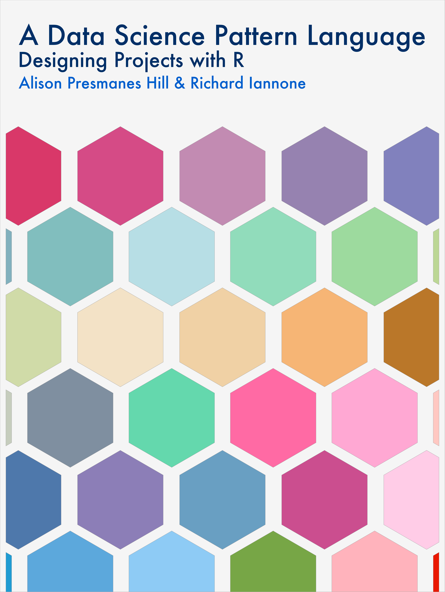

--- 
knit: "bookdown::render_book"
title: "A Data Science Pattern Language"
github-repo: dspatterns/dspatterns
site: bookdown::bookdown_site
documentclass: book
---

```{r, echo=FALSE}

```


# Welcome {-}


*A Data Science Pattern Language: Designing Projects with R* will get you up and running with **R**. You'll learn many things in this book, with the main goals of enabling you to explore data, perform analysis on it, and communicate the results of that analysis. There are lots of little things to learn to get to that stage, but we'll take a structured approach using a collection of **R** packages. You may have had experience using **Excel** or other GUI-driven data manipulation tools when working with data. However, we're going to assume a sort of blank slate here: experience with such tools is not expected or required for this book.

Why do this using **R**? Well, it has really developed into a great ecosystem of tools for working with data. It has had its origins in statistical programming but its ever-expanding stable of packages (i.e., collections of functions that help us work with data) and diverse user base has taken **R** far beyond its only-for-statistics origins. It's quite often the case now that if you need to solve a data problem, **R**&mdash;and a handful of packages&mdash;can help you do just that.

Throughout the book's lessons, you'll learn how to use **R** to gather, transform, and gain insights from data. We put together an **R** package just for this book, **dspatterns**, that contains custom-made datasets and some **R** functions that will be used extensively in examples and exercises. We'll make great use of this package to address challenges that are common with doing data analysis with data you'll find in the real world. We'll learn to make use of the *Tidyverse* collection of **R** packages to gather, tidy, transform, and visualize data. These packages are rigorously developed and are focused toward performing the core tasks of data analysis and reporting. 

We sincerely hope that you find the lessons give you the skills to become productive with data using **R** (with a minimum of frustration). We always appreciate feedback and so you are encouraged to post any questions, comments, or suggestions you have about the book in the *Issues* section of the **dspatterns** repo. Your feedback is taken quite seriously and will be incredibly valuable for the development of this book.

#### About the Book {-}

*A Data Science Pattern Language: Designing Projects with R* is written by [Alison Hill](https://github.com/apreshill) and [Richard Iannone](https://github.com/rich-iannone). The book's development can be followed at the [**dspatterns/dspatterns** repository on **GitHub**](https://github.com/dspatterns/dspatterns). There are [*Issues*](https://github.com/dspatterns/dspatterns/issues) and [*Discussions*](https://github.com/dspatterns/dspatterns/discussions) sections in the repo so feel free to create an *Issue* or more casually share ideas about how to improve the book material.

This book was built by the wonderful [**bookdown**](https://bookdown.org) **R** package.
