# Starting with R {#starting_with_r}

This chapter covers

- Getting a feel for what **R** is and what its ecosystem is like
- Installing the **R** language and **RStudio Desktop** application
- Acquainting ourselves with the **RStudio** and learning some keyboard shortcuts
- Introducing **R Markdown** as a way to run **R** code
- Understanding our learning path for this book
- Where to go for help

**R** is a great language for working with data. Have you ever used **Excel** for data analysis work and wished you could make better charts? Perhaps you came up against problems with working with larger amounts of data? The lessons in this book will help to address those common woes and much more. We'll tidy and summarize tabular data. We'll make beautiful charts. We'll also work toward making those trickier topics (like working with dates and times, joining datasets together, and publishing and distributing our work) less cumbersome and much more understandable.
	
**R** has really come a long way in the past decade! The large and growing ecosystem of packages (i.e., collections of functions that help us work with data) and diverse user base has extended the language such that it's not just about doing only statistics. **R** is, in fact, now very useful for solving a wide range of data problems. It's great that you're picking up this book and learning about what **R** can help you accomplish. As it turns out, there's a good chance that your analytical problems can be solved with even just a little **R** knowledge.
	
**R** is currently developed by the *R Development Core Team* and, at the time of this writing, the latest **R** release is 4.0. **R** has a package system that allows users to write and distribute their own packages of functions. The number of user-created packages at this point is well over 10,000 and that figure is part of the reason why **R** has so much functionality. A more detailed look at the **R** landscape is available in the *Appendix*.

Because of the many user-created packages, **R** is now widely used in academia, industry, and in other organizations. **R** can be integrated into analytical pipelines, it is useful for ad-hoc data analysis, and it's highly capable in producing automated, reproducible reporting. Its plotting abilities have made it possible for individuals and organizations to generate and publish beautiful data visualizations. Of course, there are alternatives to **R** for working with data. Other languages include **Python**, **Julia**, **Matlab**, and **SAS**. All of those languages can, of course, help you to work with data. However, I think some of the key strengths of **R** (e.g., ease of manipulating datasets, great plotting capabilities, expressive and readable syntax, approachable community, etc.) will make the investment in learning **R** a great choice.

Throughout the upcoming lessons, we'll learn how to use **R** to gather, transform, and gain insights from data. This book also has an **R** package called **edr** that contains custom-made datasets and some **R** functions that will be used in examples and exercises. We'll make great use of this package to address those data analysis challenges that are common with real-world data. We'll learn to make use of the *Tidyverse* collection of **R** packages to gather, tidy, transform, and visualize data. **R**'s place in the field of data science is now well-established and these tools (and a few others in the ecosystem) will serve us well for effectively performing the core tasks of data analysis and reporting.

## Understanding the RStudio Desktop Environment

**RStudio Desktop** is an integrated development environment (IDE) that makes it easy to do work with **R** (we'll simply refer to this IDE as **RStudio** throughout this book). **RStudio** and **R** itself both need to be installed separately (the order of installation does not matter). Detailed instructions for the installation of both (for Windows and macOS) are available in the *Appendix*.
	
**RStudio** has a customizable, four-pane workspace. It has a collection of useful features that help with **R** coding such as syntax highlighting, autocomplete, file and project management, and much more.

```{r rstudio-desktop-env, echo = FALSE, fig.cap = "The **RStudio Desktop** environment with an **R Markdown** file in focus in top-left (the source pane) and the **R** console occupying the bottom-left."}
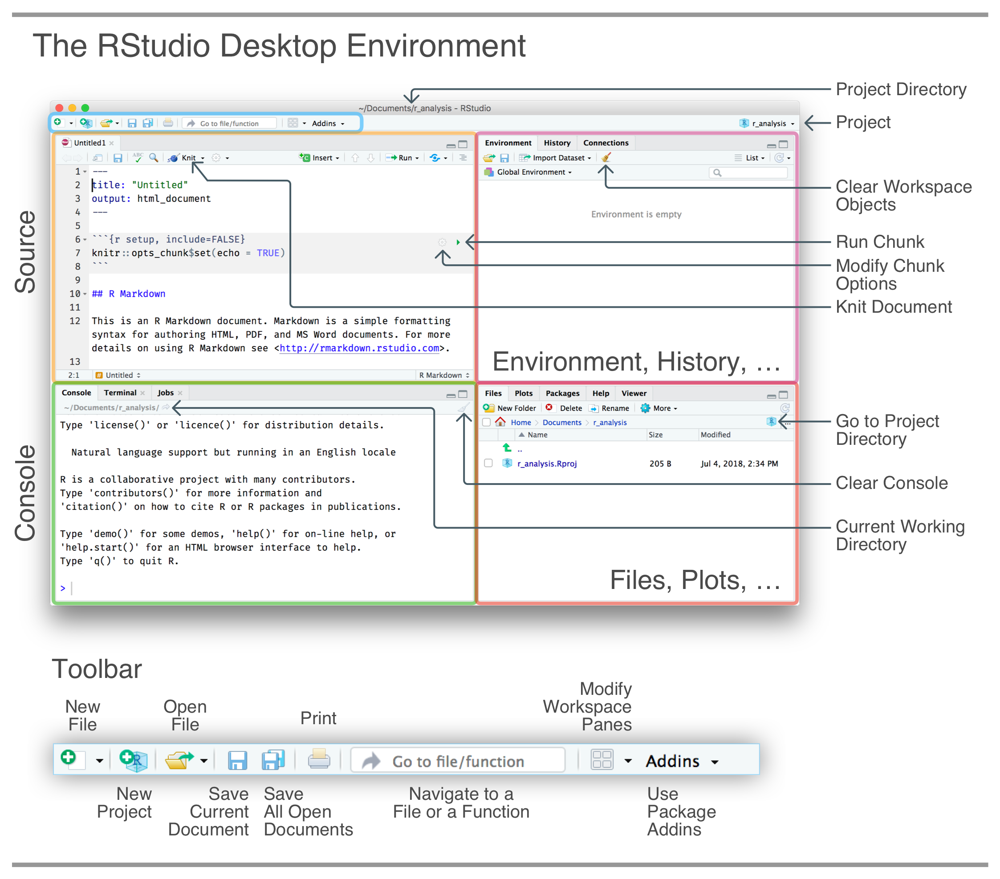
```

The diagram shown in *Figure \@ref(fig:rstudio-desktop-env)* provides a reference to a cross section of the buttons available in the initial view. The most important takeaways from this first look at **RStudio** are:

  1. The source pane (top-left) is where you would work on **R** scripts and **R Markdown** documents.
  2. The console pane (bottom-left) is where you would access the **R** console and the system's terminal.
  3. The toolbar (above the source pane) provides useful tools for managing and navigating through documents and projects.
  4. Two panes (to the right) provide access to files, workspace objects, **R** packages, plots, and much more. 
  5. The *Project* dropdown (upper-right corner) provides access to existing projects, project options, and anything else related to managing projects.
  
It's important to note that not all of the features of **RStudio** are likely to be touched by the average user. Early on, we will only need a very small subset of the functionality that's provided.

Indeed, a little can go a long way, so, while on the topic of the small things, it's never too early to learn about a few useful keyboard shortcuts. These are the ones that you'll use again and again.

  1. `Control` + `Enter` — runs the current line or a selection of code from the editor in the console. This is extremely useful as you select even nested functions and run them in the console without copying anything anywhere.
  2. `Tab` — provides an auto-complete function. Start typing in the editor or even in the console and try hitting the tab key: **RStudio** will suggest functions, variables, or file names. Up and down with the arrow keys and another `Tab` (or `Return`) will accept the choice.
  3. `Control` + `.` — brings up a search bar where you can search for files or functions. Up and down arrows and return allow you to navigate quickly to the file (at the right location) in a new tab.
  4. `Command` + `Option` + `I` (`Control` + `Alt` + `I` on Windows) — creates an empty **R** code chunk in an **R Markdown** document. As this is one of the key things you'll be doing, this shortcut does save a lot of time.
  
With time, it becomes easier to **RStudio** with less reliance on a pointing device. If you want to get on that road try the **RStudio** shortcut `Shift` + `Option` + `K` (`Shift` + `Alt` + `K` on Windows), it brings up the (Keyboard Shortcuts Help* overlay (which has a lot of keyboard shortcuts).

## Using **R Markdown** for Reproducible Reporting

Reporting the results of a data analysis is quite important and is often the deliverable. **R** has something known as **R Markdown** which is a format for writing code and prose in the same document. The idea for this comes from literate programming, where the mixture of source code for a computer program is intertwined both with an explanation of what the program is doing and also the results of running the program.
  
There are many advantages of taking this approach for virtually all data analysis tasks:

  1. The explanation of the code is adjacent to the code itself; code comments are like this, but these explanations are more prominent and accessible than source code comments.
  2. There is no risk of having the code explanation and the code itself dissociated from one another; these two elements are tightly bound.
  3. A single document contains all of the analysis which is part code and part explanation. It's self-contained.

You may or may not be familiar with **Markdown**, which is a big part of this format. **Markdown** is a text markup language that translates really well to **HTML**. It was created by John Gruber as a very simple way for anybody (i.e., non-programmers) to write in an easy-to-read format that could be converted directly into **HTML**. It was inspired by the informal text markup that people would often use in email messages, and, owing to this familiarity, it feels quite natural to write. *Figure \@ref(fig:markdown-reference)* has a quick reference of **Markdown** and what it looks like when rendered to **HTML**.

```{r markdown-reference, echo = FALSE, fig.cap = "A simple reference for Markdown. The text on the left will become the HTML on the right after an **R Markdown** document is *knitted*."}
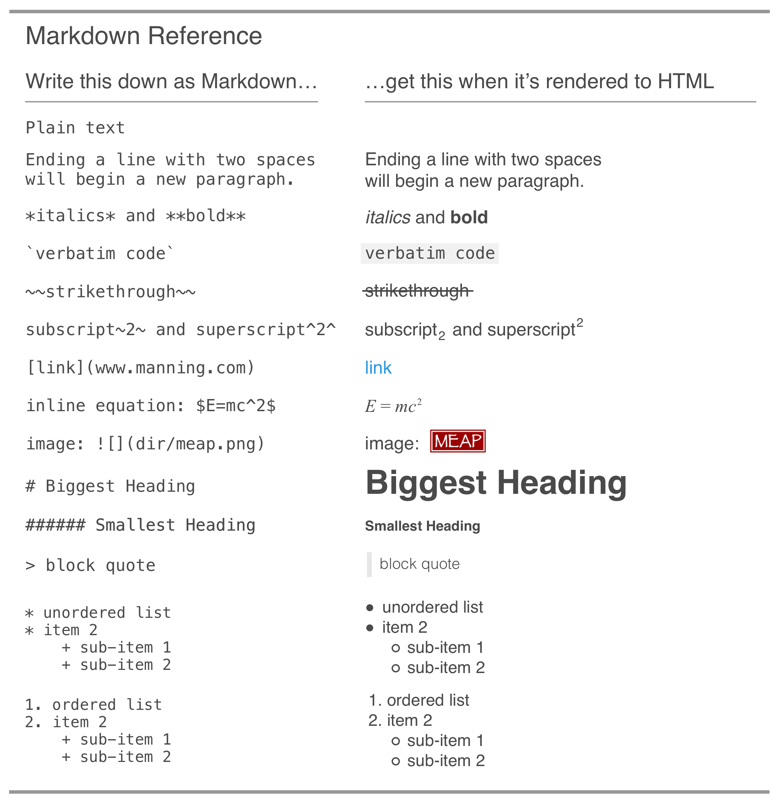
```

  All of the lessons in this book will incorporate **R Markdown** because it really is a great approach for running all **R** code in data analysis and visualization contexts. The prose portion of **R Markdown** (i.e., *not* the **R** code) is the default text entry type. The **R** code is run inside code chunks, which are marked off areas (with three backticks: ```) in the document. The schematic in *Figure \@ref(fig:rmarkdown-annotation)* shows what an **R** code chunk looks like and what controls are available in **R Markdown**.

```{r rmarkdown-annotation, echo = FALSE, fig.cap = "A simple reference for Markdown. The text on the left will become the HTML on the right after an **R Markdown** document is *knitted*."}
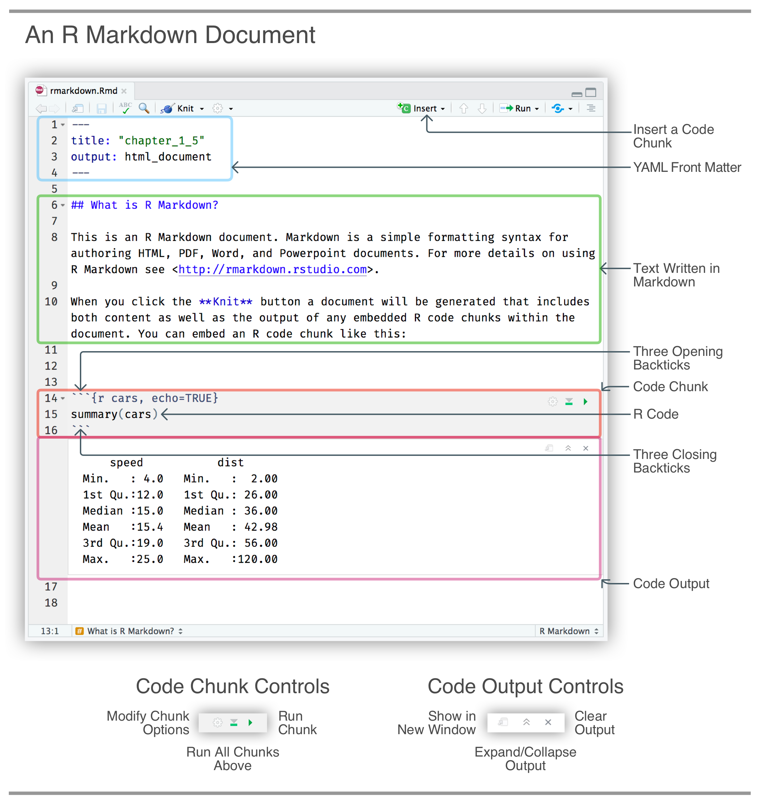
```

Aside from reproducibility, the finished **R Markdown** document can be rendered to a self-contained HTML file, to a Word document, to a various presentation types including Powerpoint, or to a PDF file. There are lots of ways to customize what the rendered document will look like (e.g., hiding code for non-technical audiences, adding HTML display elements, etc.), so, the analysis can double as a deliverable report. This will undoubtedly save you time. If ever the input data should change, the report could be run again and updated, usually with minimal (if any) modification. That's one of the features of reproducible reporting.
  
Let's walk through a simple example of how to use **R Markdown** in RStudio. You probably don't know any **R** at this point and that's perfectly fine. The point of this example is to show some of the mechanics of using the interface to run code and generate an HTML report. The main things we'll do in this **R Markdown** walkthrough are to fill in the YAML front matter (these are basic rendering instructions), add in two **R** code chunks (displaying a data summary and showing a plot), and adding Markdown text with basic explanations.

<hr>

```{r walkthrough-1, echo = FALSE}
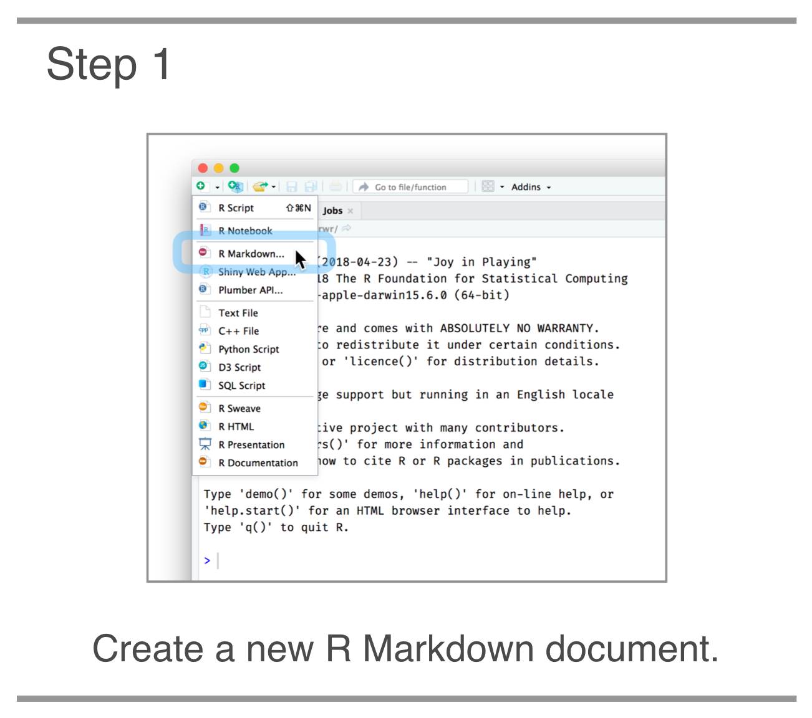
```

**STEP 1**. The first thing to do is create a new **R Markdown** document. This is conveniently done through the *New File* dropdown button (top left of IDE). A new **R Markdown** document is the third choice from the top.

<hr>

```{r walkthrough-2, echo = FALSE}
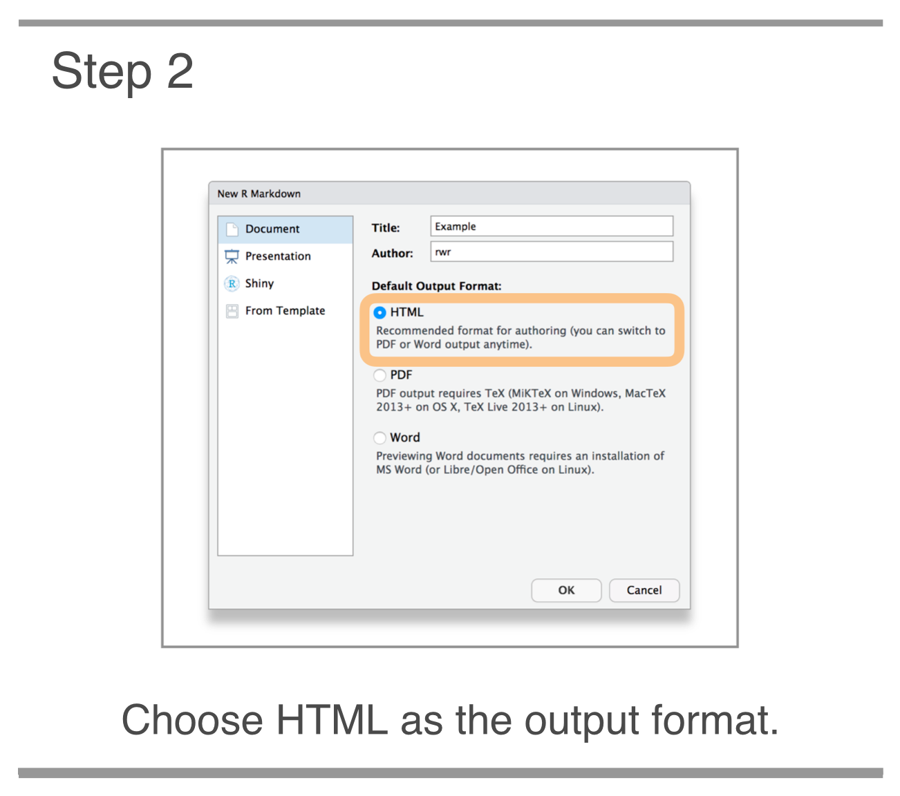
```

**STEP 2**. You'll be presented with a dialog box and some options. The default option of HTML is what we want for this walkthrough, so hit Enter or the *OK* button. A new, untitled **R Markdown** document will appear in the Source pane (the top-left pane).

<hr>

```{r walkthrough-3, echo = FALSE}
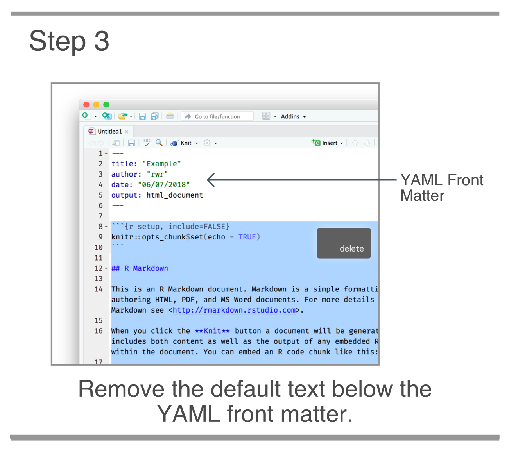
```

**STEP 3**. We should delete everything in this default document except for the useful YAML Front Matter (i.e., the text enclosed by three hyphens). Then save the document as an .Rmd file. Saving is necessary before rendering and is generally considered a good practice (though RStudio will always keep your unsaved documents across sessions).
  
<hr>

```{r walkthrough-4, echo = FALSE}
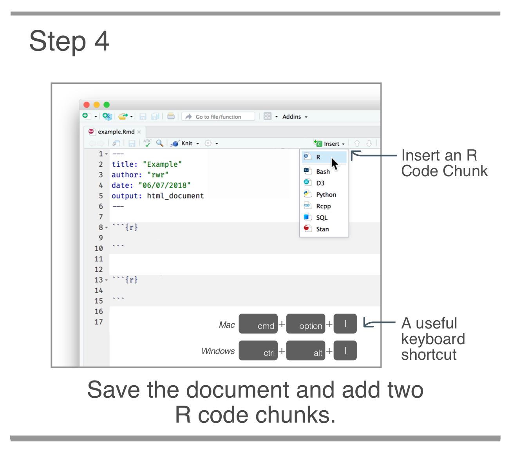
```

**STEP 4**. Now, place the insertion point in the document below the YAML and insert two **R** code chunks. This can be done through the *Insert Code Chunk* button or the handy keyboard shortcut `Command` + `Option` + `I` (`Control` + `Alt` + `I` on Windows). You'll see two text areas enclosed by backticks and the language of the code in curly braces: `{r}`.

<hr>

```{r walkthrough-5, echo = FALSE}
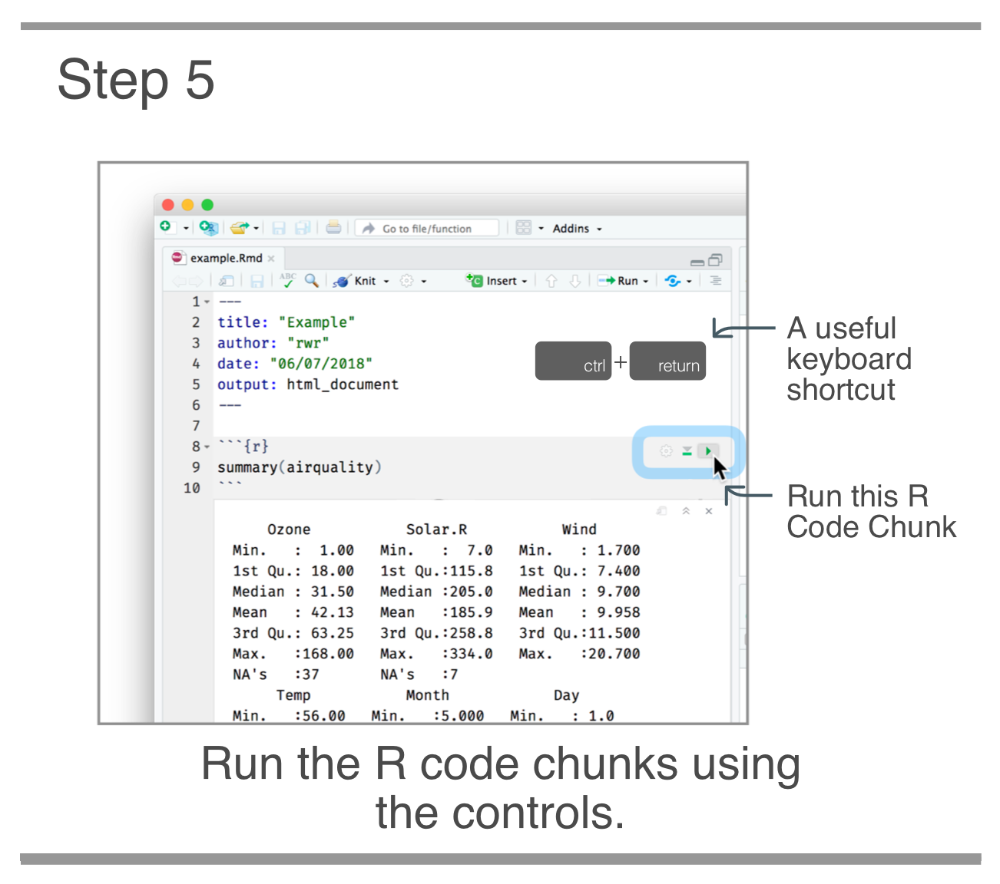
```

**STEP 5**. Now we can do some writing of code. Place the insertion point inside the first **R** code chunk and type `summary(airquality)` (this is a built-in **R** dataset and is always available). Then, run the code in that chunk by pressing the green run button, or, with the keyboard shortcut: `Control` + `Enter`. You'll see a summary of data appear below! Running the code and verifying the output matches expectations is a great practice (although running each code chunk is not necessary for rendering the **R Markdown** document). We'll do something similar in the second code chunk. First type in this plotting code.

  ```{r}
  plot(x = airquality$Temp, y = airquality$Ozone)
  ```

After running this code chunk, we'll see a plot showing the effect of temperature on ground level ozone concentrations (conveniently right below the code chunk).

<hr>

```{r walkthrough-6, echo = FALSE}
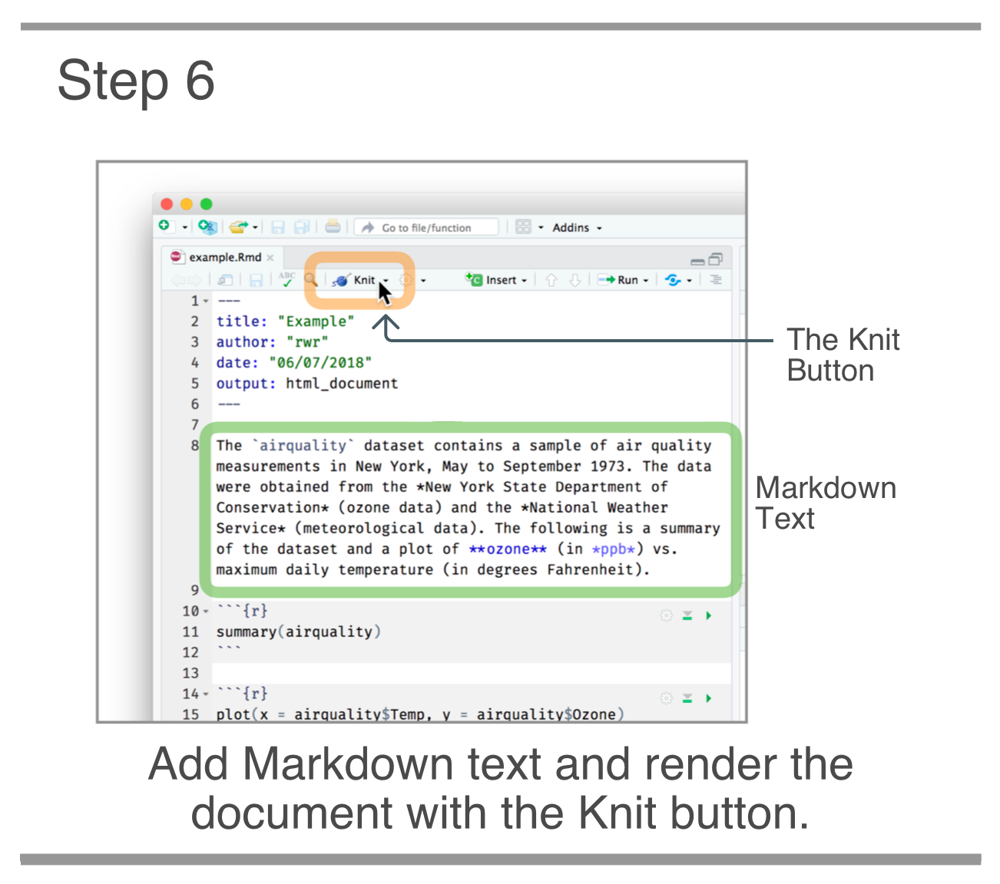
```

**STEP 6**. To make this document function as a report, let's add some text above and below the **R** code chunks. Here is the Markdown text that could be put in above:

```
The `airquality` dataset contains a sample of air quality measurements in New York, May to September 1973. The data were obtained from the *New York State Department of Conservation* (ozone data) and the *National Weather Service* (meteorological data). The following is a summary of the dataset and a plot of **ozone** (in *ppb*) vs. maximum daily temperature (in degrees Fahrenheit).
```

The Markdown text for below the code chunk can be:

```
For more information on this dataset, use `help(airquality)` in the R console.
```

Inside the IDE, this just looks like plaintext with some highlighting applied when using asterisks or other Markdown elements. Let's render the document by pressing the *Knit* button that is on the toolbar.

<hr>

That will produce an HTML document with the same name as the **R Markdown** document (in the directory where the .Rmd file was saved) and the process opens a preview window with the HTML report (*Figure \@ref(fig:rmarkdown-html-output)*).

```{r rmarkdown-html-output, echo = FALSE, fig.cap = "The rendered HTML document based on the **R Markdown** document. The preview window provides a way to easily look over the output initiated by a *Knit*."}
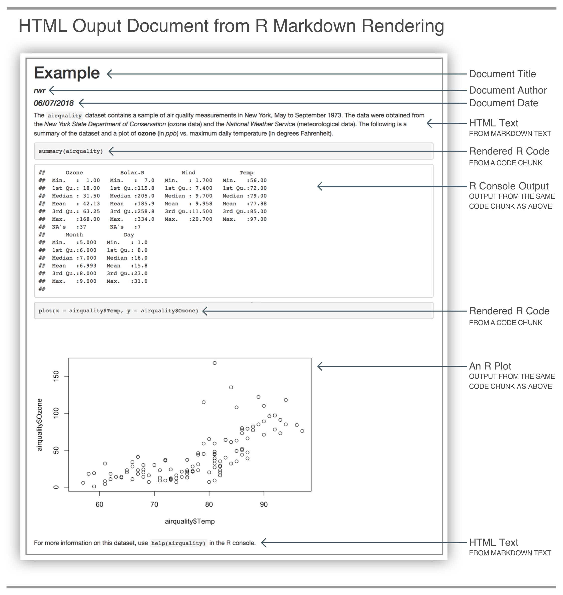
```

It's here where you can see that the Markdown elements become things like bold and italicized text. That rendered text appears above and below the code and the outputs, just as it was in the **R Markdown** document. It's also here where its more apparent that **R Markdown** is indeed useful for working with data and also for creating reports.

## Our Learning Path

When working on a data analysis project what you'll often find is that the activities of data cleaning and transformation take up the bulk of the time. Data is often messy, so we need to clean it before we analyze it. Once we clean the data we usually can't jump directly to visualization. We first have to manipulate the cleaned-up dataset. This can involve many things like restructuring, filtering, sorting, summarizing, or combining the dataset with other datasets.

To make all of this much easier, we can and should adopt a way to store data and use our data manipulation tools that will minimize the effort involved when preparing data for analysis and visualization. Throughout this book, we'll adopt the tenets of tidy data. One of the greatest, direct benefits of tidy data is that we can use tidy tools to process tidy data. Tidy tools will accept, transform, and return tidy data. All of this is great because we are able to maintain the best parts of the tidy data structure while also reducing the need for additional data manipulation. The **R** language has a great set of tidy tools that we'll be using throughout this book: the *Tidyverse*.

The *Tidyverse* (<https://www.tidyverse.org>) is a collection of **R** packages designed for working with tabular data. These packages work well together, and, they all share an underlying design philosophy. By installing the tidyverse package, we get the entire collection of **R** packages under the *Tidyverse* umbrella.

The skills we need to learn are closely tied to the packages that provide us with the toolsets for the task at hand. The diagram presented as *Figure \@ref(fig:workflow)* outlines the basic data analysis and reporting workflow. It is annotated with the packages that we'll learn and use in different chapters of this book.

```{r workflow, echo = FALSE, fig.cap = "A typical workflow in a data analysis task or project. We begin by importing and tidying the data, enter into a cycle of transformation, visualization, and modeling, then we conclude by reporting our findings. All the while, we use our **R** programming skills along with functions from various packages."}
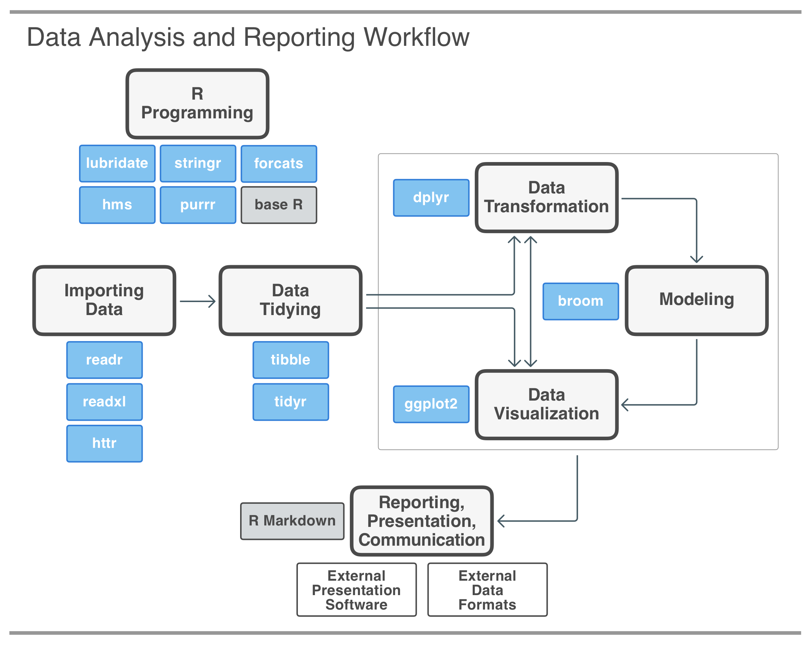
```

Throughout this book, we'll use *Tidyverse* packages and several other packages to perform a range of data-related tasks. These include data collection, data transformation, and data visualization. We will learn when it's appropriate to write our code inside **R Markdown**, **R** scripts, or in the **R** console. As **R Markdown** is a great medium for data exploration and for communication so we will be predominantly working in that format. Taken all together, the combination of **R** programming, **R** packages, and **R Markdown** makes for a very powerful and effective toolset for working with the data you'll encounter in the real world.

The lessons from each of the chapters are available in a **GitHub** repository (<https://github.com/rich-iannone/edr>). That public repository also contains the source code for an **R** package called **edr** that we'll need to install before experimenting with the **R** code presented throughout the book. Aside from the **R Markdown** files available in the repo's /rmd folder, the package gives us access to the datasets and specialized functions that we'll see and use in the upcoming lessons. Given that installing the **tidyverse** and **edr** packages is central to running the code in this book, that whole process will be one of the first skills taught in *Chapter 2*.

## Where to go for Help

Getting help in an unfamiliar programming language is something you'll undoubtedly need to do quite regularly. *Google* (or any other leading search engine) will be indispensable for typing in keywords that relate to the problem at hand. At first, you may not know how to describe your problem. That's natural, so don't worry. A good strategy is to type in something descriptive using a few more words than usual. The search results may lead you to discover some terminology that more succinctly describes your problem. Chances are good that you'll get a few *Stack Overflow* (SO) pages. Stack Overflow (<https://stackoverflow.com>) really is a great resource for **R** questions and answers.
  
Take a look at a few of the SO pages and see if the original poster (OP) had the same problem as yourself. If you find that to be the case, take a look at some of the answers (usually text explanations and a block of code). Copy the code and try it out. It's should be self-contained and reproducible, meaning that the block should run from a simple copy and paste. You'll likely need to adapt that code to fit your problem but you're well on your way at this point.

It may well be that you cannot find a question that matches your particular issue. This situation is a bit tougher to deal with and not uncommon. I suggest skimming through some of the search results for clues on how to search again. It may be a found phrase that comes closer to your issue or some terminology that seems to fit. Experiment with searching again using these variations, you may get search results (again, ideally *Stack Overflow* pages) closer to the mark.

While *Stack Overflow* is quite effective, it's not the only way to get help. Far from it. You can also engage more directly with the **R** community through *Twitter*. It's an excellent way to interact with people that are both friendly and enthusiastic about **R**. The `#rstats` hashtag is often used in tweets focused on all things **R**. So, be not afraid: introduce yourself and ask away (again, use `#rstats` in your tweet for extra visibility). You might be surprised at how cordial and welcoming the community is!

The *RStudio Community* website (<https://community.rstudio.com>) is also a great place to ask questions and get unstuck. It's quite active and you're sure to get a quick response. There is also the distinct advantage that for whatever you're searching for will be **R** related.

It's hard to get a sense of how **R** can help you do before you get down to using it. Getting started is probably the hardest part but we have a defined learning path and, so long as **R** and **RStudio** are installed and using **R Markdown** doesn't feel cryptic, we are well on our way!

## Summary

- Installing **R** (the language) and installing the **RStudio Desktop** IDE are two separate tasks than can be done in any order
- We will use **RStudio** to work with **R** throughout this book
- **R Markdown** is a way to run **R** code and create a report from a combination of prose and code
- Our learning path is largely centered around **R** packages (mainly from the *Tidyverse* collection), which are focused collections of functions for doing a particular type of work
- The best places to go for help when you inevitably get stuck with an **R** problem are *Stack Overflow* (via a search engine), *Twitter*, and *RStudio Community*
