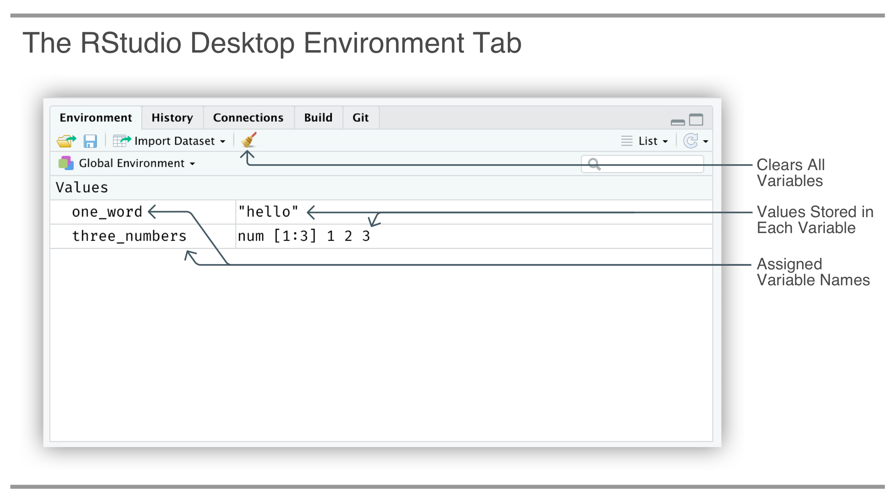

# Introductory Data Transformation with **dplyr** {#intro_transformation_dplyr}

```{r setup, include=FALSE, echo=FALSE}
library(edr)
library(tidyverse)
```

This chapter covers

- learning the basics of assigning values to variables
- installing and loading packages from **CRAN** and **GitHub**
- accessing datasets and understanding the basic elements of a table
- using the **dplyr** `filter()` function, with expressions that filter a table to only the rows you need
- reordering rows with the **dplyr** `arrange()` function
- performing several column-selection operations with **dplyr**'s `select()` function
- creating new table columns (or modifying existing ones) with `mutate()` and carefully crafted expressions
- summarizing tabular data with the combination of `group_by()` and `summarize()`

We will start off by getting our bearings with assignment of variables in **R**. Later in the book, we'll certainly get the opportunity to learn more programming fundamentals, however assignment is one of those topics that should be addressed right away. Then, the installation of packages will be covered. This will give us the chance to install the packages that are required for the book: **tidyverse**, **edr**, and **devtools**.

The rest of the chapter is devoted to learning a skill that is very important: transforming tabular data. Of all the skills you will learn in this book, the value of this one cannot be understated. A bit more than the usual amount of time will and should be spent on this.

The **edr** package will give us the dataset needed for the examples in this chapter: `sw`. This dataset is a modified version of the `starwars` dataset that is available in the **dplyr** package. Whenever we load in the **edr** package using `library(edr)`, the `sw` table will be available for use. This particular dataset has 87 rows, one for each Star Wars character, and the following 8 variables (or columns):

- `name`: the name of the character
- `height`, `mass`: the character's height and weight (in centimeters and kilograms)
- `hair_color`: a description of the character's hair color, where available
- `gender`, `homeworld`, `species`: the character's gender, homeworld (i.e., a planet name), and species

We will learn how to install packages like **tidyverse**, **edr**, and devtools in *Section 2.1.2*. Once you've gotten the hang on that (and those packages are installed), more information on the `sw` dataset can be obtained by executing `?sw` in the **RStudio** console (a help page will appear).

## Programming Basics and Package Installation

Before we get to the fun stuff, it's best if we first get acquainted with two things: (1) the programming concept of assignment, and (2) installing packages. We will have a more in-depth look at **R** programming later in the book and just touch upon the basics for now. In **R**, installing and using packages is commonplace and thus a fundamental skill, so a few packages will be installed in this chapter.

### The Basics of Assignment

Let's create a new **R** script using the New File icon in the **RStudio** toolbar. Now we can type lines of code in the open **R** Script document in the Source pane, and, also execute individual statements or regions of code by selecting them (as you would select text in a word processor) and using the *Control* + *Enter* shortcut.

We assign values to variables (that we name ourselves) by using the leftward arrow `<-`. Many different types of data can be assigned to a variable. They can be single values, a vector of values (within the `c()` function, which combines individual values of the same type), or, more complex objects like tables (we'll get to that in the next section). Let's have a look at three examples.

We can assign the single number `5` to the variable called `a_number`. Executing the line with just the variable name prints the value `5` in the console (the assignment line itself will show nothing in the console).

`r edr::code_hints(
"**CODE //** Assigning a single number to ~~a_number~~.",
c(
"#A This is the assignment of the number ~~5~~ to the variable called ~~a_number~~.",
"#B Executing just ~~a_number~~ by itself returns the values held by the variable."
))`
```{r a-number-assign}
a_number <- 5  #A
a_number  #B
```

Inside of the code listing, the console output is shown. Whenever you see `#>` in this book, it means we are looking at what the console returned to us.

Multiple values (of the same type, like numbers or character strings) can be put together (with the `c()` function) as a vector and assigned to a single variable. An example of this is shown in the following code listing.

`r edr::code_hints(
"**CODE //** Assigning a vector of three numbers to ~~three_numbers~~.",
c(
"#A Assignment of a vector of numeric values (using ~~c()~~, to *combine*). The name ~~three_numbers~~ is just a name that was made up; it could easily have been called ~~foo~~."
))`
```{r three-numbers-assign}
three_numbers <- c(1, 2, 3)  #A
three_numbers
```

Shown again, just above, is the console output. We are getting back the values we put into `three_numbers`.

Character strings can be assigned to variables. In the next example, the single string `"hello"` is assigned to `one_word`.

`r edr::code_hints(
"**CODE //** Assigning a character string to ~~one_word~~.",
c(
"#A We need quotes to distinguish character strings from variables. While you can use single quotes, I recommend adopting double quotes as used here."
))`
```{r one-word-assign}
one_word <- "hello"  #A
one_word
```

The console output shown above consists of all values in `one_word`: `#> [1] "hello"`.

A good way to check that the variables were actually defined is to look at the *Environment* tab in the top-right pane of **RStudio** (*Figure \@ref(fig:environment-tab)*). The names of the variables will appear here as they are assigned, and, you also get an indication of the value attached to the variable.

```{r environment-tab, echo = FALSE, fig.cap = "The *Environment* tab in **RStudio** is a great way to quickly see which variables have been assigned and what their values are (space permitting)."}

```

We can overwrite any variable currently assigned. This is done by assigning a value to any variable name that was previously assigned. In the next example, we'll overwrite the `one_word` variable with `"hi"` and inspect the variable by printing it.

`r edr::code_hints(
"**CODE //** Replacing the ~~one_word~~ variable with a different value.",
c(
"#A Assigning any value to an already assigned variable. Here, **R** will simply overwrite the previous value in ~~one_word~~, and, **R** won't inform you that ~~one_word~~ was previously assigned."
))`
```{r one-word-new-assign}
one_word <- "hi"  #A
one_word
```

The return value in the console is now `"hi"`, or, `#> [1] "hi"`. The *Environment* tab in **RStudio** will show us this change after executing the first statement in the previous code listing. The execution, or printing, of just the variable `one_word` further confirms this in the console.

### Installing and Loading Packages in R

**R** packages contain functions and datasets that extend the usefulness of **R**. It's very common to want to install and use numerous packages to address different problems. Packages can be installed from both **CRAN** and **GitHub**, so, there are two methods for installing from both places. **CRAN** packages are often considered to be 'stable' versions and these can be installed using `install.packages()`.

We need to install the **tidyverse** package, which installs all of the *Tidyverse* packages (plus numerous other packages that are dependencies), and we can use `install.packages("tidyverse")` in the **R** console. This installs the **tidyverse** meta-package and all of the *Tidyverse* packages like **dplyr**, **ggplot2**, **readr**, and more.

To actually load the packages in your **R** session, we need to use the `library()` function for each package. Each `library()` call typically goes on its own line at the top of an **R** script or **R Markdown** document. We'll be reminded of `library()` quite often throughout this book.

We can install packages from **GitHub** by using the `install_github()` function from the **devtools** package. Let's first install devtools from CRAN with `install.packages("devtools")`.

Next, let's install the **GitHub** package that is essential for this book, edr, by using library(devtools) and then `install_github("rich-iannone/edr")` in the **R** console. This package contains datasets, functions, and useful source files pertaining to this lesson and the lessons ahead.

The reason that `library(devtools)` was used right before the `install_github()` statement is because this ensures that the `install_github()` function is loaded and available in the session before calling it in the next line.

an aside (info)
Do you have an older installation of **R** and/or **RStudio** and having some trouble installing packages? I recommend getting a newer version of both **R** and **RStudio** and trying again. Package installation is usually a snap but older versions of **R** can sometimes pose this sort of problem.
/aside

## Using **dplyr** to Transform Data

While visualizing your data is useful for generating insights, it's not common that you'll initially have the data in exactly the form you need. It's far more likely that you first will have to create some new variables or generate some summaries before plotting the data. So, we'll get to visualization in the next chapter and learn all transforming our data first. The process of data transformation is made easier in **R** by using the **dplyr** package. We'll learn how to use only a few functions from **dplyr** to modify a dataset in several useful ways.

### The Main **dplyr** Functions

There are five key **dplyr** functions that can help us solve the vast majority of data manipulation tasks:

- `filter()` — Pick observations by their values
- `arrange()` — Reorder the rows
- `select()` — Pick variables by their names
- `mutate()` — Create new variables with functions of existing variables
- `summarize()` — Collapse many rows down to a single summary

These can be used in conjunction with the `group_by()` function, which tells dplyr that it should be operating on data group-by-group (i.e., with collections of rows). Taken together, these functions enable a cohesive language of data manipulation.

All these functions generally work the same, where

1. the first argument is the data
2. the subsequent arguments describe what to do with the data
3. the result is a new data table

Eventually we'll see that we can chain together multiple simple steps to achieve a complex result but, first, let's just see how each of these functions work in isolation.

Through the rest of this chapter, let's work with **dplyr** in the context of an **R Markdown** document. In Listing 2.5, we'll create a new **R Markdown** document and include this **R** code chunk just after the YAML header.

`r edr::code_hints(
"**CODE //** Loading the **tidyverse** and **edr** packages.",
c(
"#A Loading the **tidyverse** package like this actually auto-loads all core **tidyverse** packages (this is almost everything we'll need for the entire book!.",
"#B The **edr** package is this book's namesake package. It has the datasets we need for all of the examples."
))`
```{r load-tidyverse-edr, eval=FALSE}
library(tidyverse)  #A
library(edr)  #B
```

The following is the console output which, in an **R Markdown** document, appears just below the code chunk (as chunk output).

```
#> ── Attaching packages ──────────────────────────── tidyverse 1.2.1 ──
#> ✔ ggplot2 3.0.0     ✔ purrr   0.2.5
#> ✔ tibble  1.4.2     ✔ dplyr   0.7.6
#> ✔ tidyr   0.8.1     ✔ stringr 1.3.1
#> ✔ readr   1.1.1     ✔ forcats 0.3.0
#> package 'dplyr' was built under R version 3.5.1── Conflicts
#> ───────────────────────────────────── tidyverse_conflicts() ──
#> ✖ dplyr::filter() masks stats::filter()
#> ✖ dplyr::lag()    masks stats::lag()
```

After running the chunk (using `Shift` + `Control` + `Enter` or the *Run Current Chunk* button), you might see messages relating to conflicts: this is entirely normal and expected (so don't worry about it). Now these packages are loaded, and all of their functions are available to use.

We'll continue the practice of writing new **R** code chunks and running them interactively in an **R Markdown** document. The *Environment* pane in **RStudio** will fill up with variables and objects during this progression. Whenever in doubt about whether a variable has or hasn't been assigned during this sort of ad-hoc data analysis, it is recommended to use the **RStudio** menu option *Session >> Restart R and Clear Output*. This provides a clean slate where you can then run the chunks from top to bottom.

### The `sw` Dataset and the Elements of a Table

The dataset with the name `sw` is provided by the **edr** package. That is, once **edr** is loaded in the session with `library(edr)`, the `sw` dataset will be available. **R** considers datasets to be important components of packages since they are valuable for testing out a package's functions. It may seem odd, but we can treat `sw` like a variable that doesn't have to be explicitly assigned by the user. In the followung code listing, we see that just by entering `sw` in the console, its output is provided.

`r edr::code_hints(
"**CODE //** The ~~sw~~ dataset can be printed to the console by using ~~sw~~.",
c(
"#A So long as we have the **edr** package loaded in (with ~~library(edr)~~), we have access to the ~~sw~~ dataset. Executing ~~sw~~ (a *tibble*) prints it and shows us some of its values."
))`
```{r sw-tibble-print}
sw  #A
```

The `sw` dataset is a *tibble* object, a special implementation of a *data frame* (a tibble prints its data differently, filling the entire width of the console). We'll learn a bit more about tibbles in a later section, especially in how else they differ from data frames. For `sw`, there are more rows in the data than what is shown (we see 6 rows, but there are 81 more that aren't displayed).

The returned console output for `sw` has a lot of information. This is a good opportunity to take some time to understand this type of output. The very first line describes the type of object returned, which is a tibble, and it also provides the dimensions of the table (87 rows and 8 columns, or, variables). The second line shows the table's column names, and the line below that describes each column's type:

- `<chr>` is for character (or text) data
- `<int>` is for integer (numbers without decimal places),
- `<dbl>` is for double-precision values which are numeric, except they have a decimal component unlike integers

Depending on the width of your editing pane, the printing of the tibble might show more or less of the table data. Columns that don't fit in the print area are mentioned at the bottom (e.g., `... with 3 more variables: ...`) and, with smaller widths of the console or **R Markdown** editing pane, data in some columns will be more truncated (e.g., showing `Obi-Wan Ken...` instead of the full name of `Obi-Wan Kenobi`). While this is intentional, we may want to inspect just a little bit more of the data values. One quick fix is to manually widen the output area (by dragging the center, vertical pane in **RStudio** left or right) and print the output again. The extra width will provide more space for the individual columns and the output may even show you data in more columns.

Sometimes, you'll discover a dataset in a package, look at it, and have no context for what the columns are supposed to be indicating. Datasets in **R** usually have internal help documents that explain the dataset in some detail. Try typing in `help(sw)` or `?sw` in the console, the help document will appear in the Help section in the bottom-right pane in **RStudio**.

You may have noticed a few of the values in the printed dataset show as `NA`. Those indicate missing values, perhaps where no observation exists for a particular variable in a row. We can have `NA` values for all different types of columns (e.g., `character`, `numeric`, etc.).

### filter: Picking Observations by their Values

The `filter()` function allows you to generate a subset of rows with a filtering expression. Let's filter the `sw` dataset in the same **R Markdown** document that we started earlier and get back only those rows where the species is `"Droid"`. The expression to use is `species == "Droid"`. The first argument is the name of the data to transform: `sw`.

`r edr::code_hints(
"**CODE //** The ~~filter()~~ function, and filtering by a single value in the ~~species~~ column of the ~~sw~~ dataset.",
c(
"#A The first value given to ~~filter()~~ is the data, which is ~~sw~~; the filtering expression comes next."
))`
```{r sw-filter-droid, paged.print=FALSE}
filter(sw, species == "Droid")  #A
```

The table prints out after this transformation (because it wasn't assigned to a variable). We see from the output that returned table seems to have just those species that are of the `"Droid"` type.

Filtering expressions are often performed by using comparison operators. The main ones are:

- `==` (equal),
- `!=` (not equal), 
- `>`, `>=` (greater than and greater than or equal to),
- `<`, `<=` (less than and less than or equal to),
- `%in%` (part of a set)

Let's look at an example using a greater than (`>`) comparison operator. To get a filtered table with all characters with a height more than 220 centimeters, we need to use `height > 220`.

`r edr::code_hints(
"**CODE //** Filtering to only keep rows where the ~~height~~ column has values greater than 220.")`
```{r sw-filter-height-gt-220, paged.print=FALSE}
filter(sw, height > 220)
```

Just by scanning the `height` column we can see that all values are greater than `220`.

There are also logical operators and they can be used to link together filtering statements. These operators consist of the following set:

- `&` (the *AND* operator)
- `|` (the *OR* operator)

The following code filters all Star Wars characters in the `sw` table to those that either have height above `210` or a mass above `120`.

`r edr::code_hints(
"**CODE //** Filtering characters by either ~~height~~ above ~~210~~, or, ~~mass~~ above ~~120~~.")`
```{r sw-height-mass, paged.print=FALSE}
filter(sw, height > 210 | mass > 120)
```

We get back 10 rows (out of 87) with the filtering expression used here. Note that `NA` values in the `mass` column are preserved. These rows are present because even though `mass` is clearly not greater than `120` (it's missing!), `height` is still greater than `210`.

The next code listing provides another common filtering scenario, where we get just the `"Droid"` and `"Human"` species. This subset table can be gotten with at least two different `filter()` statements. Here is an example that uses two expressions with an *OR* (`|`) operator.

`r edr::code_hints(
"**CODE //** Get all Droid and Human characters (method 1 with a ~~[expr | expr]~~ construction).",
c(
"#A This is our second use of the OR operator (~~|~~), which can be confusing until you think of it in terms of 'include either this or that'."
))`
```{r sw-species-or, paged.print=FALSE}
filter(sw, species == "Droid" | species == "Human")  #A
```

The tibble that's printed shows that, at least in the first 6 rows, each character is either a Human or a Droid.

Next, in Listing 2.11, we provide the better way to get the same result, which is to look for occurrences in a set (defined with the help of c()). So, instead of using species twice in our statement, we can use the %in% operator in a single expression.

`r edr::code_hints(
"**CODE //** Get all Droid and Human characters (method 2 with ~~[colname %>% c(...)]~~ construction).",
c(
"#A This statement gets us exactly the same output as before. It might be an easier statement to write out and to reason about. We can think of it as 'the column must contain any of this set of values to be kept'."
))`
```{r sw-species-in, paged.print=FALSE}
filter(sw, species %in% c("Droid", "Human"))  #A
```

We get the same output as before. The `%in%` operator checks for membership in a set (here, `"Droid"` and `"Human"` in the `species` column). This use of `%in%` is preferred over multiple `|` operators because there's less redundancy, it's much more readable, and it is less error prone to write.

### arrange: Reordering Rows

Sometimes, you'll want to sort your data. The `arrange()` function makes this possible and it works just like `filter()` except that instead of selecting rows, it changes their order. It takes the table and a set of column names to order by. If more than one column name is given, each additional column will be used to break ties (if there are still remaining ties, then the original ordering is preserved). Let's arrange the `sw` dataset by the `height` of its characters.

`r edr::code_hints(
"**CODE //** Arranging characters by increasing ~~height~~.",
c(
"#A Like the ~~filter()~~ function (and really, this applies to all of **dplyr**'s main functions), the first value to give to ~~arrange()~~ is the data: ~~sw~~."
))`
```{r sw-arrange-height, paged.print=FALSE}
arrange(sw, height)  #A
```

We can see from this snippet of data (6 of 77 rows) that `height` is increasing (ascending) from top to bottom.

Arranging rows by multiple columns can be a common task and the next example arranges by two different character-based (`<chr>`) columns: `hair_color` and then `gender`.

`r edr::code_hints(
"**CODE //** Arranging characters by ~~hair_color~~ and then by ~~gender~~.",
c(
"#A We can keep adding column names, separated by commas, to further specify the priority of ordering."
))`
```{r sw-arrange-twice, paged.print=FALSE}
arrange(sw, hair_color, gender)  #A
```

The sorting is alphabetical and first ordering on `hair_color` and then ordering on `gender` for those groups of rows with the same `hair_color` value. Notice that, in the output, for all the rows where `hair_color` is `"black"`, the sorting of rows is by `"female"` first then `"male"` after that.

We can change the order of any variables to descending with `desc()`. Let's modify the previous example so that `hair_color` is sorted in reverse and gender is still ascending in order.

`r edr::code_hints(
"**CODE //** Arranging by descending ~~hair_color~~, then by ascending ~~gender~~.",
c(
"#A Arranging a column in descending order requires a modifier, and we use the ~~desc()~~ helper function to indicate that those columns that should be sorted in that way."
))`
```{r sw-arrange-twice-desc, paged.print=FALSE}
arrange(sw, desc(hair_color), gender)  #A
```

We immediately notice that the first few rows have a `hair_color` value of `"white"` (i.e., near the end of the alphabet) and also that `gender` is indeed sorted in alphabetical order (within the `hair_color` subgroups).

A final note about the `arrange()` function: `NA` values will always be sorted last, and, using `desc()` doesn't affect that. Why? Because there is nothing to sort by. `NA` values are lumped together at the end (although their initial ordering is preserved). And while we are on the topic of `NA` values, in the above tibble printing, one of the `hair_color` values should be assigned as an NA value. Which one? The `"unknown"` one for Captain Phasma. The `hair_color` values of `"none"` are perfectly fine as they are because those observations were actually made (of no hair color because, no hair).

### select: Picking Variables by their Names

It's not unheard of to be working with datasets having dozens, hundreds, or even thousands of variables. If you're exploring such a dataset, at some point you'll likely need to focus on a few variables at a time. The `select()` function allows us to obtain a useful subset of variables, and, it's easy to use: provide the names of the variables you want to keep.

Let's run through a few examples so we can get the general idea. The first example shows how we can get just 3 columns (`name`, `gender`, `species`) from the 8 available. 

`r edr::code_hints(
"**CODE //** Selecting the ~~name~~, ~~gender~~, and ~~species~~ columns.",
c(
"#A With ~~select()~~ we first supply the data (~~sw~~), and then the columns we want to keep. We separate each name with a comma."
))`
```{r sw-select, paged.print=FALSE}
select(sw, name, gender, species)  #A
```

Indeed, we find columns remain in the transformed table. Also note that the order in which the variables are provided is preserved in the output.

Because the order of variables matters, we can create a slightly different output table with the same columns. In the next code listing we will see that the order of the variables provided will result in same ordering of variables in the output table: `gender`, `species`, and then `name`.

`r edr::code_hints(
"**CODE //** Selecting the ~~gender~~, ~~species~~, and ~~names~~ columns (in that order).",
c(
"#A We are keeping the same columns, but they appear (left to right) in the order we specify: ~~gender~~, ~~species~~, ~~name~~."
))`
```{r sw-select-revised, paged.print=FALSE}
select(sw, gender, species, name)  #A
```

The output table shows that the order of columns is that which was specified in the `select()` call.

There are a handful of helper functions you can use within `select()`:

- `starts_with()`: matches column names that begin with certain characters,
- `ends_with()`: matches column names that end with specific characters, and
- `contains()`: matches column names that contain a sequence of characters.

There aren't any variables in `sw` that share a common beginning but there are more than a few with common endings. Let's get the `name` column first and then any columns that end with the letter `"s"`.

`r edr::code_hints(
"**CODE //** Selecting the ~~name~~ column and any additional columns ending with ~~\"s\"~~.",
c(
"#A We want to keep the ~~name~~ column (appearing first, at the left) and then all columns with those names ending in the letter ~~\"s\"~~ (in the order they originally appear)."
))`
```{r sw-select-ends-with, paged.print=FALSE}
select(sw, name, ends_with("s"))  #A
```

As we expect, we get the column called `name` first then all of the columns ending with `"s"`, in the order that those last two columns appeared in the original dataset.

Noting that there are a few columns in `sw` that contain the underscore (`"_"`) character, let's try using the `contains()` helper function for quickly selecting those column names (along with `name`).

`r edr::code_hints(
"**CODE //** Selecting the ~~name~~ column and any additional columns containing an underscore.",
c(
"#A The ~~name~~ column comes first. Any column names containing an underscore character will follow (in their original order)."
))`
```{r sw-select-contains, paged.print=FALSE}
select(sw, name, contains("_"))  #A
```

Aside from the `name` column, we see the columns with underscores populating the rest of the tibble printout.

If ever we want to put a few columns near the start and keep other columns in the same order then the `everything()` select helper function is useful for this.

`r edr::code_hints(
"**CODE //** Selecting three specific columns and then ~~everything()~~ else after that.",
c(
"#A Three columns are selected directly by their names, then, all remaining columns come after those in their original order (captured by ~~everything()~~)."
))`
```{r sw-select-w-everything, paged.print=FALSE}
select(sw, name, homeworld, gender, everything())  #A
```

Here we notice that we do get the `name`, `homeworld`, and `gender` columns first, and then every other remaining column (in their preserved order):

These select helper functions are very useful. They save us having to carefully type out every column name, which can be arduous and error-prone if we have a very large number of columns.

### mutate: Creating New Variables with Expressions

We can create new columns of data with `mutate()`. It adds the new variables at the end of the table, so, let's prepare a narrower version of `sw` by using `select()`.

`r edr::code_hints(
"**CODE //** Create the ~~sw_small~~ table containing just three columns.",
c(
"#A We ~~select()~~ three columns from ~~sw~~ and assign the resulting table to ~~sw_small~~.",
"#B Executing the newly made variable (~~sw_small~~) displays that smaller table in the output."
))`
```{r make-sw-smaller, paged.print=FALSE}
sw_small <- select(sw, name, height, mass)  #A

sw_small  #B
```

Now, let's take the new `sw_small` table and create a new column called `bmi` and calculate the body mass index for all characters in the next code listing. The mathematical expression uses column names to generate a row-wise calculation result. Here we use the right-hand side (RHS) expression: `mass / (height / 100)^2`. On the left-hand side (LHS) of the expression is the new column `bmi`.

`r edr::code_hints(
"**CODE //** Add the ~~bmi~~ column to ~~sw_small~~ using the ~~mutate()~~ function.",
c(
"#A The ~~mutate()~~ function takes data first (~~sw_small~~) and then an expression that creates the new column ~~bmi~~. The expression uses values from the ~~mass~~ and ~~height~~ columns and places the results in the ~~bmi~~ column."
))`
```{r mutate-bmi, paged.print=FALSE}
mutate(sw_small, bmi = mass / (height / 100)^2)  #A
```

We can see that the column `bmi` is now available to the right of the original columns `name`, `height`, and `mass`. All new columns that are created by `mutate()` are placed at the end (which is to the right). The `bmi` column has values in every row (this is a double-type variable, since `mass` is of the type `double`). 

It turns out that the `mutate()` function is very powerful. We can have multiple mutations in a single call of `mutate()`. What's even more interesting (and useful) is that a variable created in an expression is immediately available for use in a following expression (in the same `mutate()` call).

`r edr::code_hints(
"**CODE //** Add the ~~bmi~~ column as before and then create ~~bmi_rnd~~.",
c(
"#A This ~~mutate()~~ statement is a bit longer than the last so let's split it over a few lines.",
"#B The data is given first.",
"#C This expression creates the ~~bmi~~ column and its values (just like in the last example).",
"#D The second expression creates the ~~bmi_rnd~~ column, a rounded version of ~~bmi~~ (with no decimal places)."
))`
```{r mutate-bmi-round, paged.print=FALSE}
mutate(  #A
  sw_small,  #B
  bmi = mass / (height / 100)^2,  #C
  bmi_rnd = round(bmi, 0)  #D
  )
```

While `bmi` is calculated just as before, there is a second expression to create another column. In that second expression, `bmi` is used in a rounding statement (rounding to `0` decimal places) to create the `bmi_rnd` variable.

### summarize: Collapsing Many Values Down to a Single Summary

To get summary statistics across a set of groups we can use `group_by()` in conjunction with `summarize()`. The `summarize()` function works a lot like `mutate()` in that we can provide a new column name and a statement for its calculation. We can use several different aggregation functions inside `summarize()`: `mean()`, `median()`, `sd()`, `min()`, `max()` are the common ones. The `summarize()` function is typically used right after the `group_by()` function, which creates grouped data. Several examples will be useful to show us how this works.

Let's group by `species` and get the mean of the `mass` variable for each group. First, we'll make grouped data in a separate object and then we can generate a summary of the average mass for each species.

`r edr::code_hints(
"**CODE //** Grouping by the ~~species~~ variable and summarizing to get the mean ~~mass~~.",
c(
"#A We are using our original dataset, ~~sw~~, and grouping it by the ~~species~~ column. That's assigned to the ~~by_species~~ object.",
"#B The ~~by_species~~ object, now a grouped table, is the data for the ~~summarize()~~ statement. For each of group of ~~species~~ we get a row of the average ~~mass~~ per group."
))`
```{r group-by-summarize-mean, paged.print=FALSE}
by_species <- group_by(sw, species)  #A

summarize(by_species, avg_mass = mean(mass))  #B
```

Notice that we get two columns back: one is from the `species` group and one is from the column we defined in the `summarize()` statement (`avg_mass`).

The pattern will hold that we get all grouping columns and all summary columns back. Another observation here is that some values for `avg_mass` appear as `NA`. This occurs if any `NA` values are introduced to `mean()`, the result will invariably be `NA` (the behavior holds true for the other aggregation functions as well). To circumvent this, we can exclude `NA` values in the calculation of the mean by using the `na.rm = TRUE` option within `mean()`. Let's now revise that `summarize()` statement.

`r edr::code_hints(
"**CODE //** A slight modification to the summary expression to deal with missing (~~NA~~) values.",
c(
"#A By augmenting the ~~mean()~~ expression used inside ~~summarize()~~ some of the ~~NA~~ values are replaced with non-~~NA~~ (i.e., ~~numeric~~) values."
))`
```{r summarize-mean-na-rm, paged.print=FALSE}
summarize(by_species, avg_mass = mean(mass, na.rm = TRUE))  #A
```

Now we see that all values in the `avg_mass` column are non-`NA`, however, there is now at least one `NaN` (not a number) value. This is explainable. The cause of this stems from there not being any non-`NA` values for that species. The consequence is that a mean couldn't be calculated, so **R** returned an `NaN`.

Let's create a summary containing two grouping columns (`species` and `gender`) and two summary columns (`avg_mass` and `avg_height`) to further demonstrate what can be done with the `group_by()`/`summarize()` combination.

`r edr::code_hints(
"**CODE //** Grouping by two columns and obtaining a summary with two new columns.",
c(
"#A Grouping by two columns: ~~species~~ and ~~gender~~; each unique combination is a separate group.",
"#B This ~~summarize()~~ statement will give us four columns: two for the two different groups, and two for the summary columns (~~avg_mass~~ and ~~avg_height~~)."
))`
```{r sw-summarize-two-column-groups, paged.print=FALSE}
grouping <- group_by(sw, species, gender)  #A

summarize(  #B
  grouping,
  avg_mass = mean(mass, na.rm = TRUE), 
  avg_height = mean(height, na.rm = TRUE)
)
```

This yields four columns as we may have expected. The `summarize()` function has an interface consistent with `mutate()`, easily allowing for multiple expressions (separated by commas) where the names we provide on the LHS are the names of the new columns.

### Bringing All of This Together with the Pipe (`%>%`)

Imagine that we want to get a ranking of average BMI values for the human characters across the different home worlds. Using what you know about **dplyr**, you might write code like this

`r edr::code_hints(
"**CODE //** Bringing it all together with multiple **dplyr** functions and assigning each step to a different object.",
c(
"#A A ~~filter()~~ statement, assigning the output table to ~~humans~~ (a sensible, short name).",
"#B A ~~mutate()~~ statement, assigning the output table to ~~humans_bmi~~ (not a bad name).",
"#C A ~~group_by()~~ statement, assigning the output table to ~~humans_avg_bmi_by_homeworld~~ (kind of a long name!).",
"#D A ~~summarize()~~ statement, assigning the output table to ~~humans_avg_bmi_by_homeworld~~ (an even longer name, but it makes sense).",
"#E An ~~arrange()~~ statement, assigning the output table to... an extremely long and redundant name. I'm getting some name fatigue here.",
"#F Let's type out this terrible name once more why don't we."
))`
```{r dplyr-stmts, paged.print=FALSE}
humans <- filter(sw, species == "Human")  #A

humans_bmi <-  #B
  mutate(
    humans,
    bmi = mass / (height / 100)^2
  )                  

humans_bmi_by_homeworld <- group_by(humans_bmi, homeworld)  #C

humans_avg_bmi_by_homeworld <-  #D
  summarize(
    humans_bmi_by_homeworld,
    avg_bmi = mean(bmi, na.rm = TRUE)
  )      

humans_avg_bmi_by_homeworld_sorted <-
  arrange(humans_avg_bmi_by_homeworld, desc(avg_bmi))  #E

humans_avg_bmi_by_homeworld_sorted  #F
```

This output is fine but the code is more than a little frustrating to write because we have to give each intermediate table object a name. We're just going to use it as input to the next statement, so, we don't care much about it. As ever, naming things is hard and the process of thinking of meaningful and distinct names will invariably slow down our analysis.

There is another way! It involves using the pipe operator (`%>%`). In the next code listing, we can take a similar set of statements as above and rewrite them in a much more succinct manner (and the final table is exactly the same as before). 

`r edr::code_hints(
"**CODE //** Bringing it all together with multiple **dplyr** functions: this time using the pipe operator.",
c(
"#A Just one name to think about for the assignment!",
"#B We begin the statement with the data (~~sw~~) and pass it into the next function with the pipe (~~%>%~~).",
"#C The ~~filter()~~ statement is the first transformation step. We don't need to specify the data, ~~filter()~~ already has it thanks to the pipe.",
"#D The filtered data is given to ~~mutate()~~, because we used ~~%>%~~ just before.",
"#E The mutated table is now grouped by ~~homeworld~~.",
"#F This is the summarization step. We are passing in a grouped table to ~~summarize()~~.",
"#G Our summary table (now with two columns) is now sorted by descending values of ~~avg_bmi~~ with the ~~arrange()~~ function"
))`
```{r dplyr-piped, paged.print=FALSE}
bmi_sorted <-  #A
  sw %>%  #B
  filter(species == "Human") %>%  #C
  mutate(bmi = mass / (height / 100)^2) %>%  #D
  group_by(homeworld) %>%  #E
  summarize(avg_bmi = mean(bmi, na.rm = TRUE)) %>%  #F
  arrange(desc(avg_bmi))  #G
```

The `%>%` operator, the pipe, makes the code easier to both write and read later on. The focus is now on the transformations. A good way to reason about the pipe operator is to think of `%>%` as meaning "then". Now we can imagine reading the above code as a series of imperative statements: **filter**, and then **mutate**, and then **group**, and then **summarize**, and then **arrange**. Let's rewrite the above statement as pseudocode to make clear that we have a series of imperative statements that can be read in a left-to-right manner:

Listing 2.28. Using pseudocode to demonstrate the readability of the code in the previous listing.

`r edr::code_hints(
"**CODE //** Using pseudocode to demonstrate the readability of the code in the previous listing.",
c(
"#A This is really the previous code listing written out in prose. It\'s sometimes helpful to see it written out in this way so we can better understand what we did at a higher level."
))`
```{r pseudocode, eval=FALSE}
# Get a table of average BMI values for humans across
# the different worlds in a single, piped expression;
# The following is written as pseudocode
# (don't run it, just read it)
<assigning to bmi_sorted> <-  #A
  <start with the starwars table> %{then}%
  <keep only the rows where species is “Human”> %{then}%
  <create a new column called bmi using a calculation> %{then}%
  <create a group for each unique value in homeworld> %{then}%
  <for each group create a summary table (one col: avg_bmi)> %{then}%
  <order the rows by decreasing avg_bmi value>

<view bmi_sorted>
```

This pseudocode should roughly map to what we should be thinking when writing out **dplyr** statements. With a bit of practice, the process of transforming tabular data starts to become natural and the idea of a grammar of data manipulation begins to make more sense.

## Creating Our Own Tabular Data

The tables we often work with are called tibbles. **R** has a table type called a data frame and a tibble is a special implementation of a data frame that prints its data differently and behaves in a more consistent manner than data frames.

It's very useful to learn how to make our own tibbles from scratch. Although we customarily get our data from other sources (e.g., CSV files, database tables, **Excel** files, etc.), there are a few good reasons for wanting to handcraft our own tibble objects:

1. To have simple tables for experimentation with functions that operate on tabular data
2. To reduce the need to use **Excel** or some other data entry systems (for small enough data)
3. To create small tables that interface with larger tables (e.g., joining, combining, etc.)
4. To gain a better understanding how tibbles work under the hood

We can create tibbles in a few different ways but let's focus on tibble construction using either of two functions available in the **dplyr** package: `tibble()` and the similarly-named `tribble()`.

### Creating Tibbles with the `tibble()` Function

Let's have a look at a few examples of tibble-making first with `tibble()`, which takes in named vectors as arguments. In the following example, we use two equal-length vectors (called `a` and `b`).

`r edr::code_hints(
"**CODE //** Using ~~tibble()~~ with equal-length vectors to make a tibble.",
c(
"#A This will become column ~~a~~.",
"#B This is to be column ~~b~~."
))`
```{r tibble-all-n, paged.print=FALSE}
tibble( 
  a = c(3, 5, 2, 6),  #A
  b = c("a", "b", "g", "b")  #B
)
```

As can be seen, the type of each column is based on the type of the vector. The order of columns in the output table is based on the order of the names provided inside `tibble()`.

Let's make another tibble in a similar manner, but with a single value for `a` (the value `3` will be repeated down its column).

`r edr::code_hints(
"**CODE //** Using ~~tibble()~~ with two vectors: one of length 1 and the other of length 4.",
c(
"#A Only one value for ~~a~~! That's okay, it will be repeated.",
"#B This will become column ~~b~~, a column of ~~character~~-based values."
))`
```{r tibble-n-1, paged.print=FALSE}
tibble(
  a = 3,  #A
  b = c("a", "b", "g", "b")  #B
)
```

In the printed tibble the value `3` in column `a` is indeed repeated down.

The key is to provide either *n*-length (*n* here signifies the total number of rows in the table) or some combination of *n*-length and length-1 vectors. The length-1 value will be repeated down. Any vector with a length between 1 and *n* will result in an error.

We can also pass in `NA` (missing) values by including `NA`s in the appropriate vector. In the next example, we incorporate `NA` values in the two *n*-length vectors.

`r edr::code_hints(
"**CODE //**  Using ~~tibble()~~ with two vectors that contain ~~NA~~ values.",
c(
"#A We intentionally placed an ~~NA~~ value among other values in column ~~a~~.",
"#B There is also an ~~NA~~ value in the b column."
))`
```{r tibble-na-vals, paged.print=FALSE}
tibble(
  a = c(3, 5, 2, NA),  #A
  b = c("a", NA, "g", "b")  #B
  )
```

The resulting tibble here shows that those `NA` values in the `numeric` and `character` input vectors appear in the output tibble in their expected locations.

In the next code listing, an `NA` value is used in a vector of length 1. What will happen? Will the `NA` values be repeated down in the column? Let's have a look.

`r edr::code_hints(
"**CODE //**  Using a single-length vector with an ~~NA~~ value in ~~tibble()~~.",
c(
"#A Using a single ~~NA~~ (and nothing else) gives us a certain type of ~~NA~~: a ~~logical~~ ~~NA~~ (yes, there are different types)."
))`
```{r tibble-na-col, paged.print=FALSE}
tibble(
  a = NA,  #A
  b = c("a", "b", "g", "b")
)
```

#A Using a single ~~NA~~ (and nothing else) gives us a certain type of ~~NA~~: a ~~logical~~ ~~NA~~ (yes, there are different types).

Yes. The `NA` is repeated down the `a` column. We can see that column `a`'s type is `<lgl>`, or, `logical`.

Using just `NA` in a column does result in repeated `NA`s, however, the column is classified as a logical column (which is meant for `TRUE` or `FALSE` values, likely not was intended). If we want this column to be a `character` column, we should use a specific type of `NA`: `NA_character_`. (There are other missing value constants for other types: `NA_real_`, `NA_integer_`, and `NA_complex_`.) Let's replace `a = NA` with `a = NA_character_`:

`r edr::code_hints(
"**CODE //** Using a single-length vector with an ~~NA_character_~~ value in ~~tibble()~~.",
c(
"#A We are now being specific about the type of ~~NA~~s we want (the ~~character~~ version)."
))`
```{r tibble-na-character, paged.print=FALSE}
tibble(
  a = NA_character_,  #A
  b = c("a", "b", "g", "b")
)
```

And we get a column type of `<chr>` for `a`, which is what we wanted.

### Creating Tibbles a Different Way with the `tribble()` Function

We can use the `tribble()` function as an alternative constructor for tibble objects. This next example with `tribble()` reproduces a tibble generated in a previous code listing:

`r edr::code_hints(
"**CODE //** Creating a tibble using the ~~tribble()~~ function.",
c(
"#A As ~~tribble()~~ is very close in spelling to ~~tibble()~~, be a little careful here.",
"#B The column names are prepended by the tilde character, and we don't use quotes.",
"#C The last (hanging) comma here is fine to keep. It won't result in an error."
))`
```{r tribble-use, paged.print=FALSE}
tribble(  #A
  ~a, ~b,  #B
  3,  "a",
  5,  "b",
  2,  "g",
  6,  "b",  #C
)
```

The resulting tibble appears just as we laid out the values. As can be seen in the code listing, the table values aren't provided as vectors but instead are laid out as column names and values in manner that approximates the structure of a table. Importantly the column names are preceded by a tilde (`~`) character, and, commas separate all values. This way of building a simple tibble can be useful when having values side-by-side is important for minimizing the potential for error.

## Summary

- We learned how to assign values to variables using the `<-` operator
- Installing packages from **CRAN** can be done with the `install.packages()` function whereas packages on **GitHub** can be installed with the `install_github()` function
- Transforming a dataset can be done with these five **dplyr** functions: `filter()`, `arrange()`, `select()`, `mutate()`, and `summarize()` (with `group_by()`)
- The pipe operator (`%>%`) (which was used with the **dplyr** functions) improved the composition and readability of our **R** statements
- We can use the `tibble()` and `tribble()` functions to create our own data tables 

## Exercises

1. When you are creating a new **R Markdown** document for analysis, what set of **R** statements is likely required before any analysis?

2. What's the difference between `=` and `==`? Where should these used (and not used)?

3. What do you expect to be returned with a filter statement like `filter(sw, species == "kangaroo")`? There are no kangaroos in Star Wars, so what might happen? (Try it out.)

4. When the tibble output reads `# A tibble: 3 x 8`, what do the `3` and `8` correspond to?

5. What is the difference between these two `filter()` statements: (1) `filter(sw, species == "Human" & mass > 100)` and (2) `filter(sw, species == "Human" | mass > 100)`? Which one would be expected to yield more rows?

6. You may have noticed that in the statement `filter(sw, species %in% c("Droid", "Human"))`, the word `species` is not in quotes. Why do you think this is?

7. When ordering rows with the statement `arrange(sw, gender, hair_color)`, what is the significance of having `gender` first and `hair_color` second? What would you expect with a statement like `arrange(sw, desc(gender), hair_color)`?

8. Selecting columns is done with `select()` and select helper functions can be used within that. What selection of columns would occur if you used the statement `select(table, name, weight, height, ends_with("t"))` on the table with columns `name`, `height`, `ticket`, `weight`, and `city`? 

9. How do we drop columns from a table? Say we had a table with the columns `name`, `height`, `ticket`, `weight`, `city` and we don't want the `ticket` column. How would you write the `select()` statement?

10. How do you drop multiple columns from a table? What `select()` statement could be used on a table with the columns `name`, `height`, `ticket`, `weight`, and `city` that would result in leaving in the columns `name`, `height`, and `weight`?

11. What does the `everything()` helper function do inside of a `select()` statement?

12. Recall that the `sw_small` table was a narrower version of `sw` table, with only the `name`, `height`, and `mass` variables. What would result from the statement `mutate(sw_small, less_mass = mass - 10)`?

13. Taking once again the `sw_small` table, do the following two statements result in the same values within the bmi column? Here are the statements: (1) `mutate(sw_small, hgt2 = (height / 100)^2, bmi = mass / hgt2)`, (2) `mutate(sw_small, bmi = mass / (height / 100)^2)`.

14. Write a `mutate()` statement with the `sw_small` table that creates the `log_mass` variable, which is a calculation of the log of the mass of each character.

15. What output table would you expect from the statement `group_by(sw_small, species)`?

16. What does the `summarize()` function do? 

17. How many columns are available in the table generated by the statement `summarize(group_by(sw, species), avg_mass = mean(mass))`?

18. What's one helpful thing that the **magrittr** pipe (`%>%`) does?

19. How would you rewrite the statement in Q17 with the use of the `%>%` operator?

20. When using the piped statements of `sw %>% filter(species == "Human") %>% mutate(bmi = mass / (height / 100)^2) %>% group_by(homeworld)`, what extra information do you get in the tibble printout?

## Possible Answers

1. One or more `library()` statements should ideally come first to load in package functions. For this lesson, the statements could be `library(tidyverse)` and `library(edr)` (to use datasets and functions particular to this book).

2. The `=` symbol is an assignment operator, whereas `==` is a comparison operator. Like the name implies, `=` is used for assignment (e.g., inside function calls where you'd like to use the argument name and the bound value) and `==` is used for comparisons (e.g., in expressions that the `filter()` function uses as a filtering condition).

3. You get an empty tibble! Dimensions provided are `0` rows by `8` columns. No error: this provides usable output to pass on to other functions.

4. The `3` corresponds to rows and the `8` represents columns (or variables). It's customary to represent table dimensions with rows first and then the columns.

5. The first `filter()` statement using `&` will return only those rows describing a `"Human"` with a mass greater than `100`. This is more restrictive than the second `filter()` statement using `|`, which returns those rows describing a `"Human"` or any rows where mass is greater than `100` (not exclusive to Humans). The second statement returns more rows than the first statement.

6. The word `species` is not in enclosed in quotes because it represents a column. The **dplyr** convention is that column names are not surrounded by quotation marks.

7. The sequence of column names in an `arrange()` statement directs **dplyr** to prioritize sorting by the columns provided first. With the statement `arrange(sw, desc(gender), hair_color)` sorting is still prioritized by gender except that's a descending sort and the secondary sorting by `hair_color` is an ascending sort.

8. The resulting selection of columns would be `name`, `weight`, `height`, and `ticket`.

9. Columns are dropped in a select statement by preceding the column name with a hyphen (e.g., `select(<table>, -<column_name>))`. For the table where we'd want to exclude the `ticket` column, a suitable statement would be `select(<table>, -ticket)`. Alternatively, we can also write `select(<table>, name, height, weight, city)`, however, this approach becomes less practical when the table has significantly more variables.

10. Multiple columns can be dropped by prefixing a hyphen to all columns we want to drop. To end up with the columns `name`, `height`, and `weight` from the table with the columns `name`, `height`, `ticket`, `weight`, and `city` we can write `select(table, -ticket, -city)`. There is also another way. We can combine the columns we want to exclude in `c()` and prefix that with a hyphen, as in: `select(table, -c(ticket, city))`.

11. The `everything()` helper function, when inside of a `select()` statement, provides the remainder of columns that weren't used explicitly. It can be thought of as "the rest of the columns in the table that I didn't call out by name".

12. The statement `mutate(sw_small, less_mass = mass - 10)` would add a new variable called `less_mass` where the value is 10 less than that found in `mass` (except when mass is `NA`, whereby `less_mass` also becomes `NA`).

13. The values within the `bmi` column for both tables will be the same. Notably, with the first statement, we'll end up with a table that has a `hgt_2` column and we probably won't find that variable very valuable.

14. The `mutate()` statement could very well be: `mutate(sw_small, log_mass = log(mass))`.

15. With the statement `group_by(sw_small, species)` you get the same table as `sw_small`! This is because we just defined some grouping (on `species`) but we didn't do anything yet with the groups.

16. The `summarize()` function helps us apply one or more aggregation functions (like `sum()`, `mean()`, `min()`, `max()`, etc.) on grouped data. We get back one summary row per group.

17. When using the statement `summarize(group_by(sw, species), avg_mass = mean(mass))`, we get back a summary table with two columns: `species` (the grouping column) and `avg_mass` (the column we define in the `summarize()` function call).

18. The magrittr pipe (`%>%`) is helpful because: (1) it eliminates to need to create intermediate object names for functions that work well with the pipe, and (2) it can be more readable than nested function calls.

19. The Q17 statement can be rewritten with the pipe as: `sw %>% group_by(species) %>% summarize(avg_mass = mean(mass))`.

20. In the tibble printout, we get information on the groups we made from the `group_by()` statement. It provides the number of groups and lists the group names alongside that.
