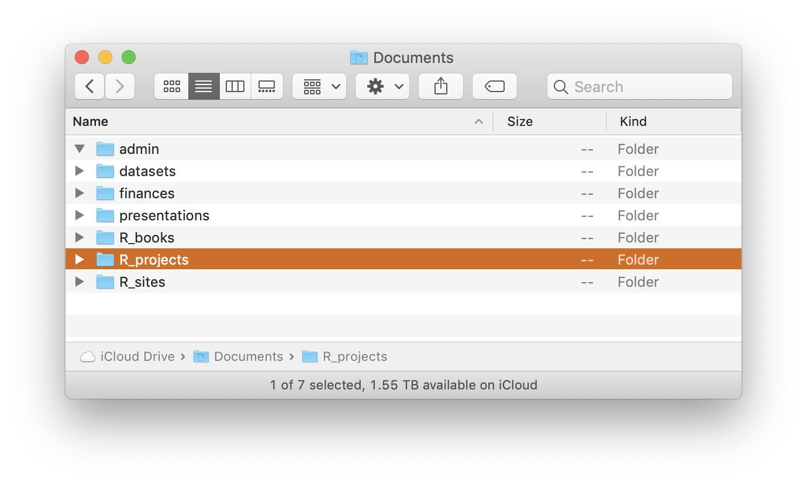
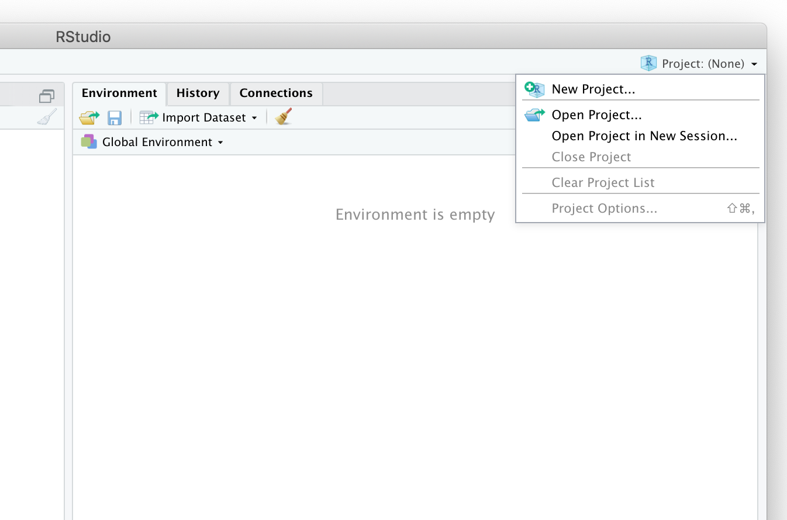
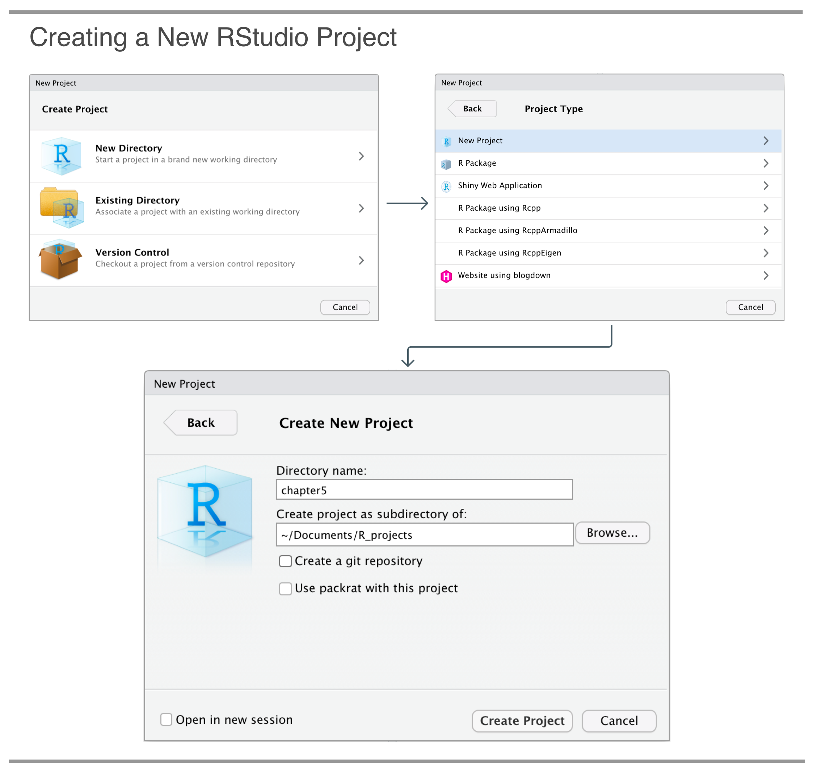
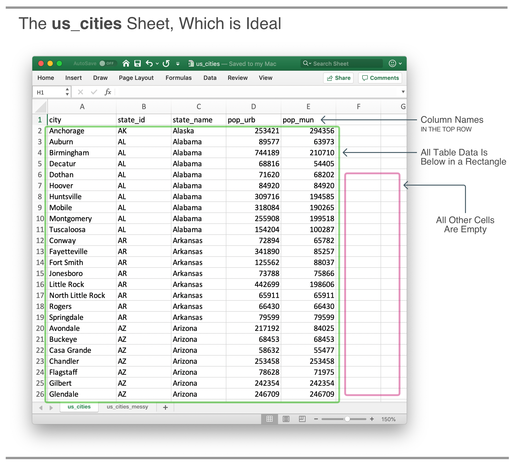
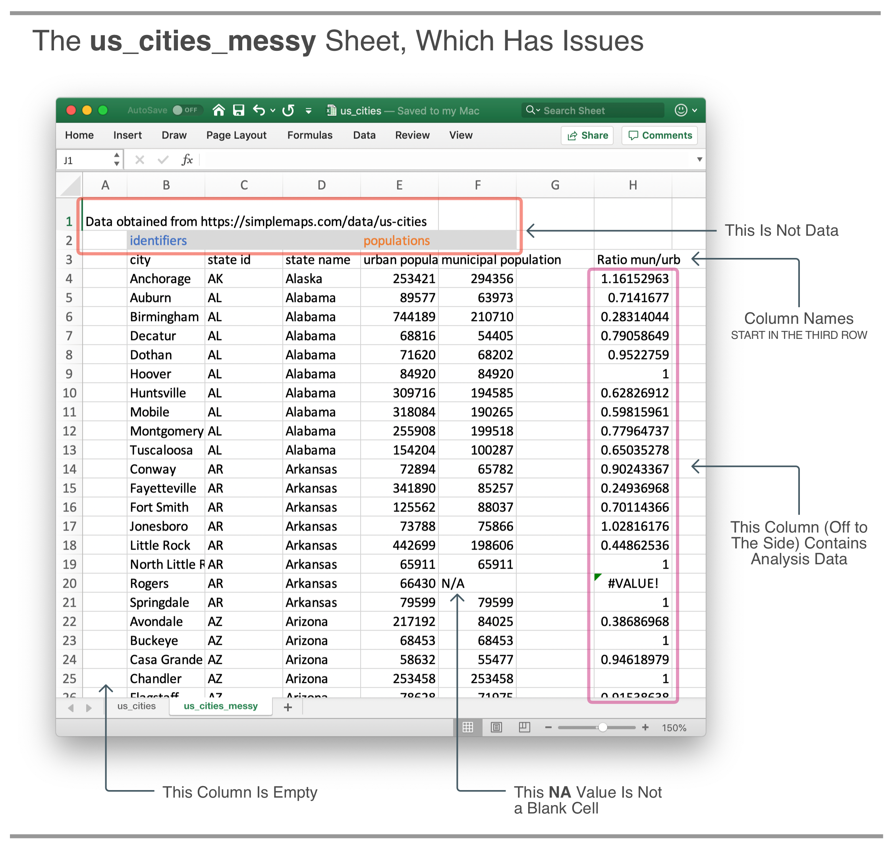

# Importing Data From Common Formats {#importing_data_common_formats}

```{r setup, include=FALSE, echo=FALSE}
library(edr)
library(tidyverse)
library(readxl)
```

This chapter covers

- Managing files with **RStudio** *Projects*
- The basics of the CSV file format
- Using the `read_csv()` function from the **readr** package
- Reading **Excel** data into **R**

Previously, we had used datasets available in the **edr** package to get the data we needed. This is all fine and well for the purpose of learning to use data transformation and visualization functions. However, real world data won't often be found in **R** packages. You may encounter useful data in text files, **Excel** files, or on the web in myriad forms. While there are hundreds of ways data can be structured and stored, there are a few formats that are quite common and so the focus of this chapter will be on the methods for importing these common formats into **R** (as tibbles). These formats are CSV and **Excel** files.

Because we are going to manage files in this chapter, we'll quickly learn about managing them in our file system by making a project in **RStudio**. The idea here is that we'd use a dedicated directory as the 'home base' for a named project, which the benefit of isolating each project and its files from other projects (and their associated files).

The **edr** package for its part will offer some custom functions to make the examples flow a bit better. We need some CSV and **Excel** files to import, so, a few functions from **edr** will be available for spawning these files in our project directory.

## Managing Projects and Files

Projects in **RStudio** are both useful and powerful. It makes creating reproducible code that much easier. This could be in the form of individual data analyses, reports that are generated from data, or even developing your own packages. One of the biggest advantages of projects is that they make your life easier when importing data. Projects make the whole concept of working with files and their paths easier because there won't be a need to use absolute file paths (they probably don't exist on other systems, and so they make sharing analyses with others difficult).

### Creating an RStudio Project to Better Manage our Working Files

Having each analysis project in a separate directory is convenient. Just like we would use folders elsewhere (either computer filesystem or physical, paper-based ones) to keep documents together, having this organizational mindset will go a long way to making your day-to-day **R** analyses feel less chaotic. As for what would constitute a project, that's up to you! It could be a simple one-off analysis with a single **R** script, or, there could be dozens of input files and a handful of **R** scripts, **R Markdown** files, and a collection of rendered documents comprising a research study.
	
Aside from the organizational aspect, which by itself is compelling, there are additional advantages to the single directory per project set up. The concept of the working directory is simplified: the working directory is set to the project directory. So, opening the project would put you in the project directory and set that directory to the working directory. What does this mean exactly? Any functions that need to read files would expect them, by default, in the working directory. On the flipside, any functions that write files would, again, by default, write them to the working directory.

If you don't have a dedicated directory on your computer for **R** projects, make one now! First choose where this directory should go. A good recommendation is inside the user `Documents` folder. Have a look at *Figure \@ref(fig:r-folder-mac)*, it shows a few of my top-level folders for **R** projects (they are inside those directories that begin with `R_`).

```{r r-folder-mac, echo = FALSE, fig.cap = "Where I put several folders for **R** projects on my computer. They all begin with `R_` (just to make it very obvious to myself)."}

```

Let's create an **RStudio** *Project*. For this example, I'm going to call it `chapter5` (feel free to come up with a name that is more sensible to you). In **RStudio**, you can either navigate to *File > New Project...* in the application menu, or, the top-right drop-down menu can be clicked to reveal the *New Project...* item (*Figure \@ref(fig:rstudio-project-menu)*).

```{r rstudio-project-menu, echo = FALSE, fig.cap = "The *Project* dropdown menu in **RStudio**. Allows for creating a new project and easily switching between projects."}

```

After this, we get to specify the *Project* through a short series of dialog boxes (*Figure \@ref(fig:new-project-flow)*). The project will be created in a *New Directory* and the type will be simply *New Project*. The final dialog box asks us to specify the directory name (it's also the project name!) and the subdirectory name. For these, I'll use `chapter5` as promised, and, I'll make this a subdirectory of `R_projects` (which is, itself, inside my `Documents` folder).

```{r new-project-flow, echo = FALSE, fig.cap = "Creating a new **RStudio** *Project* with a *New Directory*. We are calling this one `chapter5` because this really is Chapter 5."}

```

After finishing this flow, we are placed into the `chapter5` project (the project name will be visible as part of the top-right *Projects* dropdown menu). The new directory/project only contains the automatically generated `chapter5.Rproj` file which defines the *Project Settings*. We are now well set up to begin working with files!

### Writing a Sample CSV File to the Project Directory

To make things easy for us, the **edr** package has a function that writes any **edr**-based dataset to a CSV file: `dataset_to_csv()`. Remember that we need to load the **edr** package first, and this can be done by executing `library(edr)` in the **RStudio** console. The datasets you'll end up importing will be varied and will serve different purposes. Occasionally, you'll need a dataset that has data associated with your main subject of study. For examples in this chapter we will be experimenting with variations of a dataset called `us_cities` that has populations for cities in United States. Why would you need such a dataset in the real world? Well, suppose you are conducting a study that looks at sales by city. You might have a dataset with a listing of such sales but, sadly, you don't have the populations of these cities (which may help explain the sales figures). By obtaining an associated dataset on city populations, we can potentially combine the city populations with a summary of total sales by city. Before joining such datasets together, we first need to fully understand how to read in datasets from files.

The `us_cities` dataset inside the **edr** package can be written as a CSV file like this:

`r edr::code_hints(
"**CODE //** Writing ~~us_cities.csv~~ to the project directory with ~~dataset_to_csv()~~."
)`
```{r datset-to-csv, eval=FALSE}
dataset_to_csv(dataset = "us_cities")
```

The following message appeared in my **R** console (your message, on your system, will likely provide a different file path).

```
#> The CSV file `us_cities.csv` was written to the working directory (`/Users/rich/Documents/R_projects/chapter5`)
```

Further information on the `us_cities` dataset can be found by executing `help(us_cities)` in the **RStudio** console.

In case we don't fully believe the message given by `dataset_to_csv()`, we can have a look at the *Files* tab in **RStudio** (in the lower-right pane, first tab). The file should be there. If it isn't, we can try two things. We should check that the path above the file view is same as that given in the message received after executing the `dataset_to_csv()` function. If it's different for whatever reason, we could navigate back to the project directory by clicking on the icon to the right of the path (the blue, **R**-in-cube icon). One last thing to try is clicking the refresh button just above (it could be that, on some file systems, a refresh of the directory listing is necessary).

## Using **readr** to Import Data from CSV Files

Now that we have learned about how to set up our projects, we will now import data from CSV (comma-separated value) files. CSVs are quite commonplace as method for storing tabular data in plain text. Many software programs that deal with tabular data can often export such data to CSV. While the CSV 'format' isn't rigorously specified (there really is a lot of variation), we commonly find that

1. each line is a separate record,
2. the records are divided into fields (separated by delimiters such as the comma, but sometimes by spaces or tab characters),
3. there is the same number of fields per record, and
4. there is often a header line that defines the column names.

While such variations in CSV formatting can't really be avoided, the *Tidyverse* **readr** package has many options to successfully deal with any such potential issues.

### Reading in Our Sample CSV file with the `read_csv()` Function

Now that we have a sample CSV file on disk, let's read in that file into a tibble object. We can do this using the `read_csv()` function from the readr package. This package is available in the *Tidyverse* so we need to first execute `library(tidyverse)` before using that function. As before, we will illustrate our upcoming examples as **R Markdown** code chunks, so, the next listing will look familiar to us.

`r edr::code_hints(
"**CODE //** Loading the **tidyverse** and **edr** packages.")`
```{r load-tidyverse-edr, eval=FALSE}
library(tidyverse)
library(edr)
```

When using `read_csv()` the file name must of course be specified but since the file is in the project directory, we don't need to provide path information. Let's assign the resulting table to the `city_table` variable.

`r edr::code_hints(
"**CODE //** Using the ~~read_csv()~~ function to read the us_cities.csv to a tibble object.",
c(
"#A This use of ~~read_csv()~~ provides only the minimal amount of required information: the file to read in."
))`
```{r read_csv, paged.print=FALSE}
city_table <- read_csv(file = "us_cities.csv")  #A

city_table
```

Since CSV files don't contain any information on column types, all CSV readers like `read_csv()` have to guess the column types upon reading. The message about parsing (in the console) appears during the function call. The printed table output looks to be reasonable, however.

So, the CSV was successfully read into the `city_table` variable as a tibble. We verified this by printing the tibble object. However, we did get a message during import that told us that the data was parsed with a particular column specification. In this case, readr successfully made a workable table. However, we might have wanted the population values in the `pop_urb` (urban population) and `pop_mun` (municipal population) columns to be of the integer type (instead of `double`, which is the default numerical type in **R**). We can also imagine a situation where we might have ID values as numbers in a CSV but we would want them to be in a table as character values (and not as integer values). The good news is that we can provide our desired column types with the `col_types` argument. It's easiest to provide this as an encoded string of letters (one per column, in the order present in the CSV file). Here are the encodings:

- `c`: `character`
- `d`: `double`
- `i`: `integer`
- `l`: `logical`
- `f`: `factor`
- `D`: date
- `T`: date-time
- `t`: time
- `?`: guess the column type
- `_`: skip the column entirely

For the first three `character`-based columns of `us_cities.csv` (`city`, `state_id`, `state_name`) we would use three `c`'s and for the integer values in the last two columns, two `i`'s are needed. This makes the string for `col_types` become `"cccii"`. The next code listing rewrites the code in the previous listing, providing the `col_types` to the `read_csv()` function call and getting us the a tibble with our desired column types.

`r edr::code_hints(
"**CODE //** Using the ~~read_csv()~~ with ~~us_cities.csv~~, specifying the exact column types in ~~col_types~~.",
c(
"#A Using compact representation of column types as ~~\"cccii\"~~ provides more information to ~~read_csv()~~ so that we get our desired column types."
))`
```{r read-csv-col-types, paged.print=FALSE}
city_table <- read_csv(file = "us_cities.csv", col_types = "cccii")  #A

city_table
```

Through inspection of the column types in `city_table`, we can see that the last two columns are now of the `integer` type.

### Additional `read_csv()` Options for Non-standard CSVs

There are many more options we can use with `read_csv()` and these begin to be important as we encounter CSV files that contain oddities within them. For example, what if we want to have proper `NA` values in our tibble to account for missing values but the CSV file, instead of using empty strings or `"NA"` (which are both parsed correctly as `NA` values), we see the word `"missing"` instead? In this case, we could use the `na = "missing"` option and then `read_csv()` would interpret those instances as `NA`s.

Here an unusual one: some CSVs contain comment lines within them. This is nonstandard, but it does exist in useful CSV datasets you might find on the Web. To correctly parse these kinds of files, it's useful to inspect the file as text in **RStudio** and identify which characters signify the start of the comment lines. (We can conveniently do this in **RStudio** by clicking on the file in the *Files* pane and selecting the *View File* option.) Often, the comment line begins with a `#` sign. Knowing this, we could provide the `comment = "#"` option to `read_csv()` and this results in such lines being completely ignored.

## Using **readxl** to Import **Excel** Data

**Excel** is a spreadsheet application that's made by **Microsoft**. It's quite popular and so there is a wealth of data stored in the .xls and .xlsx file formats within organizations and available as public data. It is widely used across many different fields because it's an easily accessible tool for organizing, analyzing, and storing data.

The **edr** package will again provide us the **Excel** files we need for the examples, eliminating the need to download **Excel** files from the Internet. We will use the **readxl** package, available in the *Tidyverse*, to import data tables within **Excel** files for all of our examples. But before we do that, we will need to consider the ways in which we can best prepare **Excel** files for import. The reason for this is that there are so many ways to add data to **Excel** files, and we'd want to ensure that the data is in the tidiest form possible before importing (remembering that tidy tools expect tidy data). We'll have a look at the ideal representation of data inside **Excel** as it relates to importing that data to R, and, propose some strategies for cleaning up **Excel** files are problematic.

### Writing an example **Excel** file to the project directory

The **edr** package has a few functions that produce example **Excel** files. As always, ensure that `library(edr)` is executed in the RStudio console if this is a new **R** session. We will use the `create_excel_file()` function to write an example **Excel** file to the working directory. The **Excel** document that the function creates has two sheets (and these are sometimes called tabs). The first sheet (called `us_cities`) contains all of the data from the `us_cities` dataset in the cleanest manner possible (*Figure \@ref(fig:us-cities)*). There are several qualities in this sheet that make it the data easy to import into **R**:

- There is only a single data table
- The data has a single header row for column names in the first row of the sheet
- All data rows follow the header (from row 2) and there are no gaps (i.e., empty rows)
- All tabular data encompasses a rectangular region (i.e., there should be no cells with entries elsewhere 

```{r us-cities, echo = FALSE, fig.cap = "The `us_cities` sheet in the example **Excel** file is a paragon of clean data as an input for the `read_excel()` function. This will make your life easier."}

```

The second sheet (called `us_cities_messy`) contains the `us_cities` data, however, there is additional data strewn about in different cells. We can look to the first sheet as the idealized example of data stored in an **Excel** file. It won't provide us with any data import problems, and it's something to strive for when managing data in **Excel** files. The second is a more real-world example of an **Excel** sheet you'll often encounter. Perhaps a colleague provided this file as a source of data for a project, perhaps it's your own file, it really doesn't matter. What does matter is that the data must be cleaned/reorganized before importing it into **R**.

Ensuring that we are within an **RStudio** *Project*, let's use `create_excel_file()` to generate the example **Excel** file.

`r edr::code_hints(
"**CODE //** Using the ~~create_excel_file()~~ function to write us_cities.xlsx to the project directory."
)`
```{r create-excel-file, eval=FALSE}
create_excel_file()
```

This function doesn't require any options. It will just write the **Excel** file that's stored in the **edr** package to the working directory. You'll get a helpful message in the console that describes what happened:

```
#> The Excel file `us_cities.xlsx` was written to the working directory (`/Users/rich/Documents/R_projects/chapter5`)
```

We can further verify that the file was written by looking for it in **RStudio**'s *Files* tab (lower-right pane). Only one type of file is generated from the `create_excel_file()` function and that's `us_cities.xlsx`.

### Reading in Our Sample **Excel** File with the `read_excel()` Function

Now that we have a sample **Excel** file on disk, let's read the first sheet of that document (the ideal, clean sheet) into a tibble object. We can do this using the `read_excel()` function from the **readxl** package. This package is available in the *Tidyverse* and will be available on your system when installing the *Tidyverse* package (through `install.packages(tidyverse)`). However, the **readxl** package functions won't be available when executing `library(tidyverse)`. Instead, we need to explicitly use `library(readxl)` beforehand. So, keep in mind that `library(readxl)` must accompany your suite of `library()` statements when importing **Excel** files.

When using `read_excel()` the file name needs to be specified just as in the case of `read_csv()`. As before, we don't need to add directory info since the file is available in the project directory. Because **Excel** workbooks can have multiple sheets, there is the sheet argument for specifying which one to use for importing. We can either specify the sheet name, or, provides its index (starting from `1`). The default is to read the first sheet in the specified **Excel** file, and that's just what we'll do first. Let's assign the resulting table to the `city_table` variable.

`r edr::code_hints(
"**CODE //** Using the ~~read_excel()~~ function to read the first sheet from the ~~us_cities.xlsx~~ file to a tibble object.",
c(
"#A This use of ~~read_excel()~~ provides only the minimal amount of required information: the file to read in. By default, the first sheet of the workbook will be read."
))`
```{r read-excel, eval=FALSE}
city_table_x <- read_excel(path = "us_cities.xlsx")  #A

city_table_x
```

```{r read-excel-internal, echo=FALSE, paged.print=FALSE}
city_table_x <- 
  read_excel(path = system.file("us_cities.xlsx", package = "edr"))

city_table_x
```

**Excel** files contain cell format information and, as long as there is consistency, this use of `read_excel()` obtains the correct column types upon reading. This is confirmed by the console printing of the tibble object.

The imported table, `city_table_x`, is the same as the table in the `us_cities` dataset (using `all.equal(city_table_x, us_cities)` in the **RStudio** console will return `TRUE`). Thus, the importing of this table presented no difficulty to us, and this is because the **Excel** sheet was formatted to only contain the table data and nothing extraneous to it.

Unlike our prior use of `read_csv()` with an example CSV file, we did not get a message telling us about the parsing of columns. Whereas CSV files don't contain any type information about their columns, **Excel** files have cell formats (which can be text, numeric, etc.). In this imported sheet, there was consistent cell formatting per each column so `read_excel()` was able to assign the correct column types in the output tibble.

While the `col_types` argument is present in `read_excel()`, it doesn't work in the same way as `col_types` argument in `read_csv()`. If we want control over the column types, we have to supply a vector of the following `read_excel()`-specific types/directives to `col_types`:

- `text`: character
- `numeric`: double
- `logical`: logical
- `date`: date
- `guess`: guess the column type
- `skip`: skips the column entirely

Since we have three character-based columns and two numeric columns, the `read_excel()` function call could be re-written to be more explicit as `read_excel("us_cities.xlsx", col_types = c(rep("text", 3), rep("numeric", 2)))` (where the `rep()` function creates a vector that repeats a value *n* times). There is no way to create integer columns so if we wanted the `pop_urb` and `pop_mun` columns to be of the `integer` type, the only option is to `mutate()` with **dplyr** after importing.

So that was the first sheet of the **Excel** workbook. The second sheet contains pretty much the same data (based on the `us_cities` dataset) but it won't fare as well during import. We only need to glance at the tibble output to see that there are some major problems.

`r edr::code_hints(
"**CODE //** Using the ~~read_excel()~~ function to read in the second sheet from the ~~us_cities.xlsx~~ **Excel** file.",
c(
"#A This ~~read_excel()~~ call specifies the sheet as ~~2~~ (it's the second sheet)."
))`
```{r read-excel-messy, eval=FALSE}
city_table_x_m <- read_excel("us_cities.xlsx", sheet = 2)  #A

city_table_x_m
```

```{r read-excel-messy-internal, echo=FALSE, paged.print=FALSE}
city_table_x_m <- 
  read_excel(
    path = system.file("us_cities.xlsx", package = "edr"),
    sheet = 2
  )

city_table_x_m
```

From this code, we get a message about new names. What's happening is that the function can't find column names on the top row, so, it's creating unique names for us. The resulting tibble has some extra columns and rows that are not intended to be table records (at least at the top, which is all we can see in this view).

Upon looking at the **Excel** file (*Figure \@ref(fig:us-cities-messy)* provides an annotated guide to its problems) we can see why the import result is the way that it is. This is all fixable though, so long as we know what the particular problems are. However, we really need to have a close look at the sheet in **Excel** proper.

```{r us-cities-messy, echo = FALSE, fig.cap = "The `us_cities_messy` sheet in the example **Excel** file has a number of issues that require a much more sophisticated use of the `read_excel()` function."}

```

The first big problem is that the table (which is comprised of the header row and the records) begins on the third row. Everything else above that is not the table and should be discarded. The `read_excel()` function has the `skip` argument (just as `read_csv()` does) to skip rows at the top of the sheet. We will use `skip = 2`, and this first problem will be solved.

The next issue is extra columns that we don't want in the tibble. The `read_csv()` function will automatically skip over the first empty column (because we eliminated the first two rows, and no text remains in column A), but we have two extra columns at the far right that should be omitted. A good option here is to use the `"skip"` directive for those undesired columns for the `col_types` argument. This will end up being `col_types = c(rep("text", 3), rep("numeric", 2), rep("skip", 2))`. Then, those last two columns are gone.

A final thing to do is to define those `"N/A"` values seen in the **Excel** sheet as genuine `NA` values. For this, the `na` argument will be used, giving it the `"N/A"` string so that the function will recode those strings as `NA`s.

Given all of these considerations, here is the finalized function call:

`r edr::code_hints(
"**CODE //** Using the ~~read_excel()~~ function with the ~~us_cities_messy~~ sheet, take 2.",
c(
"#A This skips the first two rows, which are clearly not tabular data.",
"#B While defining the types is good, choosing which columns to skip (i.e., get rid of) is also good and needed.",
"#C We see some cell values being 'N/A'. They really should be blank but that's okay. This is fixable with the ~~na~~ option."
))`
```{r read-excel-messy-options, eval=FALSE}
city_table_x_m <- 
  read_excel(
    "us_cities.xlsx",
    sheet = 2, 
    skip = 2,  #A
    col_types = c(rep("text", 3), rep("numeric", 2), rep("skip", 2)),  #B
    na = "N/A"  #C
  ) 

city_table_x_m
```

```{r read-excel-messy-options-internal, echo=FALSE, paged.print=FALSE}
city_table_x_m <- 
  read_excel(
    path = system.file("us_cities.xlsx", package = "edr"),
    sheet = 2,
    skip = 2,
    col_types = c(rep("text", 3), rep("numeric", 2), rep("skip", 2)),
    na = "N/A"
  )

city_table_x_m
```

Upon printing `city_table_x_m` to the console, we can see that we now have a usable table.

If the column names of the `city_table_x_m` table are not satisfactory, we can use **dplyr**'s `rename()` function to modify some of them.

`r edr::code_hints(
"**CODE //** Using **dplyr**'s ~~rename()~~ function to change column names.",
c(
"#A The ~~rename()~~ function is from the **dplyr** package. The syntax is to have the replacement name first, making it equal to the existing column name (none of these names are in quotes).",
"#B We have to use backticks for all of the existing names because these names have spaces in them (**R** only allows such names if they are enclosed in backticks)."
))`
```{r rename-columns, paged.print=FALSE}
city_table_x_m <- 
  city_table_x_m %>%
  rename(  #A
    state_id = `state id`,  #B
    state_name = `state name`,
    pop_urb = `urban population`,
    pop_mun = `municipal population`
  )

city_table_x_m
```

We can see that the column names are now the same as those in the `us_cities` dataset. If one wanted to remove some columns, then that only requires the use of the **dplyr** `select()` function.

Would it have been easier to hand edit the messy **Excel** sheet before importing? Perhaps, but this is a choice that depends on the situation at hand. If you created the **Excel** file and its only purpose was to get data into **R**, then that's a good case for correcting your own mistakes in that **Excel** sheet. If a collaborator generated the file and it's treated as 'raw data', perhaps likely to be updated various times (and thus requiring periodic importing into **R**), then it's wise to not hand edit the file. That practice is error-prone and not leads to problems with reproducibility. Often, it's best to deal with these files as they are and make use of the helpful options in the **readxl** and **dplyr** packages to handle the importing.

## Summary

- Managing our projects and their associated files is much easier now that we've learned how to create and manage **RStudio** *Projects*
- We learned how to import data from a CSV file with the **readr** package's `read_csv()` function
- **Excel** files often contain datasets and we used the `read_excel()` function (from **readxl**) to successfully read in data from **Excel** sheets
- We encountered some common problems in both CSV and **Excel** files and discovered some useful options in `read_csv()` and `read_excel()` to ensure that data could be imported properly

## Exercises

1. We used the `read_csv()` function to read a CSV a file into **R** as a tibble. How would you write a call if the CSV file data.csv were in the raw_data subdirectory of the project directory?

2. What is a column specification and which argument in `read_csv()` allows us to create one?

3. What is the preferred way to have missing values represented in CSV files and **Excel** sheets?

4. Suppose you want to import a CSV into **R** but it doesn't have a header row. You at least know what the column names should be. What could you do to import the CSV as a tibble with the desired column names?

5. What kind of tibble would you expect if you used `read_csv("us_cities.csv", col_types = "ddddd")`? How about `read_csv("us_cities.csv", col_types = "ccccc")`?

## Possible Answers

1. Assuming that we didn't need to supply extra options for the CSV import, the `read_csv()` call would be written as `read_csv("raw_data/data.csv")`.

2. A column specification is a set of column types (one for each column of the dataset to be imported). We can create a column specification or provide a shorthand for one using the col_types argument of `read_csv()`.

3. The best way is to represent missing values (`NA`s) is through empty strings in CSV files and empty cells in **Excel** sheets.

4. Use the `col_names` argument of `read_csv()`. Specifically, pass a vector of the correct column names to `col_names` when using `read_csv()` (being careful to ensure that the length of that vector matches the number of fields in the CSV).

5. In the first case, where `col_types = "ddddd"`, the first three columns (`city`, `state_id`, and `state_name`) would be filled with `NA` values and the column types would be `numeric`. These `NA` values are the result of coercing character values to the `numeric` type (try `as.numeric("text")` in the console). In the second case, where `col_types = "ccccc"`, we don't see get any `NA`s but the `pop_urb` and `pop_mun` columns are now of the `character` type. We could always `mutate()` those columns to be `numeric` or `integer` though.
