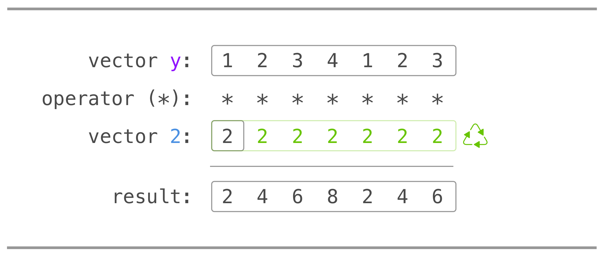
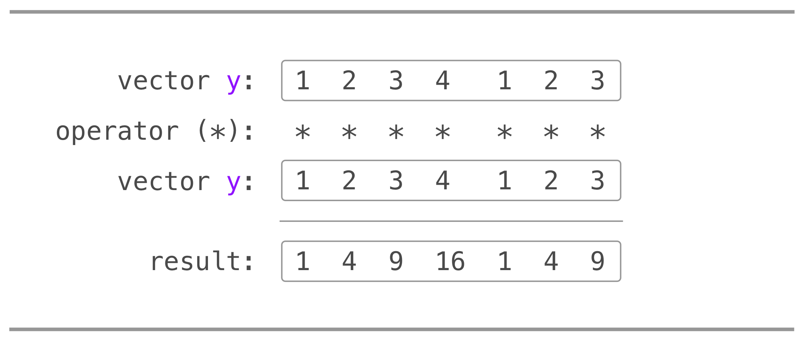
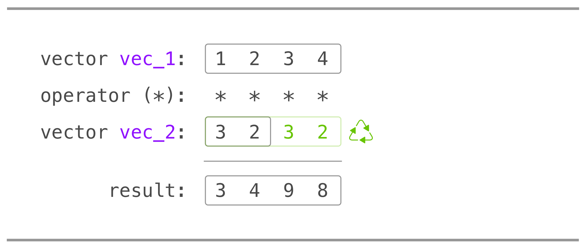
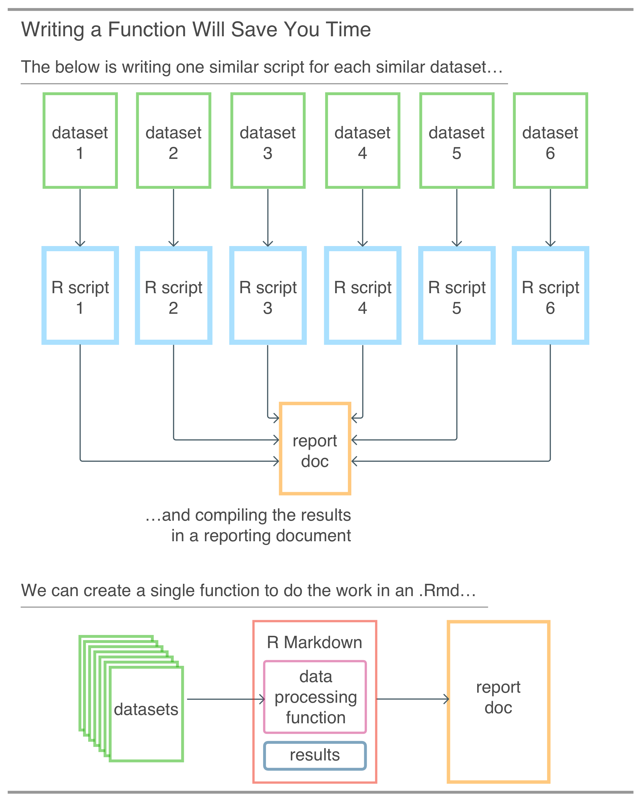
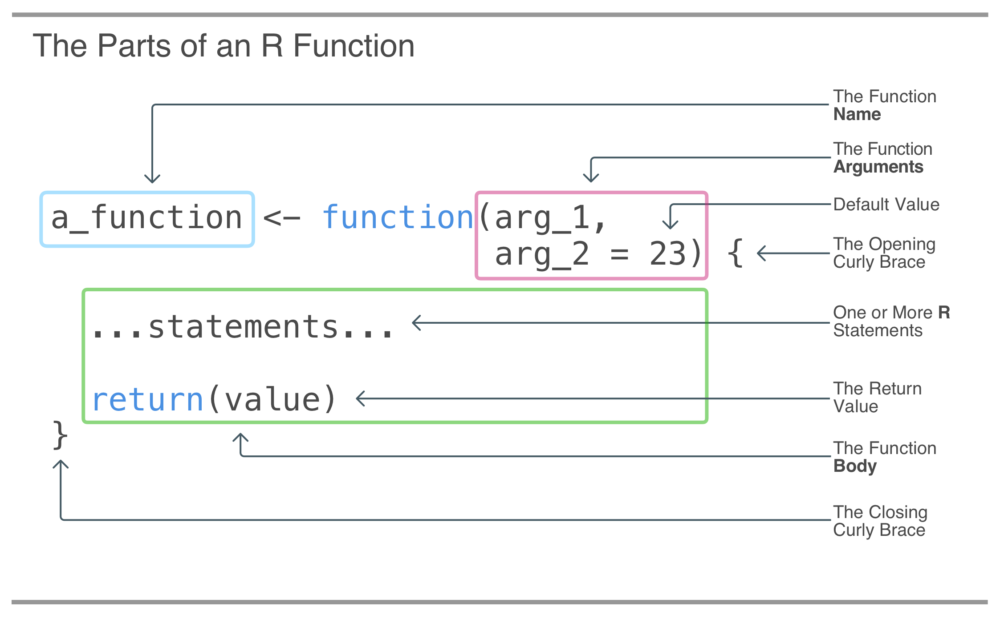

# A Closer Look at R Programming {#closer_look_r_programming}

```{r setup, include=FALSE, echo=FALSE}
library(edr)
library(tidyverse)
library(lubridate)
```

This chapter covers

- Working with vectors and learning about **R**'s recycling behavior
- Learning and reviewing some of the more essential base **R** functions (and getting the names of the dozens of other useful functions)
- Writing our own functions to manipulate data
- Writing conditional statements and understanding the logic behind control flow

In this chapter, we will take a closer look at how vectors, data frames, and tibbles work. We've used vectors in previous chapters but now we'll learn about some of the ways that vectors can be generated, how numeric vectors can be used in math operations, and how we can subset them. We'll also learn about how **R**, in certain cases, does something a little bit unexpected: recycling. It's something that is often to be avoided and so we have to be fully aware of this behavior. Concerning data frames and tibbles: they are very similar but there are subtle differences that we need to know about. When using **R** long enough, you'll come across both data frames and tibbles, so, we must be capable in handling both of these tabular data structures and dealing with their idiosyncrasies.

Eventually there comes a time where we'd have to learn more of base **R**. What is base **R** really? It's commonly understood as the functions and objects that are available without loading any additional **R** packages (i.e., using `library()` statements like `library(tidyverse)`). Most of these functions and objects come from the base package but some other packages are automatically loaded at the beginning of an **R** session (e.g., **datasets**, **tools**, **stats**, **graphics**, etc.) and they variously contain useful functions for day-to-day **R** use. Because understanding the base language is so important, we will use this chapter to work through as much as it is reasonable. While base **R** has a huge amount of functions, our real-world usage of base **R** will only involve a small subset.

Our learning of the more useful base **R** functions will occur within the context of learning more about **R** programming in general. We will learn how to write our own functions, using conditional statements as decision points in the code. We'll also explore what it means in practice to program defensively. That's all about anticipating user input errors when calling our function and providing error messages that help users discover and correct their mistakes. By the end of this chapter we will have taken some code, transformed it into a callable function, and improved it substantially (through several iterations).

## Vectors in **R**

We will take a closer look at vectors, one of the fundamental data structures of the **R** programming language. While we have focused previously on using tibbles to do a lot of useful work, we really have to understand how to work with vectors as well. After all, a tibble is essentially a list of equal-length vectors, so, there is a close relationship here. We can use vectors to create tibbles (via the `tibble()` function) and we can extract vectors from tibbles as well. A good knowledge of how vectors can be manipulated (through **R** operators and functions) goes hand-in-hand with knowing how tibbles can be transformed during data analysis.

### Creating Vectors with the `c()` Function

An easy way to construct a vector is with the `c()` function, which stands for combine. Let's create a vector containing the numbers `1`, `2`, and `3`, storing it in the variable `x`.

`r edr::code_hints(
"**CODE //** Creating a numeric vector with the ~~c()~~ function.",
c(
"#A The ~~c()~~ function helps us create a numeric vector by virtue of providing only numbers to it (we didn't have to specify that this should be a numeric vector, **R** uses the input to determine the type)."
))`
```{r vector-c}
x <- c(1, 2, 3)                                            #A
```

There is a useful shortcut for specifying sequences of numbers: using the colon operator. With that, we can write `1:3` and get the vector defined before. There's yet another option, we can also elect to use the base function `seq()` as `seq(1, 3)` and we'll get the same result.

Vectors can be combined to make a new vector; our `x` vector can be used in another `c()` statement to make a longer vector of numbers. Next, we create a new vector that contains `x`, `4`, then `x` again in that order.

`r edr::code_hints(
"**CODE //** Combining numeric vectors, again with ~~c()~~.",
c(
"#A Imagine that the ~~x~~ variables here in ~~c()~~ (included twice) are expanded to ~~[1, 2, 3]~~, joining the only number provided here (~~4~~)."
))`
```{r vector-c-vector}
y <- c(x, 4, x)  #A

y
```

As can be seen, this creates the longer vector that contains the sequence of `1`, `2`, `3` at the beginning and end, with `4` in the middle.

We've previously performed mathematical operations when using **dplyr** (mostly within the `mutate()` function). Just as a reminder, the common math operators are `+`, `-`, `/`, `*`, and `^` (where `2^2` means ‘two squared'). If we need to specify operator precedence (i.e., which math operations should be performed before others), parentheses should be used. Here are a few examples, where three vectors of length 1 are created (`math_1`, `math_2`, and `math_3`) and then combined into a vector called `y`:

`r edr::code_hints(
"**CODE //** Performing math operations and combining the results with ~~c()~~.",
c(
"#A The ~~5~~ times ~~2~~ operation happens first, then, ~~5~~ is added to that. This is BEDMAS/PEDMAS! So, the order of operations is brackets, exponents, division, multiplication, addition, and then subtraction.",
"#B This looks similar to the previous except that we put in parentheses. The addition happens first, then the multiplication.",
"#C While the outside set of parentheses is not strictly necessary, it's perfectly okay to use more parentheses to make the calculation clearer to yourself and to others."
))`
```{r math-operations}
math_1 <- 5 + 5 * 2  #A
math_2 <- (5 + 5) * 2  #B
math_3 <- ((5 + 5) / (5 - 10)) * 2^2  #C

c(math_1, math_2, math_3)
```

The resulting vector has three values that are essentially the evaluated results of the three statements with math operations.

Aside from the mathematical operators, there are also several functions that help us do math. A square root of a number can be obtained with `sqrt()`. The logarithm and exponential functions are `log()` and `exp()`. We can get the absolute value of a number with `abs()`. The code listing below has some examples on how these functions could be used, and the results are wrapped up in a `c()` so that we can easily see the result of each function in a single vector.

`r edr::code_hints(
"**CODE //** Using math functions and combining the results with ~~c()~~.",
c(
"#A Because of all of these function calls generate a number, we can safely include these inside ~~c()~~ and fully expect a numeric vector."
))`
```{r math-functions}
c(sqrt(16), log(2.5), exp(2.5), abs(-5))  #A
```

### Doing Math with Vectors and Understanding Recycling

We can do math with vectors themselves. Taking the previously assigned numeric vector `y`, let's use that directly in a mathematical expression. The first example involves multiplying every number in `y` by `2`.

`r edr::code_hints(
"**CODE //** Multiplying a numeric vector by a single number.",
c(
"#A The ~~y~~ variable was assigned previously, it has the values ~~[1, 2, 3, 4, 1, 2, 3]~~."
))`
```{r multiplying-y-by-2}
y * 2  #A
```

From this output, we see that indeed each resulting value is the original value multiplied by two. The math operations used to produce each value can be represented in this vector schematic:

```{r multiplying-by-a-single-number, echo = FALSE, fig.cap = ""}

```

That was an example of performing a mathematical operation across vectors of different sizes. The `y` vector has a length of `7`, and the unnamed vector with the single value of `2` has a length of `1`.

We can also perform math across two equal-length vectors. Here, `y` is multiplied by itself:

`r edr::code_hints(
"**CODE //** Multiplying two numeric vectors of the same length.",
c(
"#A We could alternatively write this as ~~y^2~~ if we're so inclined."
))`
```{r multiplying-y-by-y}
y * y  #A
```

Using the vector schematic to represent the individual operations, both vectors (indeed, with the same vector values) are lined up perfectly because they are of the same length. So, the first element in each vector is multiplied, then the second element of each, and so on. The vector schematic for this makes it clearer:

```{r multiplying-by-two-of-same-length, echo = FALSE, fig.cap = ""}

```

What would happen if we were to multiply vectors of different lengths, say, lengths `4` and `2`? Let's try that and see what happens:

`r edr::code_hints(
"**CODE //** Multiplying two numeric vectors of different lengths.",
c(
"#A This is a ~~numeric~~ vector of length ~~4~~.",
"#B This is a ~~numeric~~ vector of length ~~2~~.",
"#C While the order of the elements in ~~vec_1~~ and ~~vec_2~~ matters, the order of multiplication doesn't matter (i.e., we could write ~~vec_2 * vec_1~~ and expect the same answer but reversing ~~vec_1~~ with ~~rev()~~ would result in a different answer)."
))`
```{r multiplying-different-length-vectors}
vec_1 <- c(1, 2, 3, 4)  #A
vec_2 <- c(3, 2)  #B

vec_1 * vec_2  #C
```

When given two vectors of the same length, **R** simply performs the specified arithmetic operation element-by-element. If the vectors are of different lengths, **R** recycles the shorter vector until it is the same length as the longer vector. Here is the vector schematic:

```{r multiplying-by-different-lengths, echo = FALSE, fig.cap = ""}

```

If the length of the shorter vector does not divide evenly into the length of the longer vector, **R** will still do its recycling, but it will also provide us with warning to inform us that this non-clean recycling is happening.

### Subsetting Vectors

Sometimes we need to extract individual elements from a vector (say, elements 2 and 4 from a vector of length `5`). This subsetting can be done by using vector indices and these indices are specified using square brackets: `[indices]`. The vector `y` that we made earlier (`[1, 2, 3, 4, 1, 2, 3]`) has a length of `7` (try using `length(y)` to check this) and indices from 1 to 7. To get the fifth element of `y`, we'd use `y[5]` and expect the fifth element back (the value of `1`). To get multiple elements back, a vector of indices can be supplied in the square brackets. What's key to know here is that all statements in the square brackets undergo evaluation. Essentially this means that we can provide virtually any type of statement that returns a vector of indices. Once that evaluation has occurred, then the subset of the vector will be evaluated and returned.

Let's have a look at the next bit of **R** code, which provides five examples of subsetting vector `y`. It wraps up all individual results in an **R** list object (useful here because the returned vectors as a single output):

`r edr::code_hints(
"**CODE //** Subsetting the same vector five different ways.",
c(
"#A Getting element 5 of ~~y~~.",
"#B Getting elements 1 and 2 of ~~y~~.",
"#C Getting elements 5, then 1, and then 5 again (results in a vector of length ~~3~~).",
"#D Getting elements 1, then 2, then 4 and 5.",
"#E Getting elements 4, 5, and 6 of ~~y~~ (~~seq(4, 6)~~ evaluates to ~~4, 5, 6~~)."
))`
```{r list-of-5-y-subsets}
list(
  a = y[5],  #A
  b = y[1:2],  #B
  c = y[c(5, 1, 5)],  #C
  d = y[c(1, 2, 4:5)],  #D
  e = y[seq(4, 6)]  #E
)
```

We immediately get back the list object in the output. **R** prints out each vector from each list element (e.g., `$a`, `$b` are the first two list elements). Knowing that the values in `y` are `1`, `2`, `3`, `4`, `1`, `2`, `3`, take a look at the above output and try to rationalize it from the input.

We can also access values from a vector with an expression involving comparison operators (e.g., `>`, `==`, `!=`, etc.). The next code listing has an example where we obtain a vector that results from subsetting with the expression `y >= 3 `(`y` greater than or equal to `3`):

`r edr::code_hints(
"**CODE //** Subsetting a vector using comparison operators.",
c(
"#A This is a common idiom in **R** for vector subsetting: using a comparison inside ~~[ ]~~."
))`
```{r subset-with-comparison}
y[y >= 3]  #A
```

What's returned are those values from `y` that are indeed greater than or equal to `3`. And, the order is preserved: `3 4 3`.

What's going on here? The answer is partially found through just evaluating the expression `y >= 3` and what we get is a vector of logical values (`TRUE`s and `FALSE`s):

`r edr::code_hints(
"**CODE //** The result of a conditional statement.",
c(
"#A An expression with comparison operators and a vector should always return a ~~logical~~ vector with the same length as the vector used in the comparison. This is great because if we use that vector for subsetting inside ~~[ ]~~, there is no recycling!"
))`
```{r eval-of-comparision-expr}
y >= 3  #A        
```

In the subsetting operation of `y[y >= 3]`, only the indices with `TRUE` will yield that value in the resulting vector. As seen from the above result, those indices are `3`, `4`, and `7`. If we consider any `FALSE` value for an index as effectively removing values from `y`, we get `[1, 2, 3, 4, 1, 2, 3]`, or, `[3, 4, 3]`.

## Data Frames and Tibbles

Data frames and tibbles are both tabular data structures. We got to using tibbles right away in Chapter 2, where we worked on transforming the `sw` tibble. The vast majority of datasets in the real world is in the form of tables (database tables and CSVs from **Excel** are two examples) because it's a great format for recording observations with many associated variables.

It's now time to further explain the similarities and differences between data frames and tibbles. The data frame (or data.frame, which is the class name) is part of base **R** and it has been part of **R** from the beginning. The data frame defines a tabular data structure where columns are the variables the rows are the observations or cases. Technically, in **R**, it is a `list()` of vectors of that all have the same length, and, have names. However, we have more or less just used tibbles (which appeared in **R** more recently) so far in this book. The reason? Tibbles don't do certain things that data frames would do automatically. And these are things that would probably cause us great consternation. Here are those things that tibbles don't do:

- convert strings to factors
- change the names of variables
- create row names

Because tibbles don't perform the above behaviors (things that the user may not even be aware of), they are considered as the less error-prone tabular data structure compared to data frames.

### Extracting Vectors from Tibbles

We learned how to create our own tibbles near the end of Chapter 2 (with dplyr's `tibble()` and `tribble()` functions). We'll keep using tibbles exclusively as we have been, but keep in mind that data frames (should you encounter them) can be converted to tibbles with **dplyr**'s `as_tibble()` function. The opposite is also true. Should you need a data frame (perhaps as an input to a function that only accepts data frames) a tibble can be converted to a data frame by using either the base function `as.data.frame()` or **dplyr**'s `as_data_frame()` function (note the use of underscores in the latter function name). However, the recommendation here is to favor the use of tibbles over data frames since they offer better printing to the **R** console (i.e., won't flood it potentially hundreds of lines of output) and they don't exhibit the aforementioned bad behaviors that could lead to us to make catastrophic errors. Let's make a tibble so that we can use it within a few examples:

`r edr::code_hints(
"**CODE //** Creating a simple tibble with the ~~tibble()~~ function.",
c(
"#A Why this use of ~~dplyr::tibble()~~ instead of just ~~tibble()~~? Well, if we didn't use ~~library(tidyverse)~~ beforehand (or ~~library(dplyr)~~), we could use the form ~~[package]::[function]~~ to call a function without loading it into the namespace. This is sometimes called a fully-qualified function name and can be useful at times.",
"#B The ~~col_1~~ column is going to be ~~numeric~~ (the vector created from the ~~1:10~~ shorthand is ~~numeric~~).",
"#C The built-in constants called ~~letters~~ and ~~LETTERS~~ are character vectors with 26 elements that are lowercase or uppercase roman letters.",
"#D The ~~col_2~~ column is going to be of the ~~character~~ class (with lowercase letters).",
"#E The ~~col_3~~ column will be of the ~~character~~ class just like ~~col_2~~ (with uppercase letters)."
))`
```{r example-tibble, paged.print=FALSE}
example_tbl <-
  dplyr::tibble(  #A
    col_1 = 1:10,  #B
    col_2 = letters[1:10],  #C,#D
    col_3 = LETTERS[10:1]  #C,#E
  )

example_tbl
```

Just as we've recently performed subsetting operations with vectors, we may want to do something similar with tibbles. We have a lot of options but let's constrain ourselves here to the base operators `[[` (double square bracket) and `$` (dollar sign). Both of these operators extract a vector from a tibble. The `$` uses names exclusively so if want to have `col_1` as a vector object from the `example_tbl` object, we would use `example_tbl$col_1`.

`r edr::code_hints(
"**CODE //** Extracting a vector from a tibble with ~~$~~.",
c(
"#A The ~~col_1~~ column is extracted as a numeric vector with this use of the ~~$~~ operator. This also works for data frames."
))`
```{r tibble-extract-1}
example_tbl$col_1  #A
```

The `[[` operator gives us the flexibility to use a name (this time in quotes) or a column index to extract the vector. Let's obtain the first column again as a vector with both approaches (in the next two code listings).

`r edr::code_hints(
"**CODE //** Extracting a vector from a tibble with ~~[[~~ and a column name.",
c(
"#A This ~~col_1~~ extraction to a vector requires the column name in quotes. If it weren't in quotes, then the expectation is that what's in the ~~[[~~ is an object (which could hold the name of a column, and that's fine)."
))`
```{r tibble-extract-2}
example_tbl[["col_1"]]  #A
```

`r edr::code_hints(
"**CODE //** Extracting a vector from a tibble with ~~[[~~ and a column index.",
c(
"#A The number inside ~~[[~~ could alternatively be replaced with an object that is a single number that, in turn, corresponds to a column number."
))`
```{r tibble-extract-3}
example_tbl[[1]]  #A
```

Both of these `[[` approaches return to us the vector of numbers from `1` to `10`, which is the same result as earlier:

#> [1]  1  2  3  4  5  6  7  8  9 10

Why extract a vector from a data frame or tibble? There are lots of good reasons. Perhaps the extracted vector might be used in a test to check for, say, the existence of any values greater than `8`. If this sort of test is important for an analysis, here's an example scenario:

1. we could extract `col_1` as a vector
2. piping it to the expression (in curly braces): `{. > 8}`
3. piping that to the `any()` function

Here is the **R** code that does all of this, giving us a single `TRUE` as a result.

`r edr::code_hints(
"**CODE //** Extracting a vector and performing a check of the values.",
c(
"#A Piping to an expression inside ~~{ }~~ is a way to use comparison operators with the extracted vector. The dot (~~.~~) represents the extracted vector in the expression.",
"#B The ~~any()~~ function takes a logical vector (i.e., a vector of ~~TRUE~~/~~FALSE~~ values) and returns ~~TRUE~~ if there is at least one ~~TRUE~~ value in that logical vector."
))`
```{r tibble-extract-check}
example_tbl$col_1 %>%
  {. > 8} %>%  #A
  any()  #B
```

### Using the `summary()` Function with Tibbles and Vectors

A useful way to give us a sense of how our data are laid out, in a data frame or a tibble, is by using the `summary()` function.

`r edr::code_hints(
"**CODE //** Getting a summary of a tibble.",
c(
"#A The ~~summary()~~ function displays output differently objects of different classes. For tibbles and data frames, the summary output is exactly the same but summaries for vectors and lists will be quite different."
))`
```{r summary-of-tibble}
summary(example_tbl)  #A
```

The result is a summary print out for each column, where the information provided is specific to each column's data type.

Given that `col_1` is numeric, `summary()` gives us these descriptive statistics: the minimum, first quartile, the median, the mean, the third quartile, and the maximum. The `summary()` function also works equally well with vectors, providing us with the appropriate summary values based on the vector's class (e.g., `numeric`, `character`, `logical`, etc.).

## Useful Base **R** Functions

We can't possibly learn the majority of base **R**'s functions in this book. There are simply too many and, oftentimes, you just need to be aware that a function you might want at a given moment vaguely exists. At that point, the necessary function might be located by searching through **R**'s help or, more likely, with a search engine. The best we can do here is provide a list of the more useful functions with a one-line description (taken directly from the help file), and, some examples of their use.

Why aspire to learn these functions? It's somewhat like gaining a higher level of literacy in **R**. You become more aware of all the things you can do in **R**, you'll know where to look for detailed help on a particular function (using `?` or `help()`), and, you might save yourself a lot of time in the long run (e.g., not having to create a function that already exists). If you have some time to explore and learn, it's always a great idea to look through the help files for some of these functions and read through the examples. Here, in the following subsections, the most important base **R** functions will be grouped by focus area. For a comprehensive set of examples of each and every one of these functions, please have a look at the Appendix.

### Assignment and Operators

These functions deal with assignment (yes `<-` is a function, virtually everything in **R** is function). We used quite a few of these functions so far.
- `<-`, `->`, and `<<-` (Assignment Operators)
- `match()` and `%in%` (Value Matching)
- `head()` and `tail()` (Return the First or Last Part of an Object)
- `$`, `[`, and `[[` (Extract or Replace Parts of an Object)
- `assign()` (Assign a Value to a Name)
- `get()` and `mget()` (Return the Value of a Named Object)

The next three code listings show some uses of `<-`, `->`, `%in%`, and `assign()`.

`r edr::code_hints(
"**CODE //** Examples: ~~<-~~ and ~~->~~.",
c(
"#A This is leftward assignment and is preferred.",
"#B This is rightward assignment and, while pretty useful at the end of a piped statement, results in the lack of a ‘subject' (the assigned name) in written code.",
"#C The two assigned objects are combined with ~~c()~~ and printed to the console."
))`
```{r example-assignment-arrows}
some_letters <- letters[1:3]  #A
letters[4:6] -> more_letters  #B
c(some_letters, more_letters)  #C
```

`r edr::code_hints(
"**CODE //** Example: ~~%in%~~ operator.",
c(
"#A The order here is important, and we can think of this as a question: \'is there a ~~\"d\"~~ in the vector that ~~letters[4:6]~~ makes?\' We get one logical answer (~~TRUE~~ here) because the object we are asking about is a vector with a length of one (~~length(\"d\")~~ is indeed ~~1~~, and it's a character vector). If we turned this around and used ~~letters[4:6] %in% \"d\"~~, we would get a logical vector of length ~~3~~."
))`
```{r example-in-operator}
"d" %in% letters[4:6]  #A
```

`r edr::code_hints(
"**CODE //** Example: ~~assign()~~.",
c(
"#A While we can assign the result of an expression with the ~~assign()~~ function, we shouldn't really do it in actual practice (stick to using ~~<-~~). The ~~assign()~~ function is more often used for specialized cases were we'd need to construct the variable name or assign the object to a different **R** environment."
))`
```{r example-assign-function}
assign(x = "last_letters", letters[24:26])  #A
last_letters
```

There are lots of ways to assign values in **R**! Some people prefer the rightward form of the assignment (as in `->`). We can even use the `=` sign to assign values. However, all other examples in this book stick to using just `<-`.

### Logical Operators and Set Functions

Logical operators were already seen to be useful components of expressions for certain dplyr functions. Those covered earlier and a few more are included here. Functions for doing set operations are often useful (perhaps you'd like to exclude certain elements from a vector? Then you need `setdiff()`).
- `&`, `|`, `&&`, `||`, `!`, `xor()`, `isTRUE()`, and `isFALSE()` (Logical Operators)
- `any()` (Are Some Values True?)
- `all()` (Are All Values True?)
- `union()`, `intersect()`, `setdiff()`, `setequal()` (Set operations)
- `which()` (Which indices are `TRUE`?)

The following code listing provides examples for the `&` and `&&` operators (the `&&` operator is generally preferred). Following that, two more code listings illustrate how the `union()` and `setdiff()` functions work with two vectors.

`r edr::code_hints(
"**CODE //** Examples: ~~&~~ and ~~&&~~ operators.",
c(
"#A This is simply a character vector with the letters ~~a~~, ~~b~~, and ~~c~~.",
"#B The preferred way to check multiple conditions with the AND operator is to use ~~&&~~ instead of ~~&~~. It \'short circuits\' when evaluating anything as ~~FALSE~~ (and it thus returns ~~FALSE~~). Evaluation is from left to right, so, ~~is.numeric(a_vector)~~ happens first. Because that\'s ~~FALSE~~, the ~~sum(a_vector) > 1~~ expression (that triggers an error) never gets evaluated.",
"#C The analogous expression with ~~&~~ (and not ~~&&~~) results in an error because of the evaluation ~~sum(a_vector)~~ (we can't sum a ~~character~~ vector). This line is commented out with a leading ~~#~~ to prevent its evaluation and it simply demonstrates the advantage of using ~~&&~~ instead of ~&~ in conditional statements."
))`
```{r example-and-operators, error=TRUE}
a_vector <- letters[1:3]  # A

long_and <- is.numeric(a_vector) && sum(a_vector) > 1  # B

# is.numeric(a_vector) & sum(a_vector) > 1  # C

long_and
```

`r edr::code_hints(
"**CODE //** Example: ~~union()~~ function.",
c(
"#A The ~~letters_1~~ vector (very original, I know) has four unique letters as elements: ~~a~~, ~~b~~, ~~c~~, and ~~d~~.",
"#B The ~~letters_2~~ vector... that also has four unique letters. The interesting (?) thing here is that it has two letters in common with ~~letters_1~~.",
"#C The ~~union()~~ function uses the union set operation, returning the unique set of elements which are in ~~letters_1~~, in ~~letters_2~~, or both!"
))`
```{r example-union-function}
letters_1 <- c("a", "b", "c", "d")  #A
letters_2 <- c("c", "d", "e", "f")  #B

union(letters_1, letters_2)  #C
```

`r edr::code_hints(
"**CODE //** Example: ~~setdiff()~~ function.",
c(
"#A The ~~setdiff()~~ function finds the elements difference in the first set (~~letters_1~~) that are different from the elements in the second (~~letters_2~~). In this example, letters ~~a~~ and ~~b~~ from ~~letters_1~~ are different than any elements in ~~letters_2~~ (which has the letters ~~c~~, ~~d~~, ~~e~~, and ~~f~~)."
))`
```{r example-setdiff-function}
setdiff(letters_1, letters_2)  #A
```

### Comparisons

Text.

- `>`, `>=`, `<`, `<=`, `==`, and `!=` (Relational Operators)
- `NA`, `is.na()` (‘Not Available' / Missing Values)
- `is.finite()`, `is.infinite()`, and `is.nan()` (Finite, Infinite and `NaN` Numbers)
- `complete.cases()` (Find Complete Cases)
- `all.equal()` (Test if Two Objects are (Nearly) Equal)
- `identical()` (Test Objects for Exact Equality)

The next two code listings demonstrate how the `is.na()`, and `all.equal()` functions operate. Both functions return a single logical value (`TRUE` or `FALSE`).

`r edr::code_hints(
"**CODE //** Example: ~~is.na()~~ function.",
c(
"#A The ~~mean()~~ function (along with ~~sum()~~, ~~min()~~, ~~max()~~, and several more) can trip people up in two ways: (1) it needs a vector of numeric values (we can\'t use the example above without ~~c()~~), and (2) if there are any ~~NA~~ values in the vector, the function will return ~~NA~~ unless we set ~~na.rm = TRUE~~. This function call will return ~~NA~~.",
"#B The ~~is.na()~~ function will determine whether the result of the ~~mean()~~ call, ~~mean_of_vector~~, is an ~~NA~~ (we only ever get a single-length vector from ~~mean()~~. Because ~~na.rm = TRUE~~ wasn't part of the call, the value is ~~NA~~, and so the ~~is.na()~~ call gives us a ~~TRUE~~ result."
))`
```{r example-is-na-function}
mean_of_vector <- mean(c(5.3, 8.2, 3.0, NA, 3.5, 7.7))  #A

is.na(mean_of_vector)  #B
```

`r edr::code_hints(
"**CODE //** Example: ~~all.equal()~~ function.",
c(
"#A The numbers of ~~numbers_1~~ are generated through some vector math. Each element in the ~~6:10~~ vector is subtracted by ~~5~~.",
"#B A similar strategy is used to create ~~numbers_2~~ except that we are using addition, instead of subtraction. Spoiler Alert! ~~numbers_1~~ and ~~numbers_2~~ have the same numbers.",
"#C Are all the numbers between ~~numbers_1~~ and ~~numbers_2~~ equal? Use ~~all.equal()~~ to find out!"
))`
```{r example-all-equal-function}
numbers_1 <- 6:10 - 5  #A
numbers_2 <- 0:4  + 1  #B

all.equal(numbers_1, numbers_2)  #C
```

### Math

Many base functions can help with performing mathematical operations. Here is a selection of often used functions of the type.
- `+`, `-`, `*`, `/`, `^`, `%%`, and `%/%` (Arithmetic operators)
- `sum()` (Sum of Vector Elements)
- `exp()`, `log()`, `log10()`, and `log2()` (Logarithms and Exponentials)
- `abs()` and `sqrt()` (Miscellaneous Mathematical Functions)
- `ceiling()`, `floor()`, `trunc()`, `round()`, and `signif()` (Rounding of Numbers)
- `max()` and `min()` (Maxima and Minima)
- `mean()` (Arithmetic Mean)
- `median()` (Median Value)
- `sd()` (Standard Deviation)

While there are many mathematical functions and operators, we can only give a few examples here. The first example shows a how we can get the decades for a vector of years with the modulo (`%%`) operator.

`r edr::code_hints(
"**CODE //** Example: ~~%%~~ operator.",
c(
"#A The numbers included in the ~~years~~ vector can be easily construed as years.",
"#B This math subtracts the modulus (remainder of a year from ~~years~~ divided by ~~10~~ in this case) from ~~years.~~ This is done for each value of ~~years~~ (vector math FTW!). We end up with the decade year for each of the years."
))`
```{r example-modulo}
years <- c(1995, 2009, 1979)  #A

years - years %% 10  #B
```

Here's a demonstration of the use of two rounding functions: `ceiling()` and `floor()`.

`r edr::code_hints(
"**CODE //** Examples: ~~ceiling()~~ and ~~floor()~~ functions.",
c(
"#A These numbers for ~~numeric_values~~ are chosen for their variety in decimal values. There's even an ~~NA~~ in there.",
"#B The ~~ceiling()~~ function will round values up to the next one. That is, unless the number is ~~3.0~~; that one just stays put. That ~~NA~~ value? Still ~~NA~~.",
"#C The ~~floor()~~ function is another extreme rounding function but it operates by rounding down (e.g., ~~7.7~~ goes down to ~~7.0~~). ~~NA~~s are again untouchable."
))`
```{r example-ceiling-floor-function}
numeric_values <- c(5.3, 8.2, 3.0, NA, 3.5, 7.7)  #A

ceiling(numeric_values)  #B
floor(numeric_values)  #C
```

### Vectors, Data Frames, and Lists

Vectors, data frames, and lists are important data structures in **R**. These functions can help you make them, transform them, and do many more interesting and useful things with them.
- `c()` (Combine Values into a Vector or List)
- `data.frame()` (Data Frames)
- `as.data.frame()` (Coerce to a Data Frame)
- `list()` and `as.list()` (Lists – Generic and Dotted Pairs)
- `rep()` and `rep_len()` (Replicate Elements of Vectors and Lists)
- `seq()`, `seq_len()`, and `seq_along()` (Sequence Generation)
- `rev()` (Reverse Elements)
- `unlist()` (Flatten Lists)
- `split()` (Divide into Groups and Reassemble)
- `character()`, `is.character()`, and `as.character()` (Character Vectors)
- `numeric()`, `is.numeric()`, and `as.numeric()` (Numeric Vectors)
- `logical()`, `is.logical()`, and `as.logical()` (Logical Vectors)
- `factor()`, `is.factor()`, and `as.factor()` (Factors)
- `names()` (The Names of an Object)
- `colnames()` and `rownames()` (Row and Column Names)
- `length()` (The Length of an Object)
- `dim()` (Dimensions of an Object)
- `ncol()` and `nrow()` (The Number of Rows/Columns of an Array)

The next few code listings show how the `rep()`, `rev()`, `names()`, and `dim()` functions can be used.

`r edr::code_hints(
"**CODE //** Example: ~~rep()~~ function.",
c(
"#A The ~~rep()~~ function repeats vectors. The vector is given first (~~5.6~~ in this example) and number of repetitions is given second. Here, the ~~5.6~~ value is repeated four times."
))`
```{r example-rep-function}
rep(5.6, 4)  #A
```

`r edr::code_hints(
"**CODE //** Example: ~~rev()~~ function.",
c(
"#A The ~~numeric_values~~ vector was created earlier. We are printing it as is in this call, and reversing the vector in the next one (**R Markdown** code chunks allow us to multiple calls printed to the output at once).",
"#B The ~~rev()~~ function will reverse the order of elements in a vector. The value ~~7.7~~ was once last and now it is first."
))`
```{r example-rev-function}
numeric_values  #A
rev(numeric_values)  #B
```

`r edr::code_hints(
"**CODE //** Example: ~~names()~~ function.",
c(
"#A Elements of data structures such as vectors, data frames, tibbles, and lists can have names. This is an example of a named vector where every element in the numeric vector has a name.",
"#B The ~~names()~~ function lets us get the names from a data structure. It results in a character vector of the extracted names. (The function also allows us to set names, but that's a lesson for later.)"
))`
```{r example-names-function}
named_vector <- c(first = 1.6, second = 8.9, third = NA)  #A

names(named_vector)  #B
```

`r edr::code_hints(
"**CODE //** Example: ~~dim()~~ function.",
c(
"#A A tibble is created here using the fully-qualified function ~~dplyr::tibble()~~.",
"#B We can get the dimensions of a data frame or tibble with the ~~dim()~~ function. For tabular objects like this, a numeric vector of two values is returned. The first number represents the number of rows and the second is the number of columns."
))`
```{r example-dim-function}
a_tibble <- dplyr::tibble(a = 1:5, b = LETTERS[4:8])  #A

dim(a_tibble)  #B
```

### Control Flow

Control flow creates decision points where different code will run depending on the input. Part of this is loops, allowing for iteratively running code while the underlying options change. Here are the reserved words for control flow in **R** and several important control flow functions.
- `if...`,  `for...`, `while...`, `repeat...`, `next`, and `break` (Control Flow)
- `switch()` (Select One of a List of Alternatives)
- `ifelse()` (Conditional Element Selection)

We provide an example of how the `ifelse()` function works in tandem with the modulo operator (`%%`).

`r edr::code_hints(
"**CODE //** Example: ~~ifelse()~~ function.",
c(
"#A This batch of numbers is a refreshing mix of even and odd numbers.",
"#B The ~~ifelse()~~ function performs a test with a vector and we can use any expression that results in a logical vector. For every ~~TRUE~~ in this case, we get ~~\"even\"~~. For every ~~FALSE~~, we get ~~\"odd\"~~."
))`
```{r example-ifelse-function}
numbers <- c(9, 4, 3, 12)  #A

ifelse(numbers %% 2 == 0, "even", "odd")  #B
```

### Creating Functions

This collection of functions is primarily concerned with function creation. We will learn how to write (basic) functions in this chapter. While we won't touch upon all of the functions listed here, have a look at their help files when the time is right.
- `function()` and `return()` (Function Definition)
- `invisible()` (Change the Print Mode to Invisible)
- `args()` (Argument List of a Function)
- `formals()` (Access to and Manipulation of the Formal Arguments)
- `on.exit()` (Function Exit Code)
- `message()` (Diagnostic Messages)
- `warning()` (Warning Messages)
- `stop()` (Stop Function Execution)
- `stopifnot()` (Ensure the Truth of **R** Expressions)

Most of these functions are typically used inside of functions. Prime examples are `message()`, `warning()`, and `stop()`; examples of each are given in next set of code listings.

`r edr::code_hints(
"**CODE //** Example: ~~message()~~ function.",
c(
"#A A ~~message()~~ provides useful information but shouldn't be used when there is a more serious problem (the ~~warning()~~ function is better suited for that). The strings provided to ~~message()~~ will be automatically pasted together. The ~~\n~~ character inserts a linebreak, greatly enhancing readability of the message."
))`
```{r example-message-function, message=TRUE}
message("This is a message\n", "Just some helpful info")  #A
```

`r edr::code_hints(
"**CODE //** Example: ~~warning()~~ function.",
c(
"#A A ~~warning()~~ to a user signals that something is wrong but the function won't be stopped dead in its tracks. Just as with message(), the strings provided to ~~warning()~~ will be automatically pasted together.",
"#B The ~~call.~~ argument (yes, there is a period at the end of it) is set to ~~FALSE~~ to not include the call itself as part of the warning message. Usually, it's a good to have this as ~~FALSE~~ because including the call doesn't usually provide much useful information."
))`
```{r example-warning-function, warning=TRUE}
warning(  #A
  "This is a warning\n",
  "Something is not quite right",
  call. = FALSE  #B
)
```

`r edr::code_hints(
"**CODE //** Example: ~~stop()~~ function.",
c(
"#A A ~~stop()~~ results in forcing an error. The function just stops. This is good to use when user inputs are not valid (and the function might stop otherwise without this intervention)."
))`
```{r example-stop-function, error=TRUE}
stop(  #A
  "The function execution has been stopped\n",
  "There is a serious problem",
  call. = FALSE
)
```

### Working with Character Strings

When dealing with character vectors (which can be quite often in practice) you'll most likely want to use the following functions:
- `paste()` and `paste0()` (Concatenate Strings)
- `nchar()` and `nzchar()` (Count the Number of Characters (or Bytes or Width))
- `substr()` (Substrings of a Character Vector)
- `tolower()` and `toupper()` (Character Translation and Casefolding)
- `strsplit()` (Split the Elements of a Character Vector)
- `grep()`, `grepl()`, `sub()`, `gsub()`, etc. (Pattern Matching and Replacement)

Functions for working with strings are covered in more depth in *Chapter 8*. An example is provided here though and it shows how the `strsplit()` function operates on a character vector.

`r edr::code_hints(
"**CODE //** Example: ~~strsplit()~~ function.",
c(
"#A The strings character vector contains strings with underscore characters. We\'ll use this vector with the ~~strsplit()~~ function.",
"#B The ~~strsplit()~~ function takes a character vectors as its primary input. The ~~split~~ argument in this case is a single character (the underscore character). The splitting involves dividing up each string where the split match occurs (All underscore characters are removed in the end). The result of this whole operation is always a list since each splitting results in a variable length character vector."
))`
```{r example-strsplit-function}
strings <- c("part_1_of_2", "part_2_of_2")  #A

strsplit(strings, split = "_")  #B
```

## Writing Our Own Functions

With so many functions available within base **R** and from the **R** package ecosystem, we might never think to write our own functions. There is one compelling reason to take the dive and write functions: we won't have to repeat ourselves unnecessarily. Say you have an analysis to perform on six similar datasets (perhaps this involves getting summary data from six different years of data). A one-page script that separately processes each of datasets can certainly get the job done, however, each of these scripts may only differ by the names of the input data files. That strategy can result in a lot of redundant typing! And, with that, quite a lot of potential for error. Take a look at *Figure \@ref(fig:reason-why-to-write-functions)* for visual depictions of the two approaches. In many circumstances it's possible to create a general function that essentially performs what the script would do. This translates to much less repetition and way fewer headaches.

```{r reason-why-to-write-functions, echo = FALSE, fig.cap = "Two approaches to an analysis involving repetitive data. The first doesn't use a generalized function but have to produce a similar analysis script for each dataset. The second approach uses a single function within an **R Markdown** document so that the results can be rendered to a document that can be shared."}

```

### Creating our First **R** Functions

Writing our own **R** functions is worth the time investment. Where do we start? *Figure \@ref(fig:parts-of-a-function)* can be helpful here. It provides a schematic for the main parts of a function and some finer details as well. The main parts of an **R** function are the name, the arguments, and the body. This figure probably won't make too much sense until we get right to making and testing our new function. So, come back to it later to reinforce what will be learned in this section. I just thought I'd leave it here.

```{r parts-of-a-function, echo = FALSE, fig.cap = "The main parts of an **R** function are the name, the arguments, and the body. The statements typically involve values provided by the arguments."}

```

Let's start by writing a function that simply adds two numbers together. First, we need a name. Let's call it `add_2_numbers.` It's descriptive (indicating what the function might do), is written all in lowercase, and it sticks to a convention called snake case where spaces (which are not allowed in function names) are preserved and written as underscore characters. As for the numbers to add, we'll use the argument names `x` and `y` to stand for the two numbers that should be supplied when using the function. The argument names will become variables in the function body, and the only statement will be `x + y`. Given that the sum of `x` and `y` are what we want from the function (i.e., it's the answer) we will provide an instruction to return that sum with a `return()` statement. Now that the function is essentially planned out, here's how it might be written:

`r edr::code_hints(
"**CODE //** A function that adds two values.",
c(
"#A The first line here has the function name and both of its arguments: ~~x~~ and ~~y~~. The opening curly brace is also very important to have after the argument list.",
"#B The middle part contains a statement. It's taking ~~x~~ and ~~y~~, adding them, and assigning to answer. This is the only statement, it involves only the arguments, and it doesn't involve any other variables.",
"#C The return statement (using the ~~return()~~ function) is necessary for the function to give us anything after calling it. Although... we strictly don't need to use the ~~return()~~ function if the last line has answer by itself."
))`
```{r adding-function}
add_2_numbers <- function(x, y) {  #A

  answer <- x + y  #B
                          
  return(answer)  #C
}
```

A new function is assigned just like any other **R** object. Once assigned, the `add_2_numbers()` function is available to perform the calculation. Let's use it to calculate the sum of `3` and `4`.

`r edr::code_hints(
"**CODE //** Using our new function to get the sum of two numbers.",
c(
"#A We call the ~~add_2_numbers()~~ function and provide the two required values for ~~x~~ and ~~y~~. Both values need to be provided."
))`
```{r calling-add-2-numbers}
add_2_numbers(x = 3, y = 4)  #A
```

As you might expect, this gives us the number `7`. When we called the function `add_2_numbers()`, we supplied both the argument names and the values. We could also use the function without specifying the argument names (as in `add_2_numbers(3, 4)`) and the same result is provided. We have to be a bit careful in doing this since positional matching relies on binding the supplied values to the arguments in order. Typically, for very simple functions we can safely omit the argument names in function calls, otherwise, it's safer to include them whenever possible. As an added bonus, when specifying argument names with their values, you can use any order you'd like (the call `add_2_numbers(y = 4, x = 3)` is just fine).

Inside the body of a function, any number of statements can be executed, and all sorts of values can be assigned. What's important is that a valid return value (enclosed in the `return()` function) is present, otherwise the function won't give you anything! When using the new function, it's important that the function has the values it needs to even get to the `return()` statement. What would the function call of the code listing below return?

`r edr::code_hints(
"**CODE //** Using our new function and supplying a single value.",
c(
"#A Both arguments need values! This is not going to end well."
))`
```{r adding-1-number, error=TRUE}
add_2_numbers(x = 3)  #A
```

The function needs both values (`x` and `y`) to complete the operations in the function body. The error statement provides a clue that, perhaps, this function would be okay if only `y` had some default. Indeed, we can define default values when writing a function, and, it's actually quite useful in a lot of situations. Let's write a new function that includes a default value for one of the arguments.

`r edr::code_hints(
"**CODE //** A function with a default value.",
c(
"#A The ~~z~~ argument has a default value. If ~~3~~ for ~~z~~ is what you need, you don't have to specify it when calling this function.",
"#B With the way it\'s written, we need to supply values for at least ~~x~~ and ~~y~~ when calling this function. The ~~z~~ is optional. If not supplied, the value of ~~3~~ will be used here."
))`
```{r function-with-a-default}
multiply_three <- function(x, y, z = 3) {  #A

  answer <- x * y * z  #B
  return(answer)
}
```

When calling this function, values for `x` and `y` need to be supplied whereas providing your own value for `z` is optional (the function will otherwise use the default value of `3` for `z`). If you were to call this function with the statement `multiply_three(x = 2, y = 4)`, the return value would be `24`.

### A More Realistic Scenario for Writing a Function

Oftentimes you'll have a working bit of code in an **R** script or **R Markdown** document that seems has a one or more of these qualities:

1. It contains a few lines of code
2. It's very useful in many different contexts and is copied and pasted across documents
3. The inputs are somewhat standard (e.g., a vector of values and some settings)
4. The type of output is well defined

This hypothetical bit of code is ripe for getting the function treatment. Let's explore an example of working code that gets some key values for shop sales on a particular day. We'll use the `sales` dataset that's provided by the edr package for our remaining examples. The `sales` tibble is a ledger of hypothetical orders placed and items sold. Here is a snippet of the `sales` dataset (more information on this dataset is available by using `?sales` in **RStudio**).

```{r sales-print, paged.print=FALSE}
sales
```

The next code listing has some working code (not yet a function) that gets the order_count, the `items_sold`, and the `total_revenue` for a particular input date (it uses the date `"2019-01-15"`). We need to load in the **tidyverse** and **edr** packages at this point as we're now using more than base **R**.

`r edr::code_hints(
"**CODE //** Code to get sales data on a particular day.",
c(
"#A We are loading the **tidyverse** and **edr** packages here because we need **dplyr** functions and access to the sales dataset in ~~edr~~.",
"#B This is a date string in ISO-8601 format (~~YYYY-MM-DD~~).",
"#C This statement obtains only the rows from ~~sales~~ where the date matches our ~~date_str~~.",
"#D The first bit of summary data needed for the day of ~~\"2019-01-15\"~~ is the count of orders placed. We are applying what we learned here. The vector of ~~order_id~~ values is taken from the tibble, then the vector is made ~~unique()~~ (because each row is a unique sale of something, not a unique ~~order_id~~), and then we get the ~~length()~~ of the vector.",
"#E The items sold on ~~\"2019-01-15\"~~? That's the number of rows in the filtered dataset, obtained by ~~nrow()~~.",
"#F The price column gives the selling price. Getting that column as a vector and then using ~~sum()~~ gives us the total revenue."
))`
```{r get-sales-data-script}
library(tidyverse)  #A
library(edr)

date_str <- "2019-01-15"  #B

sales_day <-  #C
  sales %>% 
  filter(date == date_str)

order_count <- unique(sales_day$order_id) %>% length()  #D
items_sold <- nrow(sales_day)  #E
total_revenue <- sales_day$price %>% sum()  #F
```

The values for `order_count`, the `items_sold`, and the `total_revenue` turn out to be `62`, `123`, and `1523.55`. Each of these is accessed separately by printing to console, and each day of sales data is determined by changing the value of `date_str` and re-running the lines of code. While this is okay in a pinch, this manual process of obtaining these key data values can be made simpler and be put in a form that provides clearer reporting.

Let's start improving all of this by transforming the lines of code above to a function. The function, called `sales_on_day()`, takes the single argument of day. The function body contains much the same code as before except that: (1) the `date_str` variable takes the value of the `day` input and (2) the individual values are put into tibble called `sales_day_tbl`, which is returned at the end of the function using `return()`.

`r edr::code_hints(
"**CODE //** Putting the code into a function.",
c(
"#A This is a function called ~~sales_on_day()~~. The only requirement is the ~~day~~ (which was ~~date_str~~ previously).",
"#B The four objects made (~~sales_day~~, ~~order_count~~, ~~items_sold~~, and ~~total_revenue~~) are the same in the script of the previous code listing.",
"#C We are now making a one-row tibble with ~~day~~, ~~order_count~~, ~~items_sold~~, and ~~total_revenue~~."
))`
```{r sales-on-day-function}
sales_on_day <- function(day) {  #A
    
  sales_day <-  #B
    sales %>% 
    filter(date == day)
  
  order_count <- unique(sales_day$order_id) %>% length()
  items_sold <- nrow(sales_day)
  total_revenue <- sales_day$price %>% sum()
  
  sales_day_tbl <-  #C
    tibble(
      date = day,
      order_count = order_count,
      items_sold = items_sold,
      total_revenue = total_revenue
    )
  
  return(sales_day_tbl)
}
```

Not too bad but... does it work? We can find out quickly by calling the newly created function. Let's do it with the same date as before:

`r edr::code_hints(
"**CODE //** Calling the new function to see if it works as expected.",
c(
"#A This call of ~~sales_on_day()~~ uses the same date from before."
))`
```{r call-sales-on-day}
sales_on_day(day = "2019-01-15")  #A
```

First of all, the function worked! Output was provided and there thankfully wasn't an error message. This gives us a single row tibble, putting all the pertinent data in one place. Yes, it's a great improvement!

It is also comforting to see that the values in this one-row tibble match the output values we've seen previously (the date of `"2019-01-15"` was purposely used to test this).

You might see this output and think, "why not include a summary of every day going back to the beginning of the dataset?"... so, let's further improve the function to do just that. We're leaning a bit more heavily on the power of **dplyr** to do give us more (and to type less).

`r edr::code_hints(
"**CODE //** Improving the function to summarize all the days.",
c(
"#A The revised function (~~daily_sales()~~) now summarizes all days with the same variables. This time, we are asking for the dataset with the sales_table argument.",
"#B This single, piped statement takes the input table data (probably ~~sales~~), groups it by date, and summarizes to get the order count, the items sold, and the total revenue by day. Finally, it arranges the summary by descending date. If that isn't enough, the resulting summary table is also returned by the function since it's the last statement in the function body!"
))`
```{r daily-sales-function}
daily_sales <- function(sales_table) {  #A
  
  sales_table %>%  #B
    group_by(date) %>%
    summarize(
      order_count = n_distinct(order_id),
      items_sold = n(),
      total_revenue = sum(price)
    ) %>%
    arrange(desc(date))
}
```

While this new function (with a new name: `daily_sales()`) looks like a radical departure from the `sales_on_day()` function, the output gives us more of what we want: important sales figures going back day by day. The name of the function was changed to better indicate what would be delivered from it. The input requirement has also changed. Each call of `daily_sales()` expects the sales data in the sales_table argument. As long as the structure of the table is maintained (i.e., column names and column data don't appreciably change) this function will continue to work when new rows are added to that table. The expectation now is that every time the sales data is updated with new rows, the function can be called to give us the latest sales summary.

`r edr::code_hints(
"**CODE //** Getting the complete sales summary.",
c(
"#A The ~~daily_sales()~~ function is called and is supplied with the ~~sales~~ dataset."
))`
```{r call-daily-sales, paged.print=FALSE}
daily_sales(sales_table = sales)  #A
```

Now this is a super useful function! And while it does work, business needs change all the time. What if you wanted the option to get a slice of the complete summary data? Perhaps the daily summary data needs to be for specified days, or, a range of days? Let's add an optional argument (i.e., has a default value) in the function signature and modify the function body to take advantage of an optional input of dates.

`r edr::code_hints(
"**CODE //** Adding an option to filter the summary to specified days.",
c(
"#A Using the ~~<arg> = NULL~~ pattern for optional values is great for decision points in the function. Some extra bit of information can be supplied by the user and that would result in some extra operation. If it isn't supplied, that's fine too.",
"#B This entire statement is the same as what was in the previous version of the function. Here, it's assigned to the ~~summary_tbl~~ object because we may do something more with the summary table.",
"#C This ~~if~~ statement reads as: if the date arg isn't still ~~NULL~~ (i.e., the user supplied a value), then evaluate the statements inside the curly braces.",
"#D This transformation of dates with ~~as.Date()~~ ensures that if string-based dates are provided, they are upgraded to dates of the ~~Date~~ class. This is important for the upcoming use of dates in the ~~filter()~~ call.",
"#E The ~~filter()~~ statement will filter the ~~summary_tbl~~ to only those rows with the specified dates.",
"#F The summary table needs to be returned on the last line. We don't really need the ~~return()~~ function to do this though (so it was left out)."
))`
```{r daily-sales-function_2}
daily_sales <- function(sales_table,
                        dates = NULL) {  #A
  
  summary_tbl <-  #B
    sales_table %>%
    group_by(date) %>%
    summarize(
      order_count = n_distinct(order_id),
      items_sold = n(),
      total_revenue = sum(price)
    ) %>%
    arrange(desc(date))
  
  if (!is.null(dates)) {  #C
    
    dates <- as.Date(dates)  #D

    summary_tbl <-  #E
      summary_tbl %>%
      filter(date %in% dates)
  }
  
  summary_tbl  #F
}
```

We are using `dates = NULL` in the signature to indicate to the user that supplying any dates is optional. We are using a conditional block in the function body (with the structure `if ( condition ) { statements }`). The condition checks dates is not `NULL`, which is `TRUE` if we supply any value to dates when calling the function. It follows that a `TRUE` condition will run the statements inside the curly braces. In this case, we elect to upgrade the dates input to **R** `Date` values with the `as.Date()` function, and then filter the `summary_tbl` to only those specified dates. Regardless of whether we supply something for dates or not, the `summary_tbl` is returned since its result is the last thing evaluated in the body (this is a shortcut for not using a `return()` statement).

As we always should, we should test the function. The next code listing is a test that uses the two dates `"2019-01-15"` and `"2019-01-25"`, where the first was chosen because it was used previously (and it's always wise to check the expectation of certain outputs not changing when the code changes).

`r edr::code_hints(
"**CODE //** Getting only a partial sales summary (by choice).",
c(
"#A Calling ~~daily_sales()~~ with an optional vector of dates. In this case, it's a character vector of string-based dates (which is okay, the function will handle that)."
))`
```{r call-daily-sales-2, paged.print=FALSE}
daily_sales(
  sales_table = sales,
  dates = c("2019-01-15", "2019-01-25")  #A
)
```

This resulted in a tibble with two rows.

Incorporating the option to return only a subset of values is a design choice. After all, we could independently use **dplyr**'s `filter()` function after returning the entire set of days. But if other people should use the `daily_sales()` function they might not know how to do that easily, or, they may prefer to always get data for a single date. Function design is often about supplying features that you or your eventual users may appreciate. As with everything, there are tradeoffs: more features can mean more potential for bugs, incorrect usage, increased documentation and examples. However, we can mitigate at least some of these risks by using defensive coding techniques.

### Coding Defensively and Checking Inputs within the Function Body

The `daily_sales()` function is, without doubt, a great step up over the `sales_on_day()` function. But there is still more that could be done, and this involves checking inputs. Others that might use this function (or, even yourself!) may provide input values that simply won't work inside the function body. Examples of erroneous inputs for the `daily_sales()` function might include `character`-based dates that are formatted differently (i.e., not in the ISO 8601 date format), a dataset that is different than what the function expects, or, perhaps a use of a `TRUE` or `FALSE` value for the dates argument. What we'll do now is add some defensive programming statements to `daily_sales()`. These pieces of code will validate each of the inputs and stop the function at the first instance where the validation is not successful. There are two base **R** functions that are useful for stopping a function if: `stop()` and `stopifnot()`. Let's use both of these on the next iteration of the `daily_sales()` function:

`r edr::code_hints(
"**CODE //** How to stop the function if inputs are invalid.",
c(
"#A This is a validation of the input for ~~sales_table~~. The logic is essentially: \"If sales_table doesn't have the data.frame class (i.e., it isn't a data frame or tibble), stop the function here with a message\".",
"#B The ~~stopifnot()~~ function contains a series of predicate statements (these are statements that result in a ~~TRUE~~ or ~~FALSE~~ value). The first statement that triggers a ~~FALSE~~ will result in a stopping of the function.",
"#C This OR statement is asking whether any one of these statements is ~~TRUE~~ (dates being a ~~character~~ vector, or, dates being a vector of ~~Date~~ values). If both are ~~FALSE~~ then the function will stop.",
"#D This ~~grepl()~~ statement is determining whether dates is formatted correctly (as ISO-8601, with the form ~~YYYY-MM-DD~~)."
))`
```{r daily-sales-function-3}
daily_sales <- function(sales_table,
                        dates = NULL) {
  
  if (!inherits(sales_table, "data.frame")) {  #A
    stop("The `sales_table` object should be a data frame.")
  }
  
  summary_tbl <- 
    sales_table %>%
    group_by(date) %>%
    summarize(
      order_count = n_distinct(order_id),
      items_sold = n(),
      total_revenue = sum(price)
    ) %>%
    arrange(desc(date))
  
  if (!is.null(dates)) {
    
    stopifnot(  #B
      is.character(dates) | inherits(dates, "Date"),  #C
      grepl("[0-9]{4}-[0-9]{2}-[0-9]{2}", dates)  #D
    )
    
    dates <- as.Date(dates)
    
    summary_tbl <- 
      summary_tbl %>%
      filter(date %in% dates)
  }
  
  summary_tbl
}
```

What's changed from the previous version of this function are the additions of a `stop()` statement within its own conditional if statement at the top of the function body, and, a `stopifnot()` statement inside the conditional if statement that is entered if dates are supplied by the user. Let's examine each of these ways of stopping the function.

The `if ( condition ) {stop(...)}` construction is useful if you'd like to supply your own customized message should the condition be met and the `stop()` function is called. The `stop()` function accepts a vector of character strings in its initial ... argument and the vector's elements are pasted together to form a message that is shown to the user should the function stop here. If multiple conditions need to be checked and a customized stop message is desired for each condition met, we can use multiple instances of the `if ( condition ) {stop(...)}` pattern. We just tested the condition that the `sales_table` does not inherit from the `data.frame` class (i.e., it's not a tibble or data frame). If we were to supply a character vector, the function would stop here and issue the stop message 'The `sales_table` object should inherit from `data.frame`'.

The `stopifnot()` function allows for several assertion statements to be separated by commas in its `...` argument. Assertions are statements that test for a `TRUE` condition. The first assertion that returns `FALSE` results in the function being stopped, showing us an automatically generated stop message that echoes the assertion tested. In the previous code listing, we have two assertions: the first one asserts that the dates object is either a character vector or a vector containing **R** `Date` values, the second assertion uses the `grepl()` to check that each of the dates (whether as `character` or `Date` values) adhere to the ISO 8601 date format (`YYYY-MM-DD`). Don't worry about the particulars of the `grepl()` function right now, we'll learn all about it in the next chapter.

Whenever adding `stop()` or `stopifnot()` statements to a function, it needs to be tested thoroughly to ensure it works (and stops) as expected. The following code listings provide examples where the function will be terminated because input errors will be caught by these new, defensive statements.

`r edr::code_hints(
"**CODE //** Several tests of the ~~daily_sales()~~ function that result in the function stopping.")`

```{r test-daily-sales-stop-1, error=TRUE}
daily_sales(sales_table = c("2019-01-15", "2019-01-25"))
```

```{r test-daily-sales-stop-2, error=TRUE}
daily_sales(sales_table = sales, dates = c(20190115, 20190125))
```

```{r test-daily-sales-stop-3, error=TRUE}
daily_sales(sales_table = sales, dates = c("209-01-15", "2019-01-25"))
```

The more that manual testing is performed, the more confident you'll be that the function will catch some of the more common input errors. The practice of defensive coding will also serve you and your users well. Providing users with instructive error messages can make it much easier for them to correct their inputs and successfully use your functions.

## Summary

- Vectors can be created using the base **R** functions `c()` and `seq()`, and, with the `:` operator
- Vectors can be used in mathematical operations (e.g., with `*`, `/`, `+`, etc.) and there is a recycling behavior (when vectors are of different sizes) that may produce unexpected results
- We can subset a vector by using the `[` (square bracket) operator paired with indices, conditional statements, or a vector of logical (`TRUE`/`FALSE`) values
- A tibble is essentially an enhanced version of a data frame; both are tabular data structures that are really lists with special properties
- We can extract columns as vectors from tibbles and data frames using the `[[` (double square bracket) and `$` (dollar sign) operators
- While there are hundreds of base **R** functions, only a small collection is really essential for building our vocabulary; read about the listed ones and experiment with several examples
- We create functions with `function()`; functions usually have a name, they have a signature that often holds at least one argument, and they contain **R** statements in their function body
- A value can be returned from a function by using an explicit `return()` statement, or, placing the object that is to be returned at the end of the function body 
- A function's arguments can have default values, these are set in the signature with the `=` sign; using `NULL` as a default value is useful in the context of control flow decision points (e.g., using `if (!is.null(arg)) { ... }`)
- Programming defensively anticipates errors in input; using `stop()` and `stopifnot()` is great for validating inputs and providing useful message to users
