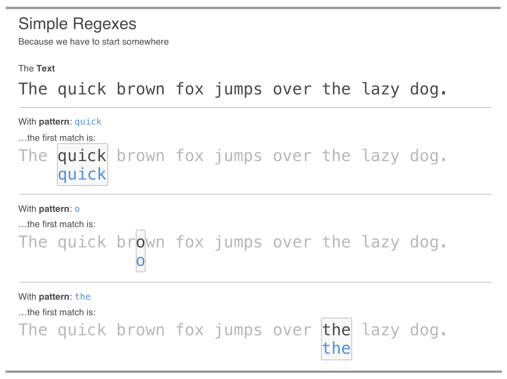
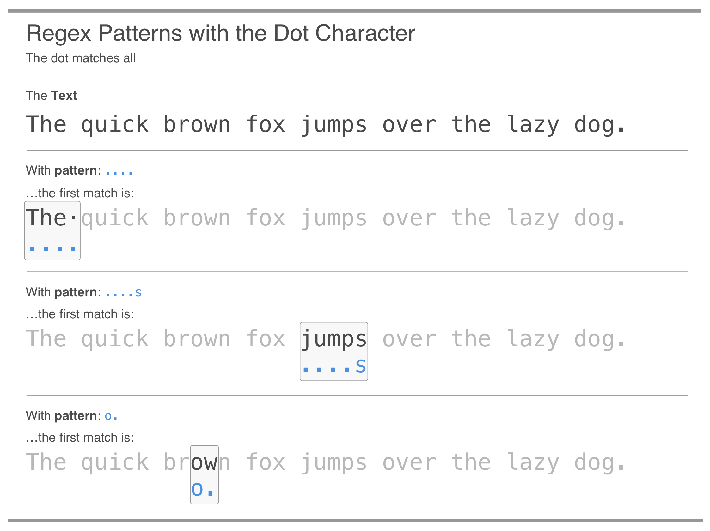
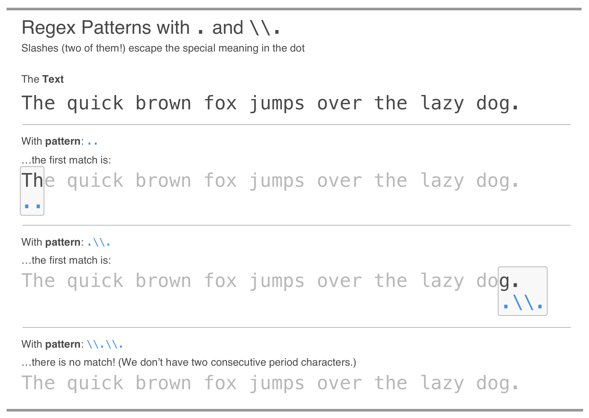
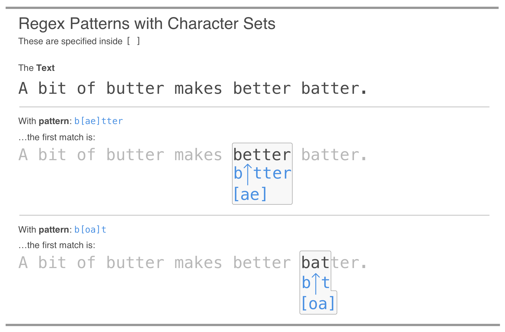
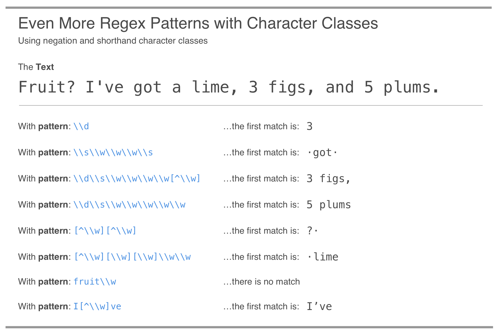
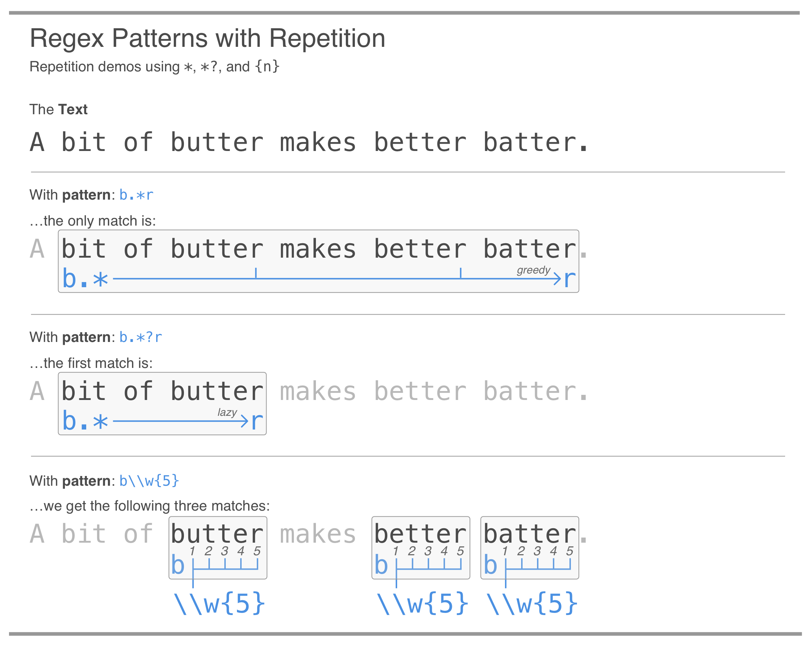

# String Transformations {#string_transformations}

```{r setup, include=FALSE, echo=FALSE}
library(edr)
library(tidyverse)
library(stringr)
```

This chapter covers

- Working with vectors and learning about **R**'s recycling behavior
- Learning and reviewing some of the more essential base **R** functions (and getting the names of the dozens of other useful functions)
- Writing our own functions to manipulate data
- Writing conditional statements and understanding the logic behind control flow
- The finer details of strings and character vectors in **R**
- Formatting, transforming, and printing character objects using several useful base **R** functions
- Writing and using regular expressions to use as patterns for more advanced string-based applications
- Using regex patterns with functions from the **stringr** package to work with strings and character vectors

Text is set of characters, strung together, giving us the term *string*. Working with strings is something you might do in **R** over and over again. Because text may be very unstructured, working with it can be quite challenging. We need to understand the tools available for dealing with strings in base **R** and in the Tidyverse because strings play a big role in many data cleaning and preparation tasks. We'll use small and large examples of text in our lessons here. The **edr** package provides a dataset for this chapter called `resto_reviews`. It's not a tibble this time but rather a character vector containing reviews for a restaurant. We will occasionally use it to practice with a collection of string-based **R** functions. Some of these functions will be base **R** functions and others will come from the **stringr** package from the Tidyverse.

## How Strings and Character Vectors Work in **R**

The characters that compose a string can include letters, numbers, and even symbols. For the purpose of simplicity here, we'll refer to individual strings and character vectors as character objects. **R** can store strings and it does so with a data type of character, and, the class is also character. Try using these statements in the **R** console: `typeof("a string")` and `class("another string")`. Both of these will return `"character"`. In this section we'll create strings and character vectors and further understand the subtle behaviors in how **R** treats these objects. We will also learn all about a small set of base **R** functions that are used very often with character objects.

### Making Simple Strings and Character Vectors

In one of our very first code listings in this book (in *Chapter 2*), we assigned a character string to an object. We did this by surrounding the text within double quotes (`" "`).

`r edr::code_hints(
"**CODE //** Assigning a character string to ~~one_word~~.",
c(
"#A We need quotes to distinguish character strings from variables."
))`
```{r one-word}
one_word <- "hello"  #A
one_word
```

We could just as easily have used single quotes (`' '`) around the string. The only condition is that you use the same type of quoting at the beginning and at the end. So `"hello"` is fine whereas `"hello'` won't work at all. I personally use double quotes whenever possible but, whether you use single or double quotes, **R** will always print character objects with double quotes.

The `c()` function helps us create vectors, and we can use it to generate character vectors from scratch (just as we've done several times before). Let's make a character vector that we can use for further experimentation.

`r edr::code_hints(
"**CODE //** Creating a character vector with three elements."
)`
```{r three-words}
three_words <- c("one", "two", "three")
```

The `three_words` character vector can be combined with other vectors using `c()`. Combining with another character vector results in a larger character vector where the ordering of vector elements is preserved:

`r edr::code_hints(
"**CODE //** Combining two character vectors with the ~~c()~ function."
)`
```{r words-and-days}
days <- c("monday", "tuesday", "wednesday")

words_and_days <- c(three_words, days)

words_and_days
```

The output vector is still a character vector since we combined vectors of the same type: `character`.

This result isn't too surprising. We know by now that vectors in **R** have to contain elements of the same type. But what would happen if a character vector were to be combined with a numeric vector? Let's find out by combining three_words with a vector of three numbers.

`r edr::code_hints(
"**CODE //** Combining a character vector with a numeric vector."
)`
```{r words-and-numbers}
three_numbers <- c(1, 2, 3)

words_and_numbers <- c(three_words, three_numbers)

words_and_numbers
```

The result is that the combined vector is of the character type. It's apparent when `words_and_numbers` is printed to the console.

The numbers are in quotes, and, we can further verify that this is a character vector by using the `is.character(words_and_numbers)` in the console. It will return `TRUE` here. The rule is that if there is even a single character element in a vector (no matter where it appears in that vector), all other elements in the vector will be transformed into character elements. This concept of automatically transforming the types of objects is called coercion. Let's create a vector with several different data types, including a character element:

`r edr::code_hints(
"**CODE //** How combining elements of different types results in coercion."
)`
```{r coercion-to-character}
c(7, 1.2, TRUE, 6.4/2, FALSE, "hello")
```

Sure enough, all of these elements appear in quotes when printed to the console.

The thing to note here is that there are no warnings for coercion, so, we need to be aware that combining elements of different types will result in a flattening to a single type.

### Strings in Data Frames and Tibbles

The `stringsAsFactors` issue with data frames is as real today as it was many years ago. It's a point of confusion and frustration that just won't go away. We really need to get the facts straight on this one. Basically it's this: when creating a data frame with `data.frame()`, any character vectors used as inputs will be converted to factors. Furthermore, when printing a data frame, it really appears as though the character values are character values. Let's generate a data frame with two input vectors, where one is `numeric` and the other is `character`:

`r edr::code_hints(
"**CODE //** Creating a data frame with two columns."
)`
```{r data-frame-w-factors, paged.print=FALSE}
data_frame <- data.frame(a = three_numbers, b = three_words)

data_frame
```

The `b` column certainly looks like a `character`-based column but using `class()` function with column `b` (as in `class(data_frame$b)`) returns `"factor"`. The way to avoid this automatic conversion is to use the `stringsAsFactors` option, setting that to `FALSE`. The upcoming code listing shows how to create a data frame that preserves character columns, inspecting the object with the `str()` function.

`r edr::code_hints(
"**CODE //** Using the ~~stringsAsFactors~~ option with ~~data.frame()~~."
)`
```{r data-frame-no-factors, paged.print=FALSE}
data_frame_2 <- 
  data.frame(
    a = three_numbers,
    b = three_words,
    stringsAsFactors = FALSE
  )

str(data_frame_2)
```

The output from `str()` shows us that column `b` has the `"character"` class.

We were warned about this behavior in *Chapter 7*, where the case for creating and using tibbles was made since tibbles don't convert strings to factors. Should data frames need to be made, however, please remember to use `stringsAsFactors = FALSE` if necessary (and most of the time, it is necessary). Just to remind us of how tibbles treat strings, the analogous statement that creates a tibble (`tibble(a = three_numbers, b = three_words)`) results in:

```{r tibble-remind, echo=FALSE}
tibble(a = three_numbers, b = three_words)
```

and there is no need to call `str()` to determine the column types since they are already included in the console output.

## Different Ways to Format Text

Base **R** contains many functions to format text! We can start with numbers and use the `formatC()` function to transform them to text, using options that define exactly how the final text-based numbers will appear. Why would we format numbers to text? We often do this for display purposes. Formatting a numeric vector to a character vector can allow for consistent usage of decimal places, decoration of numbers with commas and units (like currency symbols or percent signs), or, left/right padding with spaces or other characters.

Other times you'll have text strings but they need to be normalized to a common format. This might entail putting all characters in uppercase or lowercase, trimming whitespace, or, getting substrings (i.e., pieces of the original text string starting and ending at certain character positions). It's sometimes surprising how often you'll need to format text and numbers during data analysis tasks so acquiring a bag of tricks for text manipulation will really pay off.

### Formatting Numbers to Strings with `formatC()`

The base **R** function `formatC()` is often used to format numeric values to strings with a consistent format. There are two other base **R** functions that also do formatting: `format()` and `sprintf()`. However since `formatC()` is more specialized to numeric formatting, we'll devote some time to learning some common uses of formatting numeric data to text.

You might have some decimal numbers in a numeric vector and there is the requirement for those to be formatted in the exact same way (three decimal digits, must have a period for the decimal mark, etc.). The `formatC()` function can handle this, have a look at this example:

`r edr::code_hints(
"**CODE //** Using the ~~formatC()~~ function to get very particular output character strings for three decimal numbers.",
c(
"#A The values have varying numbers of decimal digits (3, 2, and 4 digits).",
"#B Setting digits to ~~3~~ means that we need exactly three digits after the decimal mark. Rounding will occur.",
"#C The format designation is pretty important here. Using ~~\"f\"~~ will give us numbers in the ~~xxx.yyy~~ format.",
"#D The choice of decimal mark is usually decided by your system's locale. It can be an explicit character though and, here, the period character is chosen for ~~decimal.mark~~.",
"#E The ~~drop0trailing~~ option will discard any trailing zeros after the decimal place if this is set to ~~TRUE~~. The default is ~~FALSE~~."
))`
```{r formatC-decimals-2dig}
decimal_numbers <- c(3.825, 1.01, 15.7758)  #A

formatC(
  decimal_numbers,
  digits = 3,  #B
  format = "f",  #C
  decimal.mark = ".",  #D
  drop0trailing = FALSE  #E
)
```

The output values, now in a character vector, show values formatted to two decimal places. The decimal point (in the `decimal.mark` argument) was forced to be a period character.

Should we have index numbers in a table, it may sometimes be preferable to pad those values with leading zeros. Why? Those index numbers may eventually find themselves combined with other strings and a common index-value width may be helpful when sorting. Let's look at an example where (1) index values reside in a tibble column (called `index`) alongside a `character`-based column, (2) the `index` values undergo transformation to fixed-width index strings, and (3) the `index` strings are combined with the `character`-based values in the `text` column.

`r edr::code_hints(
"**CODE //** Using ~~formatC()~~ in a ~~mutate()~~ call to format sequential numeric values to index strings that are left-padded with zeros (to a specified width).",
c(
"#A The ~~tibble()~~ statement generates a 1200 row tibble object.",
"#B The ~~mutate()~~ call will write over the index column with the output values.",
"#C The ~~digits~~ value being ~~4~~, this time, indicates total digits shown (there won't be decimal places because of the format specification we are providing).",
"#D The format of ~~\"d\"~~ indicates that we want integers (no decimals).",
"#E The flag is a format modifier (and there are several that ~~formatC()~~ understands); a flag of ~~\"0\"~~ is understood as a directive to pad with zeros on the left.",
"#F Instead of using **dplyr**'s ~~mutate()~~ to ~~paste0()~~ strings together, the **tidyr** ~~unite()~~ function is used here.",
"#G Reverse sorting on ~~combined~~ is done here to prove that the alphanumeric sorting works now that the numeric portion is padded with zeros."
))`
```{r formatC-mutate, paged.print=FALSE}
combined_tbl <-
  dplyr::tibble(index = 1:1200, text = rep(LETTERS[1:12], 100)) %>%  #A
  dplyr::mutate(index = formatC(  #B
    index,
    digits = 4,  #C
    format = "d",  #D
    flag = "0"  #E
  )) %>%
  tidyr::unite(col = "combined", index, text) %>%  #F
  dplyr::arrange(desc(combined))  #G
  
combined_tbl
```

The combined index string has a numeric component that still sorts properly (try it without the `mutate()` statement to see the difference!). And this is all thanks to `formatC()` and its myriad options.

### Simple String Transformations with base **R** Functions

There are some useful base **R** functions that help us to transform character values in vectors. Should we need to have strings all in upper case or lower case letters, the `toupper()` and `tolower()` functions will make that possible. 
`r edr::code_hints(
"**CODE //** Using the ~~toupper()~~ and ~~tolower()~~ functions to transform characters to upper case and lower case."
)`
```{r toupper-tolower}
mixed_cases <- c("One", "two", "Three", "FOUR")

c(
  toupper(mixed_cases[1:2]),
  tolower(mixed_cases[3:4])
)
```

Why would you ever want to make these transformations? Well, `tolower()` is useful if you have string inputs of mixed case (e.g., `c("yes", "Yes")`) and you'd like to standardize those values to lower case, perhaps for plotting or for string matching in **dplyr** `filter()` statements. The `toupper()` function might be used for similar reasons, and may also be handy for creating initialisms for printing (e.g., `toupper("uk")` gives us `"UK"`).

Sometimes, text strings are too long for a given purpose (e.g., for displaying in a visualization with a limited amount of space) and, especially if these strings represent states, conditions, or something categorical, they can be amenable to abbreviating. We can abbreviate strings in a character vector with the `abbreviate()` function:

`r edr::code_hints(
"**CODE //** Using ~~abbreviate()~~ to make unique abbreviations for longer strings.",
c(
"#A This is the character vector with terms to abbreviate; notice that some of these are pretty close in spelling (and there's a duplicated entry in there as well).",
"#B All strings in the ~~terms~~ vector are abbreviated with a minimum length of 3 characters with ~~minlength = 3~~."
))`
```{r abbreviate-terms}
terms <- c("location", "site", "area", "arena", "locale", "site")  #A

abbreviate(terms, minlength = 3)  #B
```

We get a named vector as output from `abbreviate()`, which makes it easy to compare the original strings with the abbreviated forms. These are unique abbreviations, and we didn't have to invent them. This is useful for those cases where you need short categorical names (say, for **ggplot**). 

Sometimes, text strings are too long for a given purpose (e.g., for displaying in a visualization with a limited amount of space) but are still viable in a shortened form. We can truncate strings in a character vector with the `substr()` function. Shortening strings like this can be a worthwhile strategy for giving a hint of the content without having to display all of it. The **edr** package has a dataset called `resto_reviews.` This is a character vector with very long strings (each element of the vector is an actual review of a restaurant). Given that these reviews are so long, let's truncate them to the first 80 characters with `substr()`. The next code listing shows how this is possible.

`r edr::code_hints(
"**CODE //** Using ~~substr()~~ to truncate very long strings to a specific length.",
c(
"#A The values supplied to ~~substr()~~ are ~~1~~ and ~~80~~, representing the range of characters to retain.",
"#B In the interest in brevity, we will just print the first five vector elements of ~~resto_reviews_trunc~~."
))`
```{r substr-resto-reviews}
resto_reviews_trunc <- resto_reviews %>% substr(1, 80)  #A

resto_reviews_trunc[1:5]  #B
```

The first five elements of the `resto_reviews_trunc` character vector are printed and we can see right away that the strings are all of the same length. Some of the truncated strings above end with a space character (elements 2 and 4). We can remove, or trim, that whitespace with the `trimws()` function. Simply pipe the `resto_reviews_trunc` vector to `trimws()` and all of the new strings won't have any trailing whitespace (this also eliminates leading whitespace).

`r edr::code_hints(
"**CODE //** Using ~~trimws()~~ to remove any leading and trailing whitespace in our truncated strings.",
c(
"#A The character vector of truncated strings is piped to ~~trimws()~~; the default options (trimming whitespace on the *left* and *right* and the function's definition of whitespace) are usually always adequate for this type of string operation.",
"#B Again, we are just printing the first five elements of (the newly modified) ~~resto_reviews_trunc~~ vector."
))`
```{r trimws-resto-reviews}
resto_reviews_trunc <- resto_reviews_trunc %>% trimws()  #A

resto_reviews_trunc[1:5]  #B
```

The result here seems subtle but for shorter strings (that perhaps need to be pasted with other strings), whitespace is much more noticeable and can be a nuisance unless it's removed.

Finally, there is the `strtrim()` function. It operates quite a bit like the `substr()` function, with a few subtle differences. Whereas `substr()` has the `start` and `stop` arguments for defining the positions of the starting and ending character for all elements of a vector, `strtrim()` just has the `width` argument. That argument is analogous to stop in `substr()` except that `width` can be a numeric vector of character widths that apply to each element. Conceivably, we could supply a vector of width values that's the same length as the character vector and expect the truncations to correspond to those widths. In the next code listing, we won't do anything with the `width` argument of `strtrim()` other than supply the value of `80` and compare the output to that of `substr()` using the `all.equal()` function.

`r edr::code_hints(
"**CODE //** Using ~~strtrim()~~ to truncate strings, much like ~~substr()~~.",
c(
"#A Every output element of the ~~substr()~~ expression is compared to that of the ~~strtrim()~~ expression with ~~all.equal()~~. If they all match (and they do here), the result is ~~TRUE~~."
))`
```{r strtrim-resto-reviews}
all.equal(resto_reviews %>% substr(1, 80), resto_reviews %>% strtrim(80))  #A
```

The `all.equal()` function compares the outputs of both function calls and determines whether they are all equivalent. In this case, the result is `TRUE`. Besides the variable width, what is different about `strtrim()` to justify its existence? It turns out that this function should be chosen over `substr()` if any character strings have double width characters (e.g., contains Chinese, Japanese, or Korean characters).

## Using Regular Expressions to Work with Text

What is a regular expression? It can be thought of as a search string, but it's more like a separate language that undergoes its own interpretation. Regular expression (or regex) patterns, however, are super-powerful and so they're really worth the time and effort it takes to learn them.

Think of a search you might do in a word processor. The search facility allows you to find simple matches with a simple string, showing you all of the exact matches of the search string to the text content. A regular expression can do this too. However, it goes so much further. You can match using higher-order patterns, such as two letters followed by two digits, or, words starting with a specified set of letters. We can make regex patterns that match phone numbers, words with similar but alternate spellings, email addresses, and much more.

How does this relate to **R**? Once we begin to understand the language behind making regular expression patterns, we'll use those patterns in **R** functions to do things with text. The *Tidyverse* **stringr** package has quite a few functions that have a pattern argument where a regular expression is expected. Those functions that use regex patterns allow us to get information about a body of text (e.g., `str_count()`, `str_detect()`, `str_starts()`, `str_ends()`, `str_which()`), extract parts of text (e.g., `str_extract()`, `str_extract_all()`), or transform a piece of text (`str_subset()`, `str_replace()`, `str_replace_all()`).

It's good to have a playground for experimenting with regexes and for that, the *RegExplain* gadget for **RStudio** (developed by Garrick Aden-Buie) is really good. It allows us to quickly experiment with our regex patterns. It's included as part of the **edr** package for convenience; all we need to do is run `edr_regexplain_gadget()` in the **R** console:

`r edr::code_hints(
"**CODE //** Opening up the *RegExplain* gadget is great for experimenting with regular expressions."
)`
```{r open-regexplain, eval=FALSE}
edr_regexplain_gadget()
```

By default, the function provides sample text to match on, but we can provide our own text string as well. *Figure \@ref(fig:regexplain-gadget)* provides a visual on how the gadget looks and it points out its main features.

```{r regexplain-gadget, echo=FALSE, fig.cap="The *RegExplain* Gadget as it appears in the **RStudio** Viewer. By interactively typing our regex into the field labeled `RegEx`, we can see what it matches on in the large text field below."}

```

When you first look at regular expression (or regex) patterns, they appear a bit daunting because of all the tokens that go into them (letters, numerals, and punctuation) are used in a terse manner. And it's indeed true that it does take some time (and much practice) to get the hang of constructing these patterns. However, it's a skill that will eventually pay off, allowing us to do really powerful things with text.

### Regex Basics: Matching Characters and Using Escapes

Let's start by doing some simple matching on `"The quick brown fox jumps over the lazy dog."` and learn how the regex engine is parsing that string with our supplied patterns. Using the regex pattern `"quick"`, will match the word `quick` in the text. This makes sense, in that this is how matching traditionally works. Single letters will also result in a match and, usually, multiple matches. Using the pattern `"o"` (the lowercase letter `O`) results in all four `o` characters being matched in the sentence. There are two instances of the word `the` in our example string. They're not quite the same though. The first instance has a capital `T` and the second has a lowercase `t`. By default, regex engines are case sensitive (and this can be changed, take a closer look at *Figure \@ref(fig:regexplain-gadget)*). That means that the pattern of the will only match on the second instance of that word. *Figure \@ref(fig:regex-examples-1)* shows how matches are made with simple regex patterns.

```{r regex-examples-1, echo=FALSE, fig.cap="Matching a simple regex pattern to the text and getting the first match."}

```

To understand this all a bit more clearly, we can try to think like a parser. With the pattern `"quick"`, we move letter-by-letter, left-to-right through the text, looking for a `q` since that's the first element of the regex pattern. Once that first `q` is located from the scan, we (as the pretend parser) lock onto that and check if the next token in the pattern matches the next character in the text. This phase of searching and comparing will continue until which point there either is a break in this matching process, or, there is a full match. In the first case, we abort this mode of comparison and move on with our letter-by-letter scan as if nothing happened before. In the second case of the full match, we declare that there is a match and then report exactly where the match occurred.

The dot character (otherwise known as a period, or `.`) is a special token in regex patterns. It matches every character, and that includes spaces as well. Let's look at a few ways we can use the dot with the regex patterns `"...."`, `"....s"`, and `"o."` (*Figure \@ref(fig:regex-examples-2)*).

```{r regex-examples-2, echo=FALSE, fig.cap="Using regex patterns with the dot, which unconditionally matches every character. In every case here, the first match is shown."}

```

We can see from *Figure \@ref(fig:regex-examples-2)* that the dot acts as a wildcard, matching every character. Four dots as the pattern, `"...."`, matches the first word (`"The"`) and the following space character. The pattern `"....s"` needs four of any character and then an `s` character (this matches `"jumps"`). Finally, the pattern `"o."` will make its first match on any first appearance of an `o` and any character. In the example sentence, this matches the `ow` in `"brown"`.

What if you wanted the dot to match just a period? Because the period or dot character has special meaning in regex patterns, we have to escape it to match on the literal `.` character. We do this by adding two backslash characters, so, we would use the pattern `"\\."` to match a period. We call this practice *escaping* because we are essentially escaping from the code meaning of these metacharacters (and moving to the alternative of using these characters as string literals).

Characters that Need Escaping: It's not just the dot that needs escaping in regular expressions as there are, in total, 12 characters with special meaning. They are the dot (or period) `.`, the caret `^`, the dollar sign `$`, the asterisk `*`, the plus sign `+`, the question mark `?`, the pipe symbol `|`, the opening and closing parentheses `(` and `)`, the opening square bracket `[`, the opening curly brace `{`, and, the backslash itself `\`. We'll discover what special meanings these characters have in regex expressions but it's good to have all of these specials collected here for future reference.

The examples in *Figure \@ref(fig:regex-examples-3)* can show us the difference between using the patterns `".."`, `".\\."`, and `"\\.\\."` with our sample sentence.

```{r regex-examples-3, echo=FALSE, fig.cap="Using regex patterns with the escaped form of the dot results in matches involving the period character."}

```

The first pattern in *Figure \@ref(fig:regex-examples-3)* isn't too surprising considering what we now know about the dot character's supreme matching abilities. The second pattern, `".\\.,"` uses the dot (matching all) followed by its escaped form (matching a period); this will match the last two characters in the sentence (that ends with a period). The last pattern, `"\\.\\.,"` just serves to remind us that matching on two literal period characters won't result in a match at all since there's only one period in the entire sentence (a trick question! but educational nonetheless).

To test these matches in **R**, we can use either the `str_match()` or `str_match_all()` functions from the **stringr** package. The `str_match()` function returns us the first match of the pattern from the input string. Its variant `str_match_all()` returns all matches from the input text. The following provides an example of how this works in practice.

`r edr::code_hints(
"**CODE //** Using ~~str_match()~~ to determine the first match of the regex pattern on the text.",
c(
"#A This is the text string.",
"#B The ~~str_match()~~ function will return the first match of ~~\"....\"~~ from the ~~fox_dog~~ string."
))`
```{r str-match}
fox_dog <- "The quick brown fox jumps over the lazy dog."  #A

str_match(fox_dog, "....")  #B
```

The returned match value represents the first four characters of the text supplied in `fox_dog`. 

Let's try a different pattern and see all of the possible matches in the text with the `str_match_all()` function:
	
`r edr::code_hints(
"**CODE //** Using ~~str_match_all()~~ to get all of the matches from the text.",
c(
"#A The ~~str_match_all()~~ function will return all matches of ~~\".o.\"~~ from the ~~fox_dog~~ string."
))`
```{r str-match-all}
str_match_all(fox_dog, ".o.")  #A
```

Turns out there are four matches from the `".o."` pattern. They are provided in the order they were found. Use these functions (or the *Regexplain* gadget) often to test out your regex patterns!

### Character Sets and Character Classes

We can match on specific characters using a character set. The allowed characters are put inside square brackets. As an example, suppose we want to match on the word `"license"` and its alternative spelling of `"licence"` in a large body of text. We could use the regex `"licen[cs]e"`, which accepts either the letter `c` or `s` as the second-to-last letter in the word. It's important to understand here that everything in the square brackets only counts for a single character match. This may be easier to understand with a few examples using some sample text (*Figure \@ref(fig:regex-examples-4)*).

```{r regex-examples-4, echo=FALSE, fig.cap="Using regex patterns with character sets to match similar words. The pattern in the first example will match two words (even though only the first match is shown)."}

```

Each of the regex patterns in *Figure \@ref(fig:regex-examples-4)* are depicted with the character sets matching on a single character. The `b[ae]tter` pattern will match `"better"` and `"batter"`. Throughout these examples, we've been sticking to just showing the first match and, here, `"better"` is that first match. How about the regex `"b[oa]t?"` It will match the text `"bot"` and `"bat"`. The first of those isn't present but the second one is (in the word `"batter"`).

We can specify ranges of characters inside of a character set with a hyphen between like characters. Want to match all lowercase letters? Use `a-z`. All uppercase? That's `A-Z`. We can even use a range of numbers; using `0-9` will match any number. Furthermore, we can mix and match single characters with ranges. Here's a list of character sets and their interpretations:

- `[a-f0-9]` matches any lowercase letter from `a` to `f` and all digits
- `[a-zA-C]` matches all lowercase letters and the uppercase letters `A`, `B`, and `C`
- `[A-Zaeiou]` matches all uppercase letters and the lowercase vowels
- `[A-Za-z ;]` matches all uppercase and lowercase letters plus spaces and semicolons
- `[a-z0-9-]` matches all lowercase letters, all numbers, and the hyphen character

We can use negation with character sets. These negated character sets are constructed by using the caret character as a leading metacharacter inside the square brackets. Here's a few examples of those along with descriptions:

- `[^5-9]` matches any character that isn't a number from `5` to `9`
- `[^a-z]` matches any character that isn't a lowercase letter
- `[^;- .]` matches any character except a semicolon, a hyphen, a space, or a period

Within the square brackets of a character set, most metacharacters don't need to be escaped (the period doesn't require any escaping for instance). If in doubt, the `\\` for escaping can still be used without adversely affecting the meaning of the character set as a whole. Another thing is that the position of the caret (for negation) and the hyphen (for ranges) is important. A `^` that's not the first character inside the `[ ]` will be interpreted as a literal `^` character. A hyphen that doesn't appear to be part of a range (e.g., `a-z`) will be interpreted as a literal `–` character. Part of attaining familiarity with regular expressions is some experimentation so, if you're ever in doubt, use `str_match()` with a toy example.

While character classes are quite useful when defining a regular expression, their content can be quite verbose. Thankfully, there exists a series of shorthand character classes. The use of `\\d` in a regex is the same as the character class [0-9]. We can interpret that shorthand character class as standing in for any numerical digit. The shorthand character class represented by `\\w` contains the ASCII range of word characters as well as all digits and the underscore character; the comparable character class is `[A-Za-z0-9_]`. The `\\s` shorthand character class is inclusive of whitespace characters. This will usually match space characters, tabs, and line breaks.

Figure *Figure \@ref(fig:regex-examples-5)* presents a number of regex examples that all use a short phrase concerning quantities of fruit. It combines a number of new things we learned about character classes.

```{r regex-examples-5, echo=FALSE, fig.cap="Using regex patterns with character classes to match on classes of characters."}

```

As can be seen, these character classes work equally well both inside and outside of the square bracket notation that defines character sets. Negation of character classes like `\\w` can either be constructed by using `[^\\w]` or by using the capitalized form (which are `\\W`, `\\D`, and `\\S` for word characters, digits, and space characters).

Now is a good time to try out all of these new things. Using the following code listing as a basis for more experimenting, we can get a better feel for how character classes work.
	
`r edr::code_hints(
"**CODE //** A regex example that uses character sets, character classes, and negation.",
c(
"#A This is the text string.",
"#B The ~~str_match_all()~~ function will return all matches the complex pattern from the ~~ihavefruit~~ string."
))`
```{r character-sets-classes}
ihavefruit <- "Fruit? I've got a lime, 3 figs, and 5 plums."  #A

str_match_all(ihavefruit, "[\\d\\w][^A-Z]\\w\\w\\w\\w\\S")  #B 
```

The returned matches give us the quantities of fruit (plus the adjoining, non-space character to the right).

There is also that tricky thing that is whitespace. You can't really see it most of the time, but you can detect it. And there are several specialized character classes that represent different types of whitespace:

- `\t` matches any tab character
- `\n` matches a line feed character
- `\r` matches a carriage return
- `\v` and `\f` match on vertical tab and form feed characters

Something to note with all of these is that they are written with only a single backslash (all previously shown character classes require two).

Finally, we have a set of character classes known as the POSIX character classes. They are constructed using a keyword enclosed in square brackets and colons, like this: `[[:keyword:]]`. While some of these can be easily formed using character sets, some would require very large character sets, making their shorthand use quite convenient. Here is a listing of the 11 POSIX character classes:
	
- `[[:alpha:]]` matches any letter, like `[a-zA-Z]`
- `[[:lower:]]` matches any lowercase letter, like `[a-z]`
- `[[:upper:]]` matches any uppercase letter, like `[A-Z]`
- `[[:digit:]]` matches any digit, like `[0-9]`
- `[[:xdigit:]]` matches any hexadecimal value, like `[a-fA-F0-9]`
- `[[:alnum:]]` matches any alphanumeric value, like `[a-zA-Z0-9]`
- `[[:space:]]` matches whitespace, like `[\t\v\r\n\f ]`
- `[[:punct:]]` matches any punctuation character
- `[[:print:]]` matches any printable character
- `[[:graph:]]` matches any printable character except for a space
- `[[:cntrl:]]` matches any ASCII control character

### Repetition, Laziness, and Greediness

Since it is tedious to incessantly repeat characters, character sets, and character classes when matching on multiple characters, a common thing in regular expressions is to use quantifiers or repetition operators. Let's dive right in and see how we can use these convenient constructs in our regex patterns.

The question mark (`?`) makes the preceding token in the regex pattern optional. For example, the pattern `"favou?r"` will match both the words `"favour"` and `"favor"`. The question mark is called a quantifier. The question mark can be applied to multiple tokens as well, we just need to wrap those in parentheses. An example of a regex pattern that uses this is `"Dec(ember)? 12(th)?"`. It'll match four common occurrences of that date: `"December 12th"`, `"December 12"`, `"Dec 12th"`, and `"Dec 12"`. The upcoming code listing provides another concrete example that uses the `?` token with the `ihavefruit` string.

`r edr::code_hints(
"**CODE //** Using the ~~?~~ quantifier to denote an optional piece of text.",
c(
"#A This regex pattern gets the fruit names whether they are three or four letters long, and, whether they have singular or plural forms."
))`
```{r question-mark-quantifier}
str_match_all(ihavefruit, " [\\d\\w]\\s\\w\\w\\w\\w?s?\\S")  #A 
```

Though the function call gives us the same matches as in the previous code listing, the regex pattern is written such that our intent is much clearer than before.

We can use a concept called repetition to repeat regex tokens, reducing the need to write a token multiple times (as was done for many of the previous examples). The asterisk (`*`) instructs the regex engine to match the preceding token zero or more times. The plus (`+`) tells the regex engine to try to match the preceding token one or more times. 

If the unbounded range on the right seems too unconstrained, we can limit repetition and supply lower and upper limits for the number of consecutive matches. This is done with the construction `{min,max}` where `min` and `max` are integers. One of these may be omitted, meaning the range is bounded on just one side. Including only a single value inside the curly braces (as in `{n}`) means that the regex engine should attempt match the preceding token exactly *n* times. This following listing summarizes how these repetition operators work:

- `a?` or `(abc)?` optionally matches `"a"` or `"abc"`; zero or one time
- `*` matches the preceding token zero or more times
- `+` matches the preceding token one or more times
- `{min,max}` matches the preceding token `min` to `max` times
- `{min,}` matches the preceding token `min` or more times
- `{,max}` matches the preceding token zero to `max` times
- `{n}` matches the preceding token exactly *n* times

Repetition with the `*` and `+` will find the longest match possible. In other words, these regexes are greedy. An example here will this concept a little bit clearer. With the text `"I'm in the mood for some food"` and the regex pattern `"mo.*d"`, we might expect that the match will be `"mood"`. However, the pattern is also valid for the longer match of `"mood for some food"`. But what if we wanted the shortest possible match of `"mood"`? Then we are asking for laziness instead of greediness (or an ungreedy match). We can accomplish this by using a question mark (`?`) after the quantifier (the `*` or `+`, as in `*?` or `+?`). With that, the regex pattern `"m.*?d"` will match just mood. In other words, the use of `?` after `*` or `+` will result in the shortest match.

*Figure \@ref(fig:regex-examples-6)* provides a few examples of how repetition with `*`, `*?`, and `{n}` is used with the 'A bit of butter makes better batter' phrase.

```{r regex-examples-6, echo=FALSE, fig.cap="The difference between `*` and `*?` during repetition means the difference between greedy and lazy matching. Repetition with `\\w{5}` is exact, matching 5 word characters."}

```

Repetition is a very useful feature because we don't have to repeat regex tokens and we furthermore have fine control over how much repetition is required in a matching expression.

### Anchors

Unlike specific characters we were matching to before, anchors don't represent a character but rather a position. In the regular expressions commonly used in **R**, anchors basically tie a pattern to the start or end of the string. There are two of them:
	
- `^` matches the start of the string
- `$` matches the end of the string

Let's take a look at three `str_match()` statements that all use the `ihavefruit` string along with regex patterns using `^`, `$`, or both:

`r edr::code_hints(
"**CODE //** Using anchors to bind the search pattern to the start and/or end of the string.",
c(
"#A This regex is anchored to the start of the string with ~~^~~. After the boundary, it wants to match as many word characters as possible.",
"#B This regex is anchored to the end of the string with ~~$~~. Before the boundary, it wants to match as many word characters as possible, and then a period before the end of the string.",
"#C This here regex is a bit different. It wants to match the entire line (as evidenced by the use of ~~^~~ and ~~$~~. As long as the string is entirely composed of printable characters (it is), a match will occur."
))`
```{r anchors}
str_match(ihavefruit, "^\\w*")  #A
str_match(ihavefruit, "\\w*\\.?$")  #B
str_match(ihavefruit, "^[[:print:]]*$")  #C
```

Anchors are often so useful because they both provide a constraint for the match and, often, the important text to match on occurs near the start or end of strings.
	
### Grouping, Capturing, and Backreferences
	
By grouping part of a regular expression inside parentheses, several things are possible. We can apply a quantifier like `*` or `+` to the entire group for repetition. We can use pipes for alternation, which allow for *OR*-type matches on subexpressions. Parentheses can also create a capturing group (this is automatic, and this can be deactivated on a per-group basis). What does a capturing group do? It stores the part of the string matched by the part of the regular expression inside the parentheses. You can refer to the same text as previously matched by a capturing group with backreferences, like `\\1`, `\\2`, etc.

All of this probably doesn't mean much of anything right now, so, let's see it in action with examples. First up, some statements with alternation in parentheses:
	
`r edr::code_hints(
"**CODE //** Using alternation inside of parentheses (which is a capturing group).",
c(
"#A This regex is entirely in parentheses and it'll match on the first instance of ~~figs?~~, ~~plums?~~, or ~~limes?~~ (recall that the ~~?~~ makes the preceding token optional). Because it's all in parentheses, this is a capturing group (by default)."
))`
```{r grouping-capturing-alternation}
str_match(ihavefruit, "(figs?|plums?|limes?)")  #A
```

The output shows us a character matrix with two columns. The first is the match (like before) and the second here is the value of the first (and only) capture group. We can deactivate capturing in this case by using the regex `"(?:limes?|figs?|plums?)"`, where the `?:` just inside the group indicates that this should not be a capturing group.

The next example involves using the capturing groups in a backreference. It's a bit complicated but it shows a useful application of backreferences with the `str_replace_all()` function.
	
`r edr::code_hints(
"**CODE //** Backreferences are used to compose a new string in a particular order with the captured text.",
c(
"#A The ~~str_replace_all()~~ function requires both a regex pattern and a replacement string. Here we are using capturing groups for each of the fruits, then, we are composing a new string with the backreferences (in a reverse order).",
"#B This is another ~~str_replace_all()~~ call that modifies the output of the previous call. The regex pattern ~~s\\\\b~~ matches on an ~~s~~ character and a word boundary. The replacement of ~~\"\"~~ (an empty string) essentially means that anything matching should be removed.",
"#C The **stringr** ~~str_split()~~ function will take a string and split it into a vector using a pattern.",
"#D The ~~str_split()~~ function always returns a list. To make this a single vector we can use the ~~unlist()~~ function."
))`
```{r str-replace-all}
ihavefruit %>%
  str_replace_all(  #A
    pattern = ".*(limes?).*(figs?).*(plums?).*",
    replacement = "\\3 \\2 \\1"
  ) %>%
  str_replace_all(pattern = "s\\b", replacement = "") %>%  #B
  str_split(pattern = " ") %>%  #C
  unlist()  #D
```

This example showed us how to selectively obtain certain words from a string and generate a vector. Incidentally, there is also another **stringr** function that will do this much better: `str_extract_all()`. The following code listing provides an example of this.

`r edr::code_hints(
"**CODE //** Extracting words from a string and putting them into a vector with ~~str_extract_all()~~.",
c(
"#A The ~~str_extract_all()~~ function just needs a regex pattern and dutifully extract each match from the string and put it into a list.",
"#B Just like ~~str_split()~~, the ~~str_extract_all()~~ function will create a list. Because we want a vector we can use the ~~unlist()~~ function."
))`
```{r str-extract-all}
ihavefruit %>%
  str_extract_all(pattern = "(limes?|figs?|plums?)") %>%  #A
  unlist()  #B
```

This is a pretty good example of alternation but, if we really wanted to be sure that these words are matched exactly on whole words then word boundaries, with `\\b`, can be used.

`r edr::code_hints(
"**CODE //** Improving the pattern with the word boundary metacharacter.",
c(
"#A The use of the word boundary metacharacters ensures that we don't unintentionally match on fragments of words."
))`
```{r str-extract-all-2}
ihavefruit_2 <- "Fruit? Yep, I've got a lime, 3 figs, and 5 plums. All covered in slime."

ihavefruit %>%
  str_extract_all(pattern = "(\\blimes?\\b|\\bfigs?\\b|\\bplums?\\b)") %>%  #A
  unlist()
```

Word boundaries are a bit like anchors in that they don't represent an actual character. They are not often used but occasionally come in handy. Hadn't we used them with the `ihavefruit_2` string, we would have had the word `"lime"` extracted twice (because of the presence of `"slime"`).

### Using Regular Expressions in **stringr** Functions

Given this crash course in regular expression was pretty intense, it may be just too much to go through the entire collection of **stringr** functions. What might be better is to focus on some of the **stringr** functions that use regex patterns, looking at a few examples of their use.

Sometimes you want to know if a particular pattern exists in one or more strings. For that, we can use `str_detect()`, which gives us a logical vector the same length as the input character vector. Let's find out if the pattern `"yum\\w*?"` exists in `resto_reviews`:

`r edr::code_hints(
"**CODE //** Using the ~~str_detect()~~ function to see whether there are any matches of our pattern in the ~~resto_reviews~~ vector.",
c(
"#A The ~~str_detect()~~ function, like all <code>str_*()</code> functions in the **stringr** package, always takes the vector of strings as the first argument.",
"#B The base **R** ~~table()~~ function is useful for converting a vector to a contingency table, which is a table counts for each categorical variable (~~TRUE~~ or ~~FALSE~~ in this case)."
))`
```{r str-detect}
str_detect(string = resto_reviews, pattern = "yum\\w*?") %>%  #A
  table()  #B
```

Given that the resulting table output shows two `TRUE` values, the pattern was found at least once in two of the reviews.

Given that this pattern did match something, we now want to know what those strings were. This can be accomplished in two steps. First, assign the logical vector returned by the use of `str_detect()`. Then, use that vector of `TRUE`/`FALSE` values to subset the `resto_reviews` character vector with square bracket operators:

`r edr::code_hints(
"**CODE //** Using the logical vector from ~~str_detect()~~ to inspect those reviews that matched the regex.",
c(
"#A The output of the ~~str_detect()~~ statement is, this time, saved to an object called ~~matches~~.",
"#B The logical vector of ~~matches~~ is a great way to subset ~~resto_reviews~~ to those elements where a match occurred."
))`
```{r str-detect-see-matches}
matches <- str_detect(string = resto_reviews, pattern = "yum\\w*?")  #A

resto_reviews[matches]  #B
```

With the two reviews that matched our pattern, the word 'yummy' is seen twice. And while this is admittedly a simple example of determining whether a single pattern is detected in a fairly large set of strings, we can probably imagine more complex searches that involve matching on multiple conditions.

Suppose you wanted to extract all mentions of pricing from the `resto_reviews` dataset. One approach is too look for all price mentions with dollar signs affixed (i.e., $12 rather than twelve dollars). Further to this, the task involves getting all of these matches and eventually working the results into a numeric vector, which may be used for getting some basic descriptive statistics like the mean or min/max values. This can be accomplished by using the `str_extract_all()` and the `str_remove()` functions (along with some base **R** functions):

`r edr::code_hints(
"**CODE //** Getting all matches of dollar values and eventually resolving to a single numeric vector.",
c(
"#A The pattern ~~\\\\$\\\\d*~~ will match on text like ~~$10~~, ~~$5~~; the resulting object is a list containing all of the matches for each of the vector elements.",
"#B Because we want all of the matches in a single vector we use ~~unlist()~~, which will flatten the list into a single character vector.",
"#C Eventually, the values should be converted into a numeric vector, however, we can't do that if the dollar sign is present. It's removed by using ~~str_remove()~~, where the pattern is the text that's to be removed.",
"#D The character vector can be converted to numeric at this point by using the ~~as.numeric()~~ function."
))`
```{r str-extract-all-str-remove}
str_extract_all(string = resto_reviews, pattern = "\\$\\d*") %>%  #A
  unlist() %>%  #B
  str_remove(pattern = "\\$") %>%  #C
  as.numeric()  #D
```

The result of this data extraction scheme is the numeric vector with the values `14`, `30`, `8`, `16`, `3`, and `19`. What was once text is now in the form of useful numerical values!

## Summary

- Combining vectors with `c()` can result in type coercion; if any vectors used with `c()` are of the `character` class, the resulting vector will be `character` (changing `numeric` vectors to `character`, for example)
- When using `data.frame()` to make a table object, any `character` vectors used as inputs will be converted to factors unless we set `stringsAsFactors` to `FALSE`; a table produced with `tibble()` won't automatically convert strings to factors
- The `str()` function shows us the structure of an **R** object and it's useful for inspecting data frames and lists (among other **R** data structures)
- The `formatC()` function is useful for formatting numeric values to string representations and has many options and useful applications
- There are many useful base **R** functions for string transformations: `toupper()`, `tolower()`, `abbreviate()`, `substr()`, `trimws()`, and `strtrim()`.
- Regular expressions (or regexes) in **R** are very useful in conjunction with string-handling functions that have a `pattern` argument
- In the regular expressions primer, important regex concepts were literals, metacharacters, escaping, the dot (that matches all), character sets, character classes, negation, repetition, greediness/laziness, alternation, anchors, grouping, capturing, and backreferences... phew!
- Experimentation with regular expressions is important for learning, so using the *RegExplain* gadget or the **stringr** package's `str_match()` or `str_match_all()` functions can be helpful for your own experimentation
- The **stringr** package provides a well-designed set of functions for making working with strings easy and most of them use regular expressions; we found `str_detect()` useful for detecting matches, and `str_extract()`/`str_extract_all()` made it possible for us to extract the matched text for further manipulation
