# Making Presentation Tables {#making-presentation-tables}

```{r setup, include=FALSE, echo=FALSE}
library(edr)
library(tidyverse)
library(DT)
library(gt)
library(stringr)
```

This chapter covers

- Making presentation tables with the **DT** package for an interactive display of thousands of rows
- Creating smaller scale, yet highly customized, presentation tables with the **gt** package

Before delving into the world of **R Markdown**, we will learn how to generate tables for reporting or presentation. There's potential to confuse data tables (e.g., tibbles, data frames, database tables) with those tables that are provided in reports or presentations. To get this straight right away, let's call the latter type of table product *presentation tables*. The **DT** and **gt** packages will be used to generate a wide set of presentation tables, using data tables as the primary inputs.

There are a lot of packages available in **R** for making presentation tables. The common thread permeating all these packages is a workflow that: (1) begins with a data table (e.g., data frame, tibble, etc.) that's in a shape close to what you'd want in the final table, (2) uses functions from the package to do formatting of values and cell styling, and (3) prints the finalized presentation table in a specified or inferred output format. Let's examine two packages for making display tables: **DT** and **gt**. If you currently don't have them in your **R** library, you can get them both by using `install.packages("DT")` and `install.packages("gt")`.

You might wonder, why look at two different **R** packages for making presentation tables? Shouldn't just one suffice? The reason for learning about both **DT** and **gt** has to do with their relative strengths. **DT** is great at displaying large data tables (i.e., multiple screenfuls of rows) and has interactive components for pagination, sorting rows by particular columns, filtering rows, and much more. It works exceedingly well if the data isn't summarized to just a few rows. The **gt** package takes a different approach. It is optimized for smaller summary-type tables. It gives you lots of control over formatting values, applying styling to individual cells, adding footnotes, and even transforming the content of cells. Knowing how to use both of these will allow you to confidently create reporting tables that meet the different concerns of the aforementioned packages (and they both work exceedingly well in **R Markdown**).

## Making Presentation Tables with **DT**

Sometimes you'll want to present a table with lots of rows. This non-summarized data is perhaps more interesting than summarized data because it provides an essential resource and aggregating would possibly make no sense. The **DT** package doesn't ship with any datasets, but we do have the `pitchfork` dataset (accessible from the **edr** package) and it's a lot of fun to peruse. As a reminder of what's in that dataset each record is a review of an album, where the `artist`, `album`, `year` columns identify the album, the `score` is the reviewer's rating (from `0` to `10`), and the `link` column provides links to the review pages.

The function in **DT** that is used to generate the table is called `datatable()`. The following code shows just how easy it is to generate a table:

`r edr::code_hints(
"**CODE //** Making a **DT** table from 1000 rows of ~~pitchfork~~ data."
)`
```{r dt-pitchfork-simple}
datatable(pitchfork %>% dplyr::slice_head(n = 1000))
```

If executing the chunk above in an **R Markdown** document (with CTRL + ENTER), the output will appear just below the chunk. This gives you a pretty operational **DT** table, however all text may be shown with the default browser font (usually `Times New Roman`), and, the full height of the table may be cut off. Not to worry though, the inline output should serve as a preview and knitting to HTML will show the entire table in the rendered document (Figure 12.1).

```{r dt-pitchfork-1-fig, echo=FALSE, fig.cap='(ref:dt-pitchfork-1-fig)'}
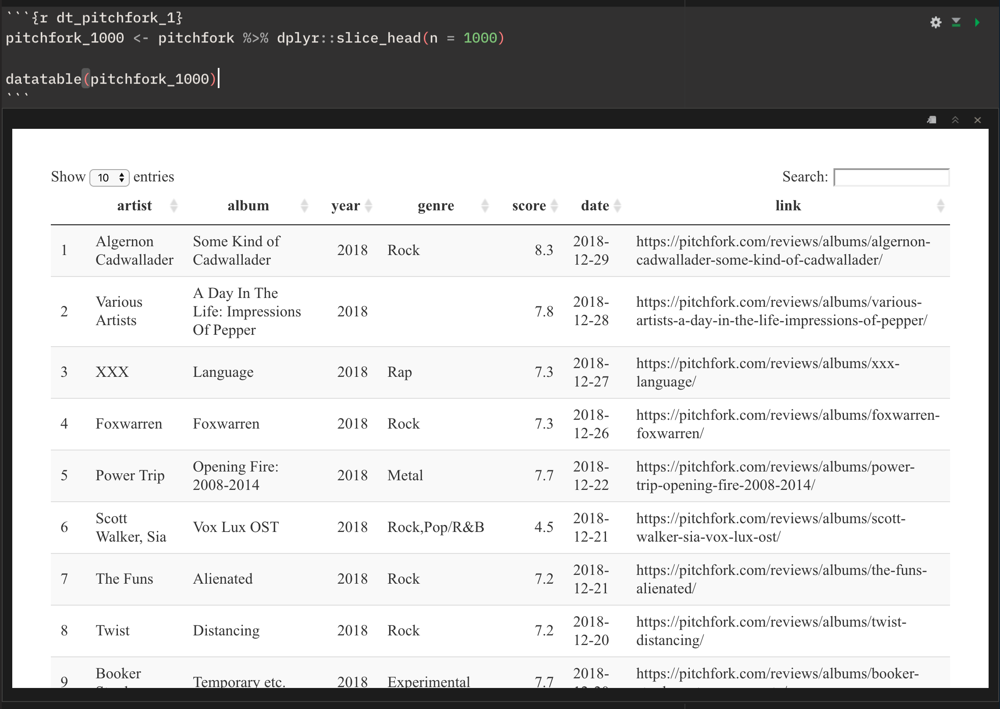
```
(ref:dt-pitchfork-1-fig) A **DT** table using the default options as it appears in an **R Markdown** document.

When the **R Markdown** document is rendered to an HTML document through knitting (easily done by clicking the *Knit* button on the top toolbar), the **DT** table looks a whole lot nicer (Figure 12.2). Before taking the screenshot that became Figure 12.2, I sorted the rows in a descending manner by clicking on the up/down arrow button next to the score label. This is one of the great things that **DT** offers without any extra configuration.

```{r dt-pitchfork-1b-fig, echo=FALSE, fig.cap='(ref:dt-pitchfork-1b-fig)'}
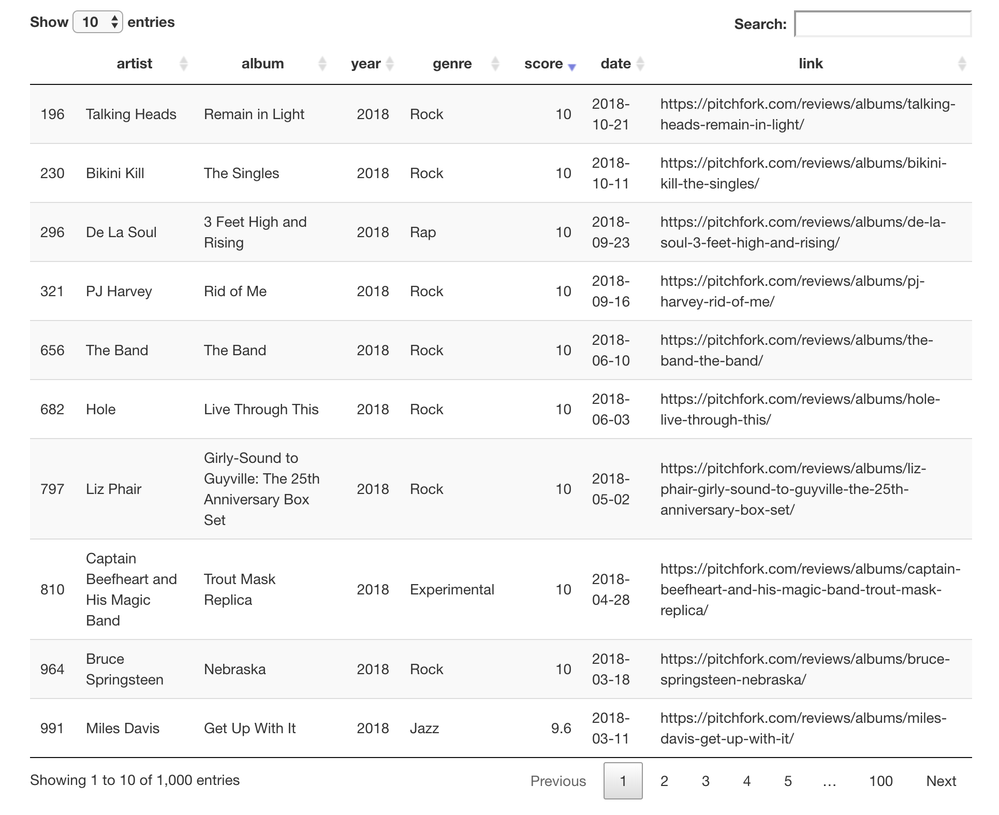
```
(ref:dt-pitchfork-1b-fig) A **DT** table using the default options as it appears in a browser (or the **R Markdown** *Preview* window).

While the default look is reasonable and good, there are all sorts of customizations that might appear even better. In the next few examples, we'll add more options and tweaks to demonstrate some of the things that **DT** is capable of.

First up, taking those links in the link column and making them clickable and navigable. We ultimately want to be taken to the relevant review page on the Pitchfork website. To do this we first need to understand how to an HTML link. It takes the form `<a href="url">link text</a>`. That bit of information (and so much more related to the web) can be found at the [*MDN web docs* site](https://developer.mozilla.org/). To generate the links as HTML links, we can use **dplyr**'s `mutate()` function on the `pitchfork_1000` tibble with some `paste0()` (Listing 12.2).

`r edr::code_hints(
"**CODE //** Creating usable links with the ~~<a>~~ HTML tag in the ~~link~~ column."
)`
```{r dt-pitchfork-links, paged.print=FALSE}
pitchfork_1000 <- 
  pitchfork %>%
  dplyr::slice_head(n = 1000) %>%
  dplyr::mutate(link = paste0("<a href='", link ,"'>review</a>"))

pitchfork_1000 %>% select(link)
```

Another thing that needs to be considered is that **DT** automatically escapes certain characters in every bit of text in the table. This effectively means that characters that have special meaning in HTML are replaced with HTML entities. For example, the characters `<`, `>`, and `&` are replaced with the HTML entities `&lt;`, `&gt;`, and `&amp;`. This *HTML sanitization* is done as a security measure but can be circumvented here by using the `escape` argument of `datatable()`. It can sound like we shouldn't do this, but, it's okay here because we are providing our own trusted HTML strings. In Listing 12.3, we use the transformed `pitchfork_1000` table to generate a **DT** table, where column `8` (`link`) is set to be not escaped (hence the negative sign).

`r edr::code_hints(
"**CODE //** Making the column of links functional in a **DT** table by removing the escape condition from column ~~8~~."
)`
```{r dt-pitchfork-2, eval=FALSE}
pitchfork_1000 %>% datatable(escape = -8)
```

The output table, when rendered to HTML via knitting, is shown in the screen capture of Figure 12.3. Do the links work? They do! I clicked on one and I was brought to the correct web page (Figure 12.4 is evidence of this).

```{r dt-pitchfork-2-fig, echo=FALSE, fig.cap='(ref:dt-pitchfork-2-fig)'}
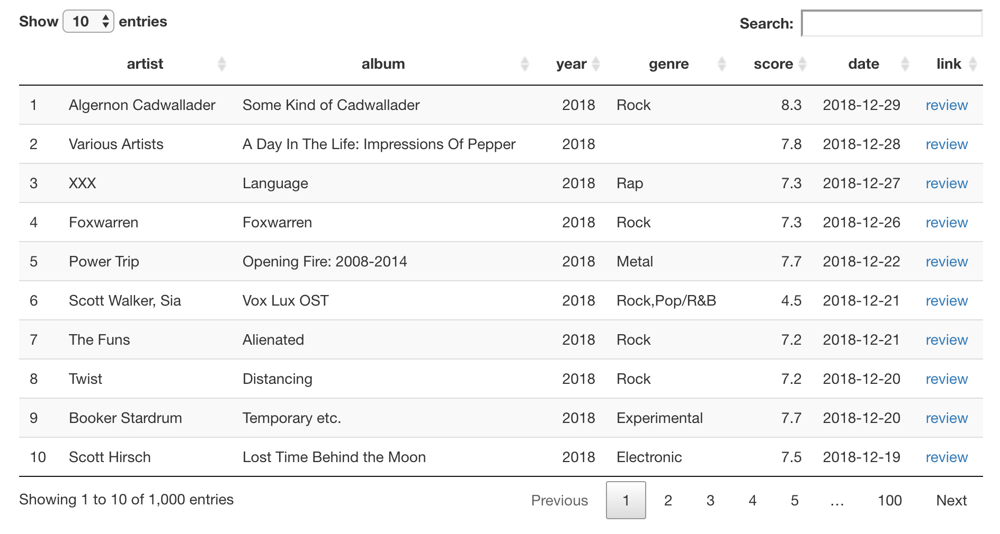
```
(ref:dt-pitchfork-2-fig) An improved **DT** table that has functional links in the rightmost column.


```{r dt-pitchfork-2b-fig, echo=FALSE, fig.cap='(ref:dt-pitchfork-2b-fig)'}
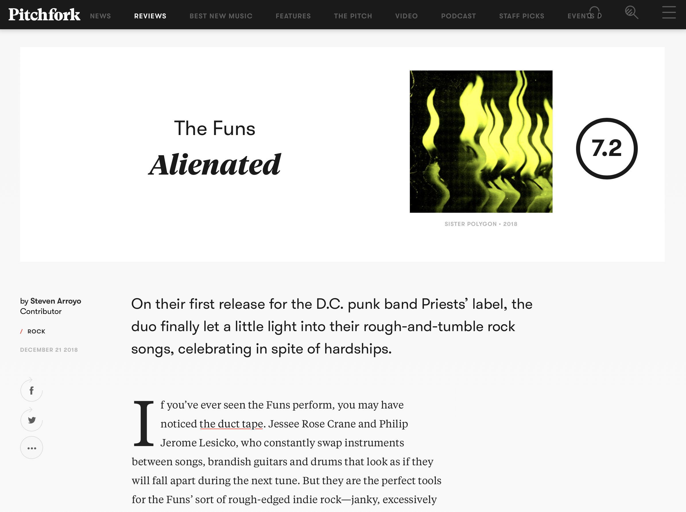
```
(ref:dt-pitchfork-2b-fig) A web page that appeared before my eyes (in my default browser) when I clicked on a link in the **DT** table (row 7, it was).

Let's make more modifications to our **DT** table. We can freshen up the look of it with some keywords in the `style` and `class` arguments of `datatable()`. We'll elect to use `style = "bootstrap4"`, which utilizes a fairly current vintage of the Bootstrap framework. On top of that, let's set `class = "table-bordered"`. This will give the table consistent horizontal and vertical lines. Oh, and we don't need those row numbers in the first column. They can be gotten rid of by using `rownames = FALSE`. In the following code listing, there is one final change to make: the index of the column to escape (`link`) is now column `7` instead of `8` (because of the dropped column with row names). A screenshot of the output HTML table is presented as Figure 12.5.

`r edr::code_hints(
"**CODE //** Changing the table appearance of the **DT** table with the ~~style~~ and ~~class~~ parameters, and, by removing the column with row names."
)`
```{r dt-pitchfork-3, eval=FALSE}
pitchfork_1000 %>%
  datatable(
    escape = -7,
    style = "bootstrap4",
    class = "table-bordered",
    rownames = FALSE
  )
```

```{r dt-pitchfork-3-fig, echo=FALSE, fig.cap='(ref:dt-pitchfork-3-fig)'}
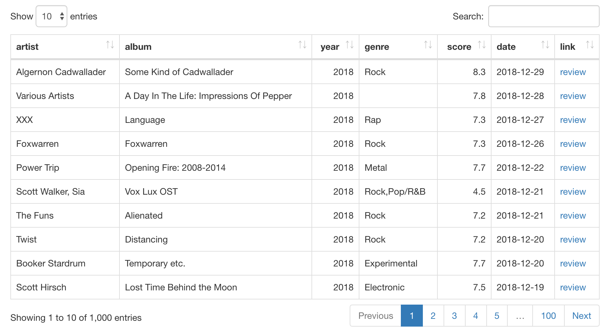
```
(ref:dt-pitchfork-3-fig) A **DT** table with *Bootstrap 4* styling and other refinements.

A thing that's often changed when going from data tables to presentation tables is the column names. It can be better to have them in title case. Quite conveniently, the **stringr** package has the function `str_to_title()` that competently transforms strings to title case. In Listing 12.5, we'll use that function to generate a vector of modified column names for the `colnames` argument of `datatable()`. Because of this, the column label `"artist"` is now `"Artist"`, `"album"` becomes `"Album"`, etc., and this looks quite a bit better (and fits the usual convention for columns labels in presentation tables). The top portion of the revised presentation table is shown as Figure 12.6.

`r edr::code_hints(
"**CODE //** The column names of the **DT** table can be modified using the ~~colnames~~ argument."
)`
```{r dt-pitchfork-4, eval=FALSE}
pitchfork_1000 %>%
  datatable(
    escape = -7,
    style = "bootstrap4",
    class = "table-bordered",
    rownames = FALSE,
    colnames = stringr::str_to_title(colnames(pitchfork_1000))
  )
```

```{r dt-pitchfork-4-fig, echo=FALSE, fig.cap='(ref:dt-pitchfork-4-fig)'}
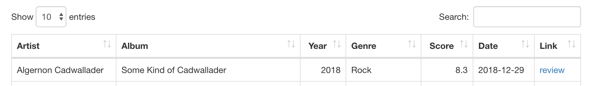
```
(ref:dt-pitchfork-4-fig) The **DT** table with modified column labels.

The last two modifications to the **DT** table involve adding UI elements. Given that there is a substantial number of rows, having controls to filter the table down to perhaps a handful based on per-column criteria is desirable. We can add intelligent filtering controls that adapt their UI to the type of data in each column. This is done by using the `filter` argument of `datatable()` and specifying a location. There are two options, and we'll elect to use `"top"` in Listing 12.6 instead of `"bottom"`. Figure 12.7 shows the top of the HTML output table, with interactive controls below each column label.

`r edr::code_hints(
"**CODE //** Adding filtering functionality to the **DT** table (UI applied to the top of the table)."
)`
```{r dt-pitchfork-5, eval=FALSE}
pitchfork_1000 %>%
  datatable(
    escape = -7,
    style = "bootstrap4",
    class = "table-bordered",
    rownames = FALSE,
    colnames = stringr::str_to_title(colnames(pitchfork_1000)),
    filter = "top"
  )
```

```{r dt-pitchfork-5-fig, echo=FALSE, fig.cap='(ref:dt-pitchfork-5-fig)'}
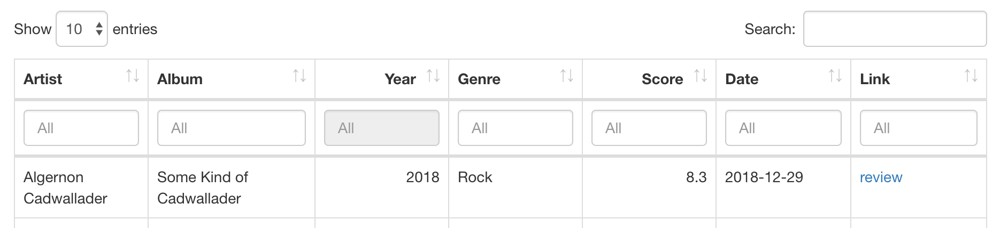
```
(ref:dt-pitchfork-5-fig) Filtering controls in the **DT** table for each column.

And now, our last modification will be made. This one can come in handy when viewers of your table want to have some or all of the data in the table for their own, separate analysis. It involves the addition of buttons that allow for downloading of the data, copying of the data (to the system clipboard), or printing (sounds archaic but, to be fair, this could be printing to PDF). Activating these buttons requires a carefully written incantation within `datatable()` that uses the extensions and options arguments. It's given in Listing 12.7 and a full screenshot of the finalized HTML table is shown in Figure 12.8.

`r edr::code_hints(
"**CODE //** Adding useful buttons for exporting the table data to various files, copying the data, and printing."
)`
```{r dt-pitchfork-6, eval=FALSE}
pitchfork_1000 %>%
  datatable(
    escape = -7,
    style = "bootstrap4",
    class = "table-bordered",
    rownames = FALSE,
    colnames = stringr::str_to_title(colnames(pitchfork_1000)),
    filter = "top",
    extensions = "Buttons",
    options = list(
      buttons = c("csv", "excel", "pdf", "copy", "print"),
      dom = "Bfrtip"
    )
  )
```

```{r dt-pitchfork-6-fig, echo=FALSE, fig.cap='(ref:dt-pitchfork-6-fig)'}
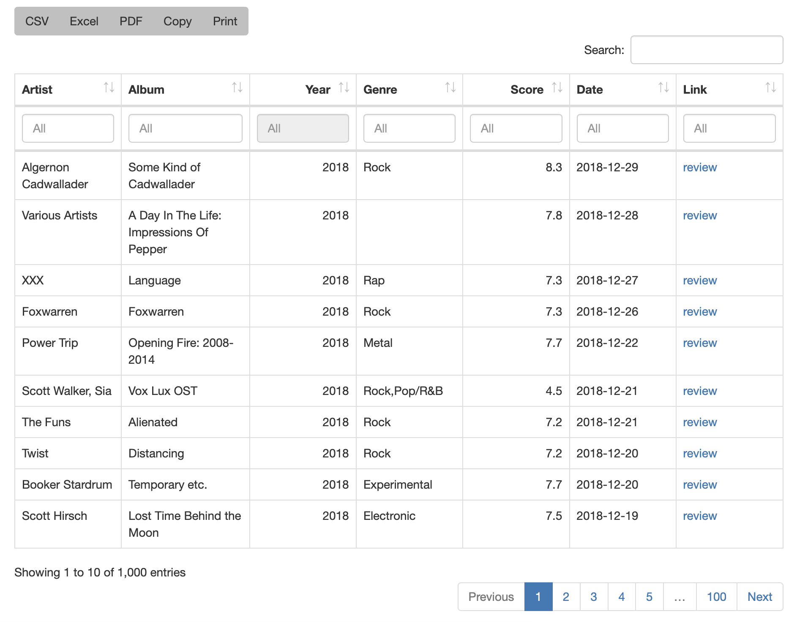
```
(ref:dt-pitchfork-6-fig) A **DT** table with the complete set of modifications, the last being the addition of a panel of buttons for downloading, copying, and printing data.

These buttons are fully functional: when pressed they either initiate a file download, copy text to the system clipboard, or active the system's printing dialog. Another nice thing about these buttons is that the data retrieved will reflect the state of the visible rows. For example, if the rows have been sorted and filtered, the user of the table can download an Excel file with just those rows in the reordered state. A drawback is that the easy functionality ends here. Should you want a button that provides data in a different format, you'll have to write some JavaScript to make that happen. Nonetheless, the available options are pretty good and should cover most of the needs of users in a self-service situation.

## Creating **gt** Tables

When you need a smaller, non-interactive HTML table that has a ton of possibilities for stylin', then consider using the **gt** package. The interface is very high-level and declarative, where you can provide general instructions versus very specific (though, that's possible too). There are lots of formatting options, with fine control for number, values in scientific notation, values with uncertainties, ranges, percentages, currency, and dates/times. This package also lets you add footnotes without the common and unnecessary problem of manually ordering them in the footer section of the table. The main workflow involves preprocessing your table data (be it a tibble or a data frame) into a form that resembles the final presentation table. You then decide how to compose your **gt** table with the elements and formatting you need for the task at hand. Finally, the table is rendered by printing it at the console, including it in an **R Markdown** document, or exporting to a file using the `gtsave()` function.

The package ships with a number of datasets and for our first set of examples, we'll use the `exibble` dataset. This tibble contains only eight rows with numeric, character, and factor columns. It's great for experimentation because it's small enough to see the whole thing when rendered to HTML. Let's see how `exibble` looks by feeding it to **gt**'s `gt()` function (Listing 12.8 and Figure 12.9)

`r edr::code_hints(
"**CODE //** The ~~exibble~~ table as a **gt** table."
)`
```{r gt-exibble-1, eval=FALSE}
gt_tbl_1 <- exibble %>% gt()

gt_tbl_1
```

```{r gt-exibble-1-fig, echo=FALSE, fig.cap='(ref:gt-exibble-1-fig)'}
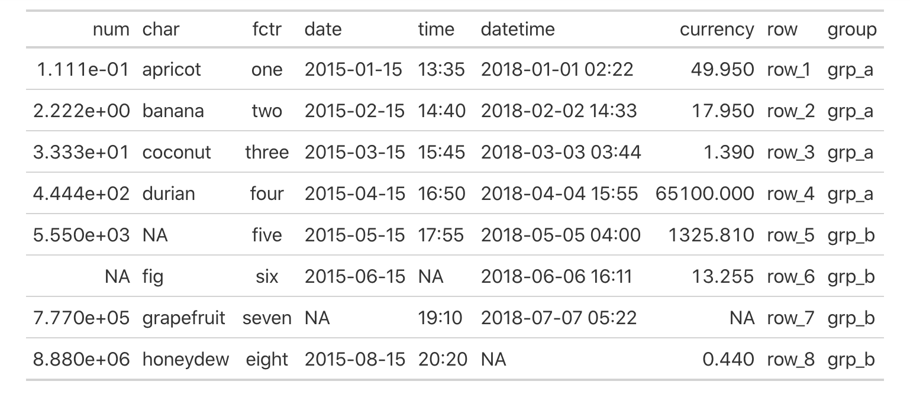
```
(ref:gt-exibble-1-fig) This is the `exibble` dataset as a **gt** table.

Before we get deeper into the functions of the **gt** package, we should take some time to understand **gt**'s model of a table.

### The Parts of a **gt** Table

The **gt** philosophy is such: we can construct a wide variety of useful tables with a cohesive set of table parts. These include the table header, the stub, the column labels and spanner column labels, the table body, and the table footer. Here's a diagram (Figure 12.10) that shows how these parts fit together.

```{r parts-of-a-gt-table, echo=FALSE, fig.cap='(ref:parts-of-a-gt-table)'}
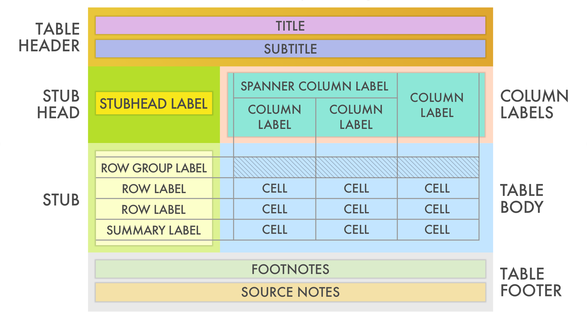
```
(ref:parts-of-a-gt-table) The parts of a **gt** table.

The parts of a **gt** table are then (roughly from top to bottom):

- the Table Header (optional; with a title and possibly a subtitle)
- the Stub and the Stub Head (optional; contains row labels, optionally within row groups having row group labels and possibly summary labels when a summary is present)
- the Column Labels (contains column labels, optionally under spanner column labels)
- the Table Body (contains columns and rows of cells)
- the Table Footer (optional; possibly with footnotes and source notes)

The way that we add parts like the table header and footnotes in the table footer is to use the `tab_*()` family of functions. There are quite a few `tab_*()` functions, and they are concerned with creating or modifying parts of a table. Here is a listing of these fundamental **gt** functions, with short descriptions of what they do:

- `tab_header()`: Add a table header
- `tab_spanner()`: Add a spanner column label
- `tab_spanner_delim()`: Create column labels and spanners via delimited names
- `tab_row_group()`: Add a row group to a **gt** table
- `tab_stubhead()`: Add label text to the stubhead
- `tab_footnote()`: Add a table footnote
- `tab_source_note()`: Add a source note citation
- `tab_style()`: Add custom styles to one or more cells
- `tab_options()`: Modify the table output options

### Adding/Modifying Parts of a **gt** Table with `tab_*()` Functions

A table header is easy to add so let's see how the previous table looks with a title and a subtitle. We can add this part using the `tab_header()` function. The arguments are simply `title` and `subtitle` (Listing 12.9, Figure 12.11).

`r edr::code_hints(
"**CODE //** Adding a table header with the ~~tab_header()~~ function."
)`
```{r gt-exibble-2, eval=FALSE}
gt_tbl_2 <- 
  gt_tbl_1 %>%
  tab_header(
    title = "The exibble dataset",
    subtitle = "(It's available in the gt package.)"
  )

gt_tbl_2
```

```{r gt-exibble-2-fig, echo=FALSE, fig.cap='(ref:gt-exibble-2-fig)'}
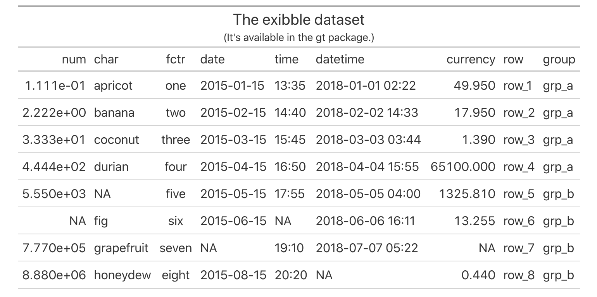
```
(ref:gt-exibble-2-fig) The `exibble` **gt** table with a table header added (via the `tab_header()` function).

Let's add a source note to the footer part of the **gt** table based on `exibble`. A source note is useful for citing the data included in the table. Several can be added to the footer and the key to that is using multiple calls of `tab_source_note()`. They will be inserted in the order provided (Listing 12.10, Figure 12.12).

`r edr::code_hints(
"**CODE //** Adding table source notes with multiple calls of the ~~tab_source_note()~~ function."
)`
```{r gt-exibble-3, eval=FALSE}
gt_tbl_3 <-
  gt_tbl_2 %>%
  tab_source_note("The gt package is available in CRAN.") %>%
  tab_source_note("This example is provided by the edr book.")

gt_tbl_3
```

```{r gt-exibble-3-fig, echo=FALSE, fig.cap='(ref:gt-exibble-3-fig)'}
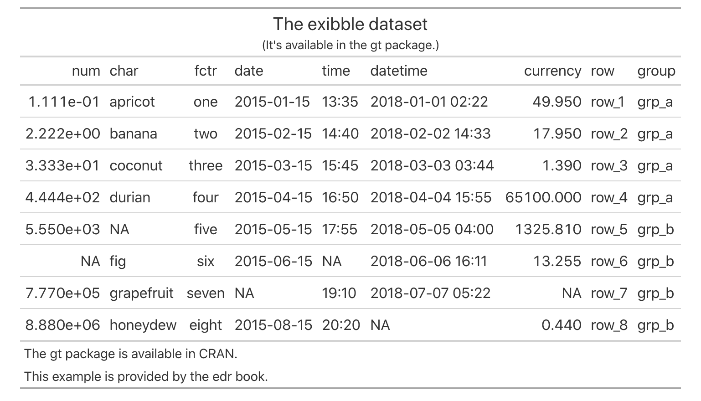
```
(ref:gt-exibble-3-fig) The `exibble` **gt** table with a both a table header and a table footer (containing two source notes provided by two uses of the `tab_source_note()` function).

Footnotes also live inside the footer part of the table and their footnote marks are attached to cell data. Put another way, there are two components to a footnote: (1) a footnote mark that is attached to the targeted cell text, and (2) the footnote text (that starts with the corresponding footnote mark) that is placed in the table's footer area. 

Footnotes are added with the `tab_footnote()` function. The helper function `cells_body()` can be used with the location argument to specify which data cells should be the target of the footnote. The `cells_body()` helper has the two arguments: `columns` and `rows.` For each of these, we can either supply (1) a vector of column names or row names, (2) a vector of column/row indices, (3) bare column names wrapped in `vars()` or row labels within `c()`, or (4) a select helper function (e.g., `starts_with()`, `ends_with()`, `contains()`, `matches()`, `one_of()`, `everything()`, etc.). For `rows` specifically, we can use a conditional statement with column names as variables (e.g., `size > 15000`).

What follows is a simple example of how a footnote can be added to a table cell. Let's add a footnote to the cell with the word `"coconut"`. We don't have any row names in this table (we'll see how those can be generated in a later example); however, we can easily see that the target cell in row `3` of the `char` column. Listing 12.11 provides a way that we might create a footnote for that table cell (Figure 12.13 shows the resulting table).

`r edr::code_hints(
"**CODE //** Adding a footnote for a specific cell with the ~~tab_footnote()~~ function."
)`
```{r gt-exibble-4, eval=FALSE}
gt_tbl_4 <-
  gt_tbl_3 %>%
  tab_footnote(
    footnote = "This coconut contains a tape and half a necklace.",
    locations = cells_body(columns = vars(char), rows = 3)
  )

gt_tbl_4
```

```{r gt-exibble-4-fig, echo=FALSE, fig.cap='(ref:gt-exibble-4-fig)'}
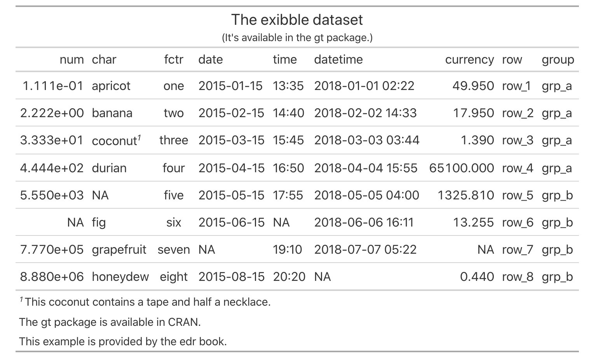
```
(ref:gt-exibble-4-fig) The footer of the `exibble` **gt** table now has a footnote that's associated with a specific body cell. With multiple calls of `tab_footnote()`, several footnotes can be added.

Footnotes can be associated with text in different parts of the table. There is a family of functions of the form `cells_*()` that are termed location helper functions. They are used in the `locations` argument of `tab_footnote()` (and also `tab_style()`). Should we want to add a footnote that explains the `char` column label, we can make a similar call to `tab_footnote()` and use `cells_column_labels()` to target that column label (Listing 12.12, Figure 12.14).

`r edr::code_hints(
"**CODE //** Adding a footnote for a specific column label with the ~~tab_footnote()~~ and ~~cells_columns_labels()~~ functions."
)`
```{r gt-exibble-5, eval=FALSE}
gt_tbl_5 <-
  gt_tbl_4 %>%
  tab_footnote(
    footnote = "This column contains alphabetical fruit.",
    locations = cells_column_labels(columns = vars(char))
  )

gt_tbl_5
```

```{r gt-exibble-5-fig, echo=FALSE, fig.cap='(ref:gt-exibble-5-fig)'}
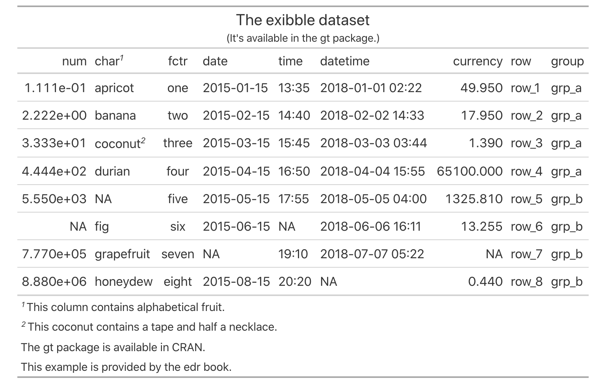
```
(ref:gt-exibble-5-fig) Two different footnotes, two different locations: the secret to this is using those location helper functions for targeting.

From the table produced and shown in Figure 12.14, we can see that the order of footnotes is handled automatically by **gt** The ordering of footnotes proceeds from left-to-right and goes top-to-bottom.

Adding footnotes wouldn't be possible without using one of the many different location helper functions. It could be hard to keep those straight; here is a listing of them (roughly ordered by locations that run from the top to the bottom of a **gt** table) with short descriptions:

- `cells_title()`: targets the table title or the table subtitle depending on the value given to the groups argument (`"title"` or `"subtitle"`).
- `cells_stubhead()`: targets the stubhead location, a cell of which is only available when there is a stub; a label in that location can be created by using the `tab_stubhead()` function.
- `cells_column_spanners()`: targets the spanner column labels, which appear above the column labels.
- `cells_column_labels()`: targets the column labels.
- `cells_row_groups()`: targets the row group labels in any available row groups using the groups argument.
- `cells_stub()`: targets row labels in the table stub using the rows argument.
- `cells_body()`: targets data cells in the table body using intersections of columns and rows.
- `cells_summary()`: targets summary cells in the table body using the groups argument and intersections of columns and rows.
- `cells_grand_summary()`: targets cells of the table's grand summary using intersections of columns and rows.

### **gt** Case Study: Making a Table with the `countrypops` dataset

The **gt** package comes with a variety of interesting datasets and, for the next set of examples, let's use the `countrypops` dataset. This is a dataset that presents yearly, total populations of countries. Total population is based on counts of all residents regardless of legal status or citizenship. Country identifiers include the English-language country names, and the 2- and 3-letter `ISO 3166-1` country codes. Each row contains a population value for a given year (from `1960` to `2017`). It's a pretty big dataset at 12,470 rows so the first thing we're going to do is whittle it down to pretty small size. How? We'll focus on just a few countries, and, use only a few data points. Here are our requirements for the final table:

- use countries from Oceania (e.g., Australia, New Zealand, Tuvalu, etc.)
- countries in different regions of Oceania will be grouped together
- provide populations for the `1995`, `2005`, and `2015` years only; they should appear as separate columns with a spanner column label above them stating that these columns refer to population values
- format population figures to contain commas
- provide a descriptive title

Alright! The first two parts involve (1) knowing which countries are located in Oceania, and (2) knowing the regions of Oceania and which countries belong to each of those. The **dplyr** and **tidyr** code of Listing 12.13 transforms the large `countrypops` table into the 17 row, 5 column `oceaniapops` table (just the right size for readable presentation table). This can be considered a preprocessing exercise and it's a very common first step in a **gt** workflow.

`r edr::code_hints(
"**CODE //** Making the ~~oceaniapops~~ table from the (much larger) ~~countrypops~~ table."
)`
```{r oceaniapops-countrypops, paged.print=FALSE}
Australasia <- c("AU", "NZ")
Melanesia <- c("NC", "PG", "SB", "VU")
Micronesia <- c("FM", "GU", "KI", "MH", "MP", "NR", "PW")
Polynesia <- c("PF", "WS", "TO", "TV")

oceaniapops <- 
  countrypops %>%
  dplyr::filter(country_code_2 %in% c(
    Australasia, Melanesia, Micronesia, Polynesia)
  ) %>%
  dplyr::filter(year %in% c(1995, 2005, 2015)) %>%
  dplyr::mutate(region = case_when(
    country_code_2 %in% Australasia ~ "Australasia",
    country_code_2 %in% Melanesia ~ "Melanesia",
    country_code_2 %in% Micronesia ~ "Micronesia",
    country_code_2 %in% Polynesia ~ "Polynesia"
  )) %>%
  tidyr::pivot_wider(names_from = year, values_from = population) %>%
  dplyr::arrange(region, desc(`2015`)) %>%
  dplyr::select(-starts_with("country_code"))

oceaniapops
```

Now that we have the `oceaniapops` data table, we might go ahead and pass that to the `gt()` function as we did before with the `exibble` dataset (Listing 12.14, Figure 12.15).

`r edr::code_hints(
"**CODE //** Making a very simple **gt** table with the ~~oceaniapops~~ tibble."
)`
```{r gt-oceaniapops-0, eval=FALSE}
oceaniapops %>% gt()
```

```{r gt-oceaniapops-0-fig, echo=FALSE, fig.cap='(ref:gt-oceaniapops-0-fig)'}
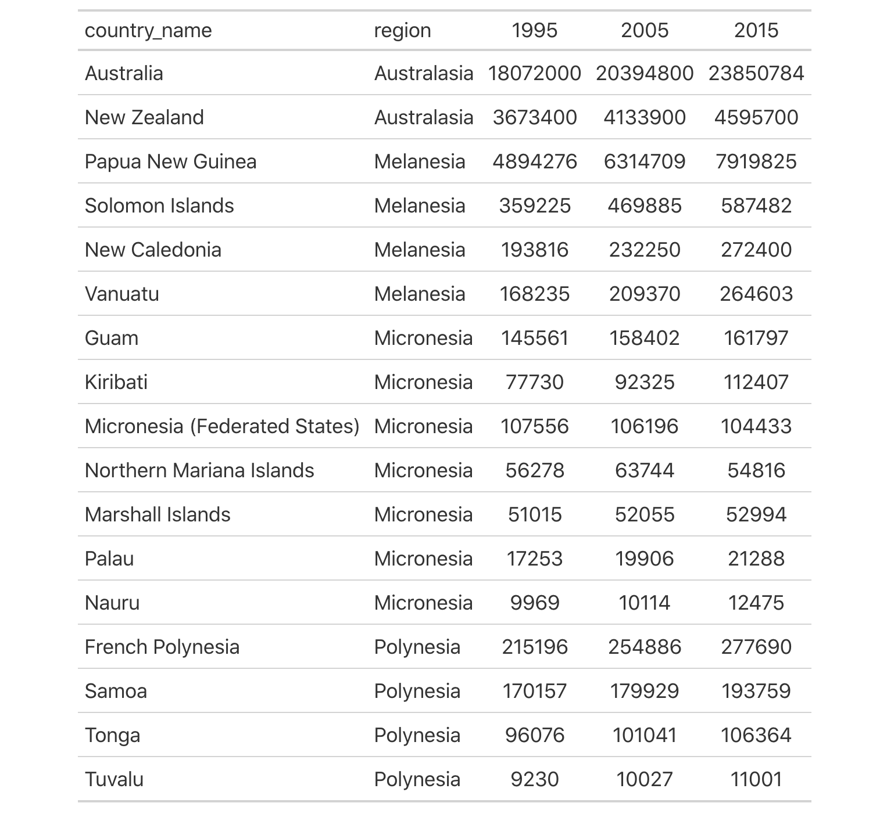
```
(ref:gt-oceaniapops-0-fig) A **gt** presentation table made with the `oceaniapops` data table by just using `gt()`. It's nice but it could be made nicer.

While the presentation of the table in Figure 12.15 looks adequate, there are ways to make it look better. We can use the `rowname_col` and `groupname_col` arguments of the `gt()` function to generate row labels (in a stub) and to generate row group labels (that span across the table in header rows). Let's try that out in Listing 12.15 and see the resulting presentation table in Figure 12.16.

`r edr::code_hints(
"**CODE //** Taking a different approach in making the **gt** table by defining a stub and row group labels."
)`
```{r gt-oceaniapops-1, eval=FALSE}
oceaniapops_1 <- 
  oceaniapops %>%
  gt(
    rowname_col = "country_name",
    groupname_col = "region"
  )

oceaniapops_1
```

```{r gt-oceaniapops-1-fig, echo=FALSE, fig.cap='(ref:gt-oceaniapops-1-fig)'}
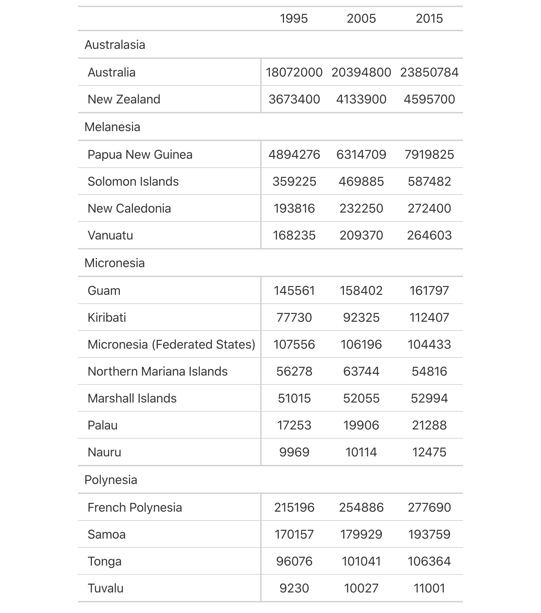
```
(ref:gt-oceaniapops-1-fig) A much-improved version of the previous **gt** table! It now contains row labels in the stub area and row group labels for each of the regions of Oceania. Superb!

As can be seen in the improved **gt** table that is `oceaniapops_1` (Figure 12.16), the stub column on the left acts as a specialized column for row labels (a vertical border is automatically placed between the stub and the table body to the right). The labels in the region column were used to generate the row group labels (e.g., `"Australasia"`, `"Melanesia"`, etc.). This change effectively puts rows into groups, adding structure and reducing needless repetition.

For the third requirement, we've already obtained the three columns that contain population data for `1995`, `2005`, and `2015.` With regard to the presentation, a further requirement is that a spanner column label be placed over those column labels. We can do this with the `tab_spanner()` function. The whole point of this function is to make it extremely easy to place a spanner column label above the columns of your choosing. Listing 12.16 has an example of this, where the label `"Total Population"` is placed above the three column labels representing the years.

`r edr::code_hints(
"**CODE //** Adding more structure to the **gt** table by placing the spanner column label ~~\"Total Population\"~~ above the three column labels."
)`
```{r gt-oceaniapops-2, eval=FALSE}
oceaniapops_2 <- 
  oceaniapops_1 %>%
  tab_spanner(
    label = "Total Population",
    columns = vars(`1995`, `2005`, `2015`)
  )

oceaniapops_2
```

```{r gt-oceaniapops-2-fig, echo=FALSE, fig.cap='(ref:gt-oceaniapops-2-fig)'}
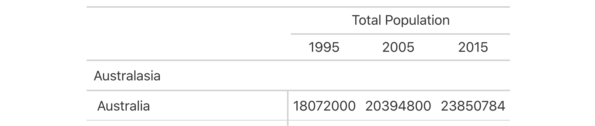
```
(ref:gt-oceaniapops-2-fig) The top portion of the **gt** table we've been working on (for the Oceania project). Now the column labels have a spanner column label above.

In Figure 12.17, we see that the addition of the spanner column label provides more information as to what the values below represent. This both looks good and gives the reader of the table additional context.

Columns of data can be formatted with the `fmt_*()` family of **gt** functions. To do formatting of numbers, we need to use the `fmt_number()` function. Our requirement is to format numbers so that they should have commas. These are technically called digit group separators and they will appear as commas by default (changeable with the `sep_mark` or `locale` arguments of `fmt_number()`). The arguments of `fmt_number()` that we need to pay attention to are use_seps, which is `TRUE` by default, and decimals which we need to set to `0`. Important note: the columns are represented by numbers so we need to enclose them with back ticks when including them all in `vars()`. Listing 12.17 provides the necessary **gt** code to do the numeric formatting of the population values. To make the values even more readable, we should right align them. That's done with the `cols_align()` function (by default, it targets all values in all columns except for the stub).

`r edr::code_hints(
"**CODE //** We can make the population values much to easier to read with decimal separators by use of the ~~fmt_number()~~ function."
)`
```{r gt-oceaniapops-3, eval=FALSE}
oceaniapops_3 <- 
  oceaniapops_2 %>%
  fmt_number(
    columns = vars(`1995`, `2005`, `2015`),
    decimals = 0
  ) %>%
  cols_align(align = "right")

oceaniapops_3
```

```{r gt-oceaniapops-3-fig, echo=FALSE, fig.cap='(ref:gt-oceaniapops-3-fig)'}
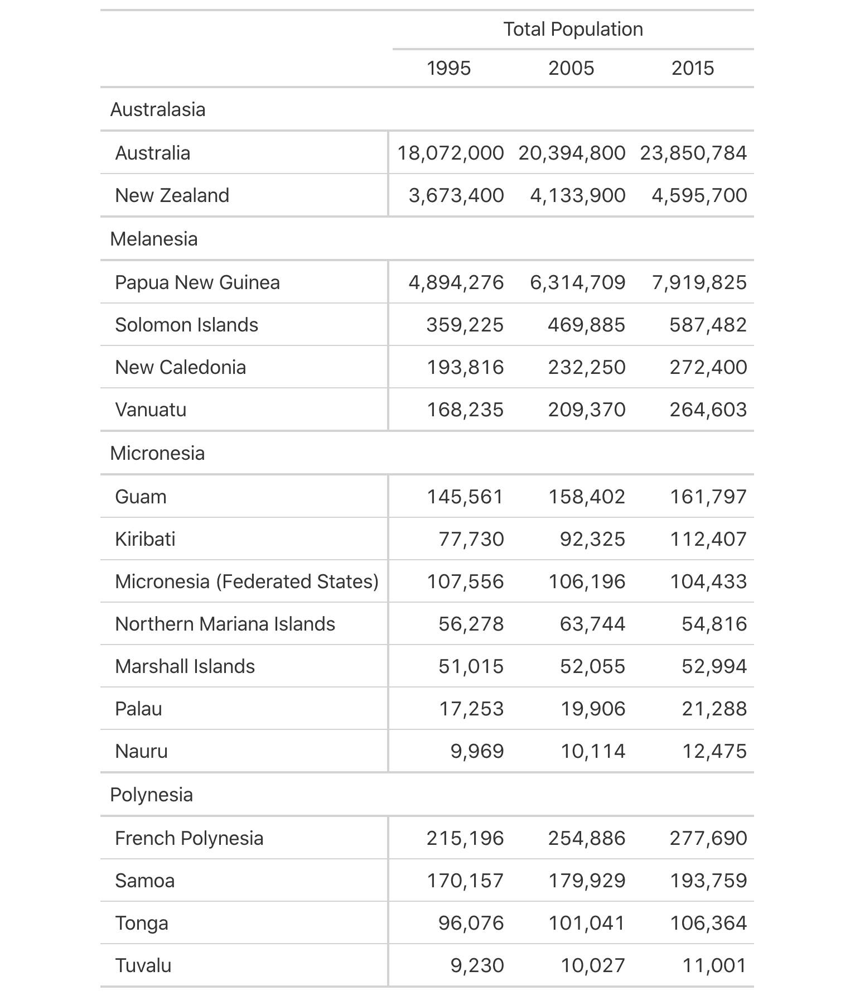
```
(ref:gt-oceaniapops-3-fig) The **gt** table's numeric values are way more readable now thanks to the numeric formatting and column alignment (to the right).

The `fmt_number()` function has a lot of options for formatting numbers exactly how you want them to appear. By default, it formats larger decimal numbers with commas for the separator mark and periods for the decimal mark (e.g., 32,432.86). This can be changed by using the sep_mark and dec_mark arguments. Setting `sep_mark = "."` and `dec_mark = ","` will result in the previous example being formatted as `32.432,86`. Another (easier) way to do this is to set the `locale` argument of `fmt_number()`. If the numbers in a **gt** table are intended for a Danish audience, for example, you could set `locale = "da"` and not have to worry about the sep_mark and dec_mark arguments (they are overridden by the `locale` setting). For more information on locales and how they are expressed and handled in **gt**, you can use the `info_locales()` function. It provides a table with locale names and previews of formatted numbers across all 712 locales supported in **gt**.

While the updated presentation table of Figure 12.18 looks great, you may find at times that the columns are too close together. This can be remedied with the `cols_width()` function. It allows for the precise definition of column widths. It uses a formula-based interface where column names in `vars()` or selection helpers go on the left of the `~`, and pixel values (best wrapped in `px()`) go on the right-hand side. The stub? It can be accessed with the number `1`. In Listing 12.18, the stub column is sized to `250` pixels and all other columns are `125` pixels wide. In addition to sizing the columns, a header is added to the table (with a title and a subtitle). Using the `md()` function, we can even supply Markdown text to either of the title or subtitle.

`r edr::code_hints(
"**CODE //** The column widths can be finely adjusted with ~~cols_width()~~, and, a heading is always a good idea."
)`
```{r gt-oceaniapops-4, eval=FALSE}
oceaniapops_4 <- 
  oceaniapops_3 %>%
  cols_width(
    1 ~ px(250),
    everything() ~ px(125)
  ) %>%
  tab_header(
    title = md("Populations of Countries in Oceania During **1995**, **2005**, and **2015**"),
    subtitle = "Combined land area of 3,291,903 sq mi and a population of over 41 million."
  )

oceaniapops_4
```

```{r gt-oceaniapops-4-fig, echo=FALSE, fig.cap='(ref:gt-oceaniapops-4-fig)'}
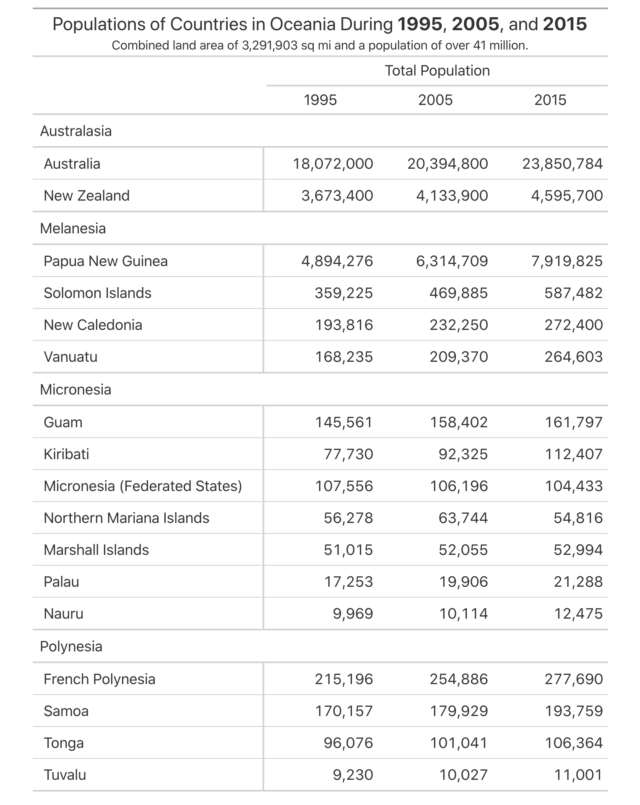
```
(ref:gt-oceaniapops-4-fig) The now-wider `oceaniapops` **gt** table now has a title and it looks great when styled with Markdown text.

We've shown examples of adding footnotes before (with the `exibble` dataset). In the code example shown in Listing 12.19, there is a more advanced used of locations (with the `cells_stub()` location helper function). Here, the `md()` function is again used to add Markdown text for some extra styling opportunities. With the `md()` function, we can do great things like add Markdown links (as was done with the source note that provides a link to the data on the Web). Figure 12.20 shows the result of this code on footer of the table.

`r edr::code_hints(
"**CODE //** Footnotes and source notes can be added to a **gt** with the ~~tab_footnote()~~ and ~~tab_source_note()~~ functions."
)`
```{r gt-oceaniapops-5, eval=FALSE}
oceaniapops_5 <- 
  oceaniapops_4 %>%
  tab_footnote(
    footnote = "United States.",
    locations = cells_stub(rows = starts_with(c("No", "Gu")))
  ) %>%
  tab_footnote(
    footnote = "France.",
    locations = cells_stub(rows = starts_with(c("New Cal", "French")))
  ) %>%
  tab_source_note(
    source_note = md(
      paste0(
        "Population data obtained from [World Bank Open Data]",
        "(https://data.worldbank.org/indicator/SP.POP.TOTL)."
      )
    )
  )

oceaniapops_5
```

```{r gt-oceaniapops-5-fig, echo=FALSE, fig.cap='(ref:gt-oceaniapops-5-fig)'}
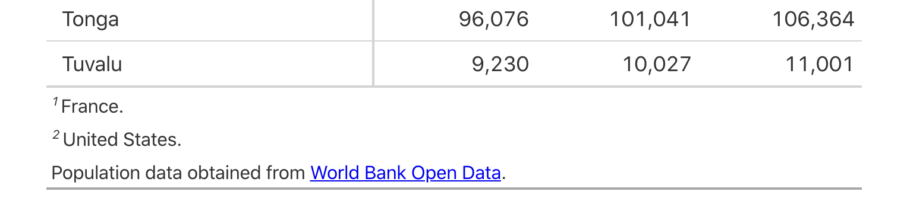
```
(ref:gt-oceaniapops-5-fig) The addition of footnotes and a source note adds more useful information to the table. Because we used Markdown, the source note even has a link to a web page.

The `tab_style()` function is quite powerful, in that it can be used to radically change the look of a table. You can: add background colors to cell, modify text styles, add cell borders, and much more. Here is an example (in Listing 12.20) where multiple pieces of text are emboldened by using the `cell_text()` helper function (there are also the `cell_fill()` and `cell_borders()` stylizing helper functions). Notable in this code example is the use of multiple locations (wrapped up in a list) that serve as targets for the style application.

`r edr::code_hints(
"**CODE //** Text can be emboldened with combination of the ~~tab_style()~~ and ~~cell_text()~~ functions; we can do this at multiple locations at once."
)`
```{r gt-oceaniapops-6, eval=FALSE}
oceaniapops_6 <- 
  oceaniapops_5 %>%
  tab_style(
    style = cell_text(weight = "bold"),
    locations = list(
      cells_column_labels(columns = TRUE),
      cells_column_spanners(spanners = TRUE),
      cells_row_groups(groups = TRUE)
    )
  )

oceaniapops_6
```

```{r gt-oceaniapops-6-fig, echo=FALSE, fig.cap='(ref:gt-oceaniapops-6-fig)'}
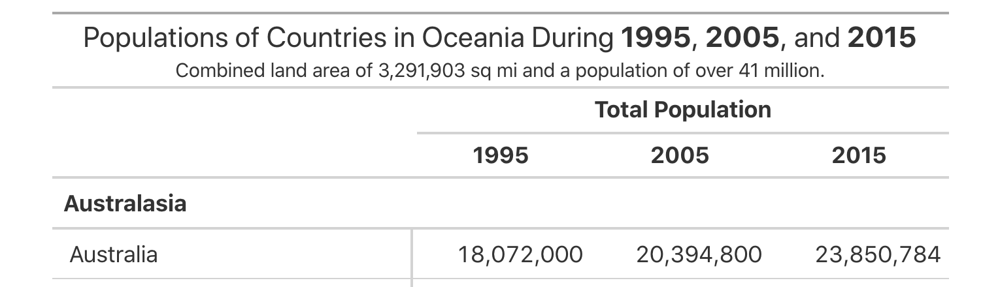
```
(ref:gt-oceaniapops-6-fig) A **gt** table can be styled with the `tab_style()` function. Here, multiple locations' cells are styled with bold text.

The output table of Figure 12.21 is seen to have multiple locations styled in a single call of `tab_style()`. You could use three separate calls of `tab_style()` with a single location specified in each cell, but the use of the list is much more efficient.

This sort of table can be further enhanced with summary rows. There are two functions for this: `summary_rows()` and `grand_summary_rows()`. The first operates within groups (and we have them in our table), the second incorporates all of the available data, regardless of whether some of the data are part of row groups

When we choose to use either of these functions, we have to supply a list of aggregation functions to the `fns` argument. We choose how to format the values in the resulting summary cells by use of a formatter function (e.g, `fmt_number`, etc.) and any relevant options. It's a bit difficult to remember all of these things so examples here are very instructive and helpful (Listing 12.21).

`r edr::code_hints(
"**CODE //** Summary rows can be generated on a per-group basis (with ~~summary_rows()~~), and, for all rows in the table (with ~~grand_summary_rows()~~)."
)`
```{r gt-oceaniapops-7, eval=FALSE}
oceaniapops_7 <- 
  oceaniapops_6 %>%
  summary_rows(
    groups = TRUE,
    columns = TRUE,
    fns = list(TOTAL = ~ sum(., na.rm = FALSE)),
    formatter = fmt_number,
    decimals = 0
  ) %>%
  grand_summary_rows(
    columns = TRUE,
    fns = list(`GRAND TOTAL` = ~ sum(., na.rm = FALSE)),
    formatter = fmt_number,
    decimals = 0
  ) %>%
  tab_options(data_row.padding = px(4))
  
oceaniapops_7
```

```{r gt-oceaniapops-7-fig, echo=FALSE, fig.cap='(ref:gt-oceaniapops-7-fig)'}
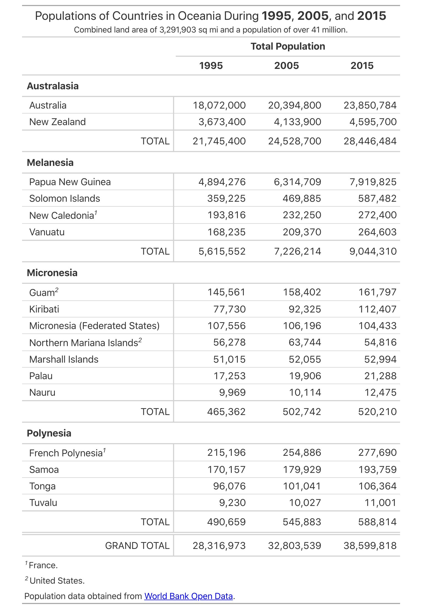
```
(ref:gt-oceaniapops-7-fig) The finalized `oceaniapops` **gt** table. It has summary rows (per group and for the whole table).

The end result? It's really a great-looking presentation table. It'll look good in **R Markdown** reports and in other places where HTML is accepted. Should you need to export the table to HTML (to use elsewhere) or capture the table as an image (to put into a presentation), we can use the `gtsave()` function. The key to getting the right file is to use the correct file extension. An HTML file will be written to the working directory if providing a filename ending in `.html` and a PNG file is obtained when using the `.png` file extension (e.g., `gtsave(oceaniapops_7, "oceaniapops_tbl.html")` or `gtsave(oceaniapops_7, "oceaniapops_tbl.png")`).

## Summary

- Large presentation tables can be generated using the **DT** package, where the `datatable()` function generates the HTML table.
- **DT** tables are highly interactive, and these interactive elements can be added/removed though named extensions, and the `options` list.
- Presentation tables made with the **gt** package are non-interactive but smaller tables look great given all the styling options available in the package.
- Tables made with **gt** start with the `gt()` function, and then you would use the `tab_*()` functions for creating or modifying table parts.
- Data cells in a **gt** table can be formatted to an exacting specification with the `fmt_*()` family of functions (e.g., `fmt_number()`, `fmt_currency()`, `fmt_percent()`, `fmt_date()`, etc.).
- Footnotes in gt tables can be made with `tab_footnote()`, source notes are generated with `tab_source_note()`; using either for the first time adds a table footer.
- A title and subtitle in a **gt** table can be added with the `tab_header()` function.
- The `tab_style()` function in gt uses a location helper function (just as  `tab_footnote()` does) and a stylizing helper function (`cell_fill()`, `cell_text()`, or `cell_borders()`).
- Summary rows can be added to a **gt** table by using `summary_rows()` or `grand_summary_rows()`.
