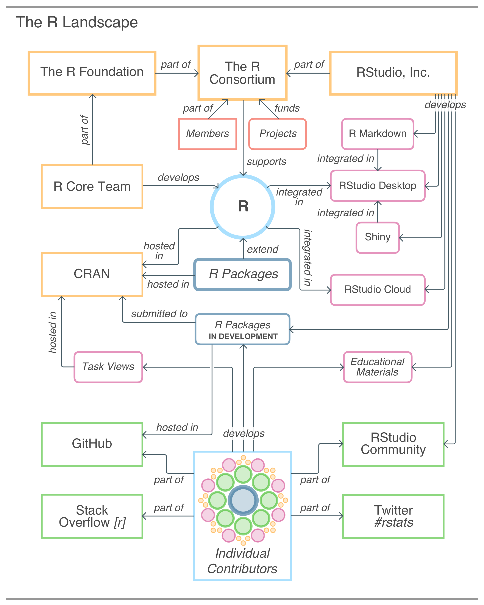

# Appendix {-}

```{r setup, include=FALSE, echo=FALSE}
library(edr)
library(tidyverse)
```

## Installing **R** and The **RStudio Desktop** IDE {-}

There are two pieces of software you'll need to download. One is **R** itself and the other is the *Community Edition* of the **RStudio Desktop** IDE. Luckily, you can use both of these in Windows, macOS, and in various distributions of Linux. Depending on your OS there are preferred ways to install both. While we do need both pieces of software installed, the order of installation is not important.

### macOS Installation {-}

Here are the steps for obtaining and installing the **R** programming language.

1. With your preferred web browser, go to <http://www.r-project.org>. This is the main site for **R** and *CRAN*.
2. Follow the *CRAN* link to the left.
3. Follow the *Downloads* link to go to the download page then get the installer for the Macintosh computing platform. It downloads as a DMG file.
4. Open the installer file and follow the installation instructions to completion.

You then have **R**. If you’d like to be fully certain of that, open the *Terminal* application and type **R** and the **R** command-line console should appear.

The next task is to download and install RStudio Desktop.

1. Go to the *RStudio* website, which is at <https://www.rstudio.com>.
2. Once there, look for the macOS installation file of **RStudio Desktop Community Edition**. If browsing from a Mac, the site will present you with a large download button that leads to the latest stable Mac release of **RStudio Desktop**.
3. Download the DMG file, open it, and drag the app to the Applications directory.

Keeping the **RStudio** app in the macOS Dock is a good idea for easy access to the IDE.

### Windows Installation {-}

The installation of **R** and **RStudio Desktop** on Windows is not very different from that on the Mac. There are some subtle differences though. Let's walk through the entire process. First, we need to get **R**, so here are the steps:

1. Go to <http://www.r-project.org>. This is the entry point to **R**-as-a-project and *CRAN.*
2. Follow the *CRAN* link to the left.
3. Follow the *Downloads* link to go to the download page then get the installer for the Windows computing platform.
4. Run the installer program; it may ask a number of potentially confusing questions, however, just accept the defaults. Soon thereafter the installation will finish, and **R** for Windows will be installed.

**R** will create a few shortcut icons and a good way to check that the installation had succeeded is to open **R** through the *Start Menu*.

The next step is to get **RStudio Desktop**.

1. Go to the website of *RStudio* (<https://www.rstudio.com>).
2. Look for the Windows install of **RStudio Desktop Community Edition**. A large download button for the Windows version of **RStudio Desktop** will appear (it leads to the latest stable Windows release).
3. Download the installation package and open it. Installation will proceed through a number of dialogue boxes, so, ensure that all are followed until completion of the install process.

After installation, try opening **RStudio**; the IDE will appear on the screen. I suggest keeping the **RStudio** icon pinned to the Task Bar so that it's easily accessible.

## How **R** is Organized {-}

There are three key organizational bodies focused on developing and maintaining **R**. These are:

1. the _**R** Core Group_ (individuals with write access to the **R** Environment)
2. *CRAN* (or, the *Comprehensive R Archive Network*)
3. the _**R** Foundation_

The **R** core group are individuals with write access to the **R** source code. While they make direct changes on the **R** codebase, individuals not part of this group are free to make contributions. Valuable contributions include recommendations for code changes, changes to documentation, etc.

*CRAN* is composed of a wider variety of individuals, some of which are in the _**R** Core Group_. Generally, *CRAN*'s mandate is to ensure that the **R** software and its extensions are tested, prepared for various platforms, and readily available for download. A large time investment on the part of volunteers is for checking the integrity of user-submitted packages. While some of this is automated, there is still a lot of 1-to-1 interaction between someone from *CRAN* and the submitter of package (this is to ensure that submitted packages adhere to quality guidelines).

The _**R** Foundation_ is an organization that provides support for **R** in general and it serves a reference point for individuals or organizations that want to support the **R** development community. The _**R** Consortium_ is an organization consisting of both public and private entities. The mission is to further **R** through a range of initiatives such as funding **R** development projects.

There are private organizations heavily involved in **R**. *RStudio, PBC* is a private company that plays a large role in the **R** landscape. They produce free and paid versions of the popular **R** IDE (integrated development environment) called **RStudio Desktop** (there are also server- and cloud-based versions of the **RStudio** IDE). They continue to play an outsized role in developing open-source **R** packages (including **shiny**, **rmarkdown**, and the *Tidyverse* group of packages). The company also delivers the **RStudio Cloud** product, which is a hosted version of the **RStudio** IDE that is easily accessible from a web browser. Finally, they support community-building through the *RStudio Community* website, which provides a welcoming Q&A forum for beginning and experienced users alike.

The user-submitted packages are developed by people coming from varied domains. These packages are usually developed 'in the open' (where incremental changes are visible to everyone and open discussions and contributions are encouraged) and hosted in *GitHub* repositories. After sufficient development, these packages are often submitted to *CRAN* and having packages available there can increase the reach and exposure of the software (since they can be installed with a single command). There is a commonly-used mechanism available where **R** users can download and install these 'pre-release' *GitHub*-hosted **R** packages. This is very useful for collaborating on the development of the in-development packages and for trying out an **R** package that is very new and has potentially exciting functionality.

The diagram shown below was put together to show how various organizations, products, and users fit in. Even in its simplified form, it shows a dense network of interactions.

```{r the-r-landscape, echo=FALSE}

```

